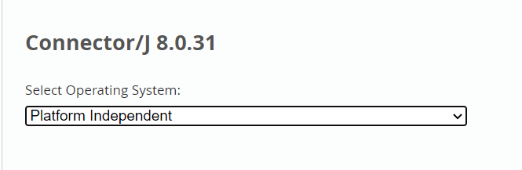
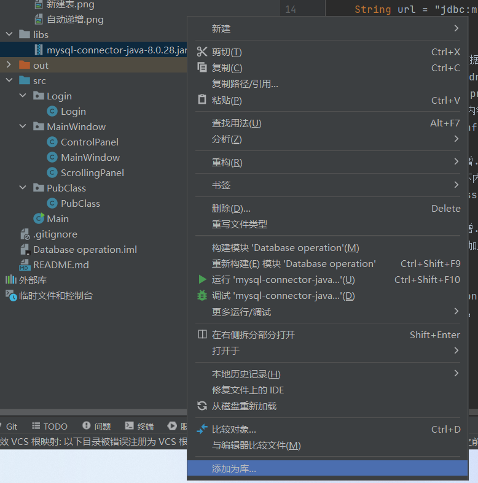

# Java操作数据库

### 下载JDBC驱动包
[点击前往官方网站](https://dev.mysql.com/downloads/connector/j/)

选择 Platform Independent



### 导入JDBC数据库驱动包

1. 将驱动包放到目录libs下

   

2. 按照下面步骤添加库：

   1. 右键驱动包mysql-connector-java.jar

   2. 选择添加为库

        

   3. 在弹出窗口选择模块库：

        
   
### 连接数据库

```
public void connection throws ClassNotFoundException, SQLException {// 需要抛出异常
   Connection conn;
   Statement stmt;
   Class.forName("com.mysql.cj.jdbc.Driver");
   // 数据库配置
   String url = "jdbc:mysql://127.0.0.1:3306/database_operation";// 根据建立的数据库写url
   String userName = "root";
   String password = "";// 数据库密码
   // 创建连接
   conn = DriverManager.getConnection(url, userName, password);
   stmt = conn.createStatement();
   System.out.println("数据库连接成功");
   // 关闭连接
   conn.close();
   stmt.close();
}
```

### 操作数据库(参考[SQL 语言](SQL 语言.md))

1. 查找：
   ```
   String selectSql = "SELECT * FROM 表名 WHERE 字段 = ?";
   // "?"为占位符，"FROM"后面为表名，WHERE"后面为条件
   ```
   例如：在用户表中查找小明的信息
   ```
   Connection conn = null;
   PreparedStatement ps = null;
   ResultSet rs = null;
   String selectSql = "SELECT * FROM userinfo WHERe userName = ?";
   conn = DriverManager.getConnection(url, userName, password);// 此处未写数据库配置
   ps = conn.prepareStatement(selectSql);
   // 一一对应，将字符串传给占位符
   ps.setString(1, "小明");
   rs = ps.executeQuery();// 执行SQL语句
   while (rs.next()){
      String ID = rs.getString("ID");
      String name = rs.getString("userName");
      String pd = rs.getString ("password");
      System.out.println( ID + " " + name + " " + pd);
   }
   ```
2. 插入：
   ```
   Stirng insertSql =  "INSERT INTO 表名(字段, 字段, ..., 字段) VALUES(?, ?, ..., ?)";
   // "VALUES"后面填插入的数据
   ```
   例如：在用户表中添加小军的信息
   ```
   String insertSql =  "INSERT INTO userinfo(ID, userName, password) VALUES(?, ?, ?)";
   ps = conn.prepareStatement(insertSql);
   ps.setString(1, "3");
   ps.setString(2, "小军");
   ps.setString(3, "123456");
   int count = ps.executeUpdate();// 执行SQL语句
   System.out.println("添加了" + count + "条数据。");
   ```
3. 更新：
   ```
   Stirng updateSql = "UPDATE 表名 SET 字段 = '字段值' WHERE 字段 = ?";
   // "?"填数据，"WHERE"后面为条件
   ```
   例如：在用户表中删除小明的信息
   ```
   
   ```
4. 删除：
   ```
   Stirng deleteSql = "DELETE FROM 表名 WHERE 字段 = ?";
   // "FROM"后面为表名，WHERE"后面为条件，第一个"?"填字段
   ```