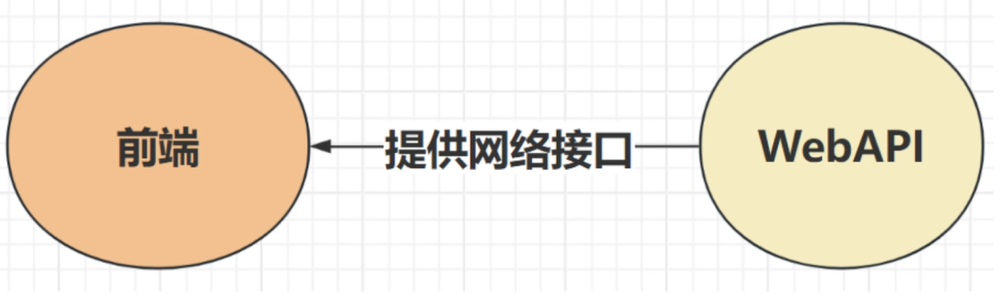
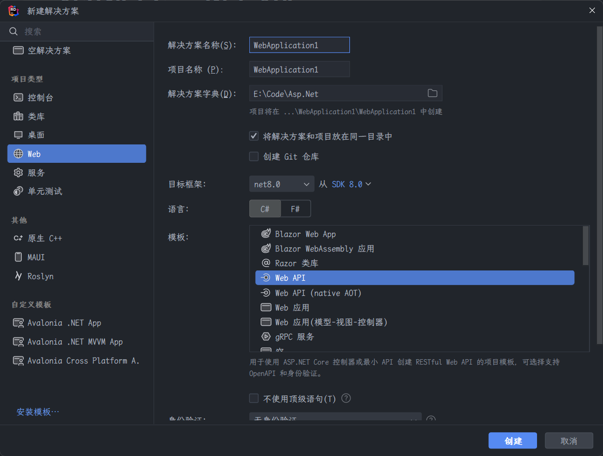
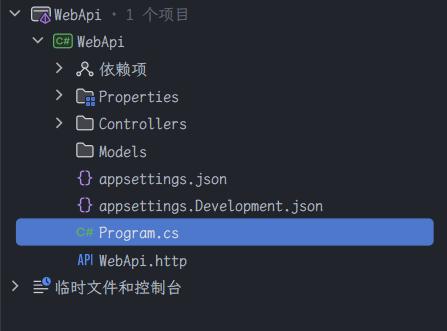
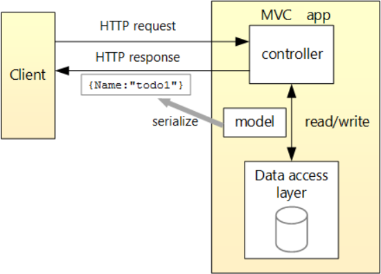

# ASP.NET Core Web API

> 本教程使用 `JetBrains Rider` 软件。

## 基本概念

`Web API`：为前端提供数据。

## 创建项目

新建解决方案 --> `Web` --> `Web API`

## 项目结构

`Controllers` 文件夹：包含控制器类，控制器处理 `HTTP` 请求并负责返回相应的视图或数据。

`Models` 文件夹存放应用程序的数据模型，通常代表数据库表或其他业务实体。

`Program.cs` 文件：包含应用程序的入口点，负责构建和配置 `WebHost`。

项目文件 (`.csproj`)：项目的主要配置文件，定义了项目的依赖项、输出等信息。它告诉编译器如何构建和组织项目。

## 基础教程

### 使用的API

| API                          | 描述             | 请求正文 | 响应正文       |
| ---------------------------- | ---------------- | -------- | -------------- |
| `GET /api/todoitems`         | 获取所有待办事项 | None     | 待办事项的数组 |
| `GET /api/todoitems/{id}`    | 按 ID 获取项     | None     | 待办事项       |
| `POST /api/todoitems`        | 添加新项         | 待办事项 | 待办事项       |
| `PUT /api/todoitems/{id}`    | 更新现有项       | 待办事项 | None           |
| `DELETE /api/todoitems/{id}` | 删除项           | None     | None           |

### 应用设计

