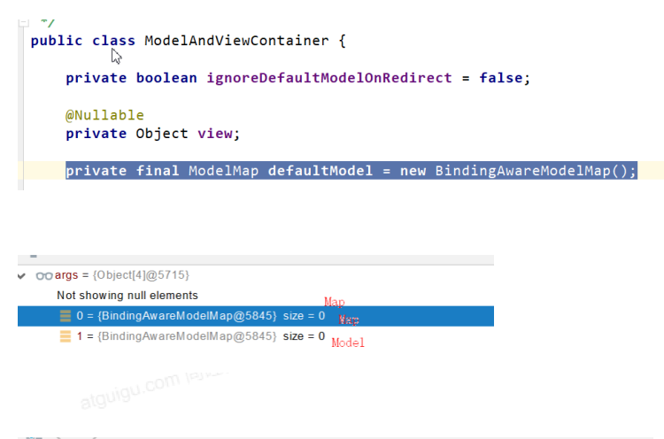

# SpringBoot

`2.7.17`

## HelloWorld

1. 创建 maven 工程

2. 引入依赖

    ```xml
    <parent>
       <groupId>org.springframework.boot</groupId>
       <artifactId>spring-boot-starter-parent</artifactId>
       <version>2.7.17</version>
    </parent>

    <dependencies>
       <dependency>
       <groupId>org.springframework.boot</groupId>
          <artifactId>spring-boot-starter-web</artifactId>
       </dependency>

    </dependencies>
    ```

3. 创建主程序

    ```java
    /**
     * 主程序类
     * @SpringBootApplication：这是一个SpringBoot应用
     */
    @SpringBootApplication
    public class MainApplication {

       public static void main(String[] args) {
          SpringApplication.run(MainApplication.class,args);
       }
    }
    ```

4. 编写业务

    ```java
    @RestController
    public class HelloController {

       @RequestMapping("/hello")
       public String handle01(){
          return "Hello, Spring Boot 2!";
       }
    }
    ```

5. 测试

    直接运行main方法。

6. 简化部署

    ```xml
    <build>
       <plugins>
          <plugin>
             <groupId>org.springframework.boot</groupId>
             <artifactId>spring-boot-maven-plugin</artifactId>
          </plugin>
       </plugins>
    </build>
    ```

## Application Properties 配置

> [文档](https://docs.spring.io/spring-boot/docs/2.7.17/reference/html/application-properties.html#appendix.application-properties)
>
> `application.properties` 文件

修改服务端口配置

```properties
server.port=8080  # 端口
```

## SpringBoot 特点

### 依赖管理

1. 父项目做依赖管理

    ```xml
    <!--依赖管理-->
    <parent>
       <groupId>org.springframework.boot</groupId>
       <artifactId>spring-boot-starter-parent</artifactId>
       <!-- 由此版本号决定，自动版本仲裁。 -->
       <version>2.7.17</version>
    </parent>
    ```

    > [!TIP]
    >
    > 自动版本仲裁
    >
    > 1. 引入依赖默认都可以不写版本 ；
    > 2. 引入非版本仲裁的jar，要写版本号。

2. 以修改默认版本号

    ```xml
    <!--1. 查看spring-boot-dependencies里面规定当前依赖的版本用的 key。-->
    <!--2. 在当前项目里面重写配置-->
    <properties>
       <mysql.version>8.0.21</mysql.version>
    </properties>
    ```

### 自动配置

1. 自动配好Tomcat
    - 引入Tomcat依赖；

    - 配置 Tomcat。

2. 自动配好 SpringMVC
    - 引入 SpringMVC 全套组件；
    - 自动配好SpringMVC 常用组件（功能）。

3. 自动配好 Web 常见功能

    如：字符编码问题。

4. 默认的包结构
    - 主程序所在包及其下面的所有子包里面的组件都会被默认扫描进来；

    - 无需以前的包扫描配置；

    - 想要改变扫描路径：

        @SpringBootApplication(scanBasePackages="com.atguigu")；

        @ComponentScan 指定扫描路径；

    > [!TIP]
    >
    > ```java
    > @SpringBootApplication
    > // 等同于
    > @SpringBootConfiguration
    > @EnableAutoConfiguration
    > @ComponentScan("com.atguigu.boot")
    > ```

5. 各种配置拥有默认值
    - 默认配置最终都是映射到某个类上，如：MultipartProperties ；
    - 配置文件的值最终会绑定每个类上，这个类会在容器中创建对象；
    - 按需加载所有自动配置项。

## 容器功能

### @Bean

Spring 的 @Bean 注解用于告诉方法，产生一个 Bean 对象，然后这个 Bean 对象交给 Spring 管理。产生这个 Bean 对象的方法 Spring 只会调用一次，随后这个 Spring 将会将这个 Bean 对象放在自己的 IOC 容器中。

### 组件添加

#### @Configuration 配置文件

1. 基本使用
    - 配置类里面使用 `@Bean` 标注在方法上给容器注册组件，默认也是单实例的；
    - 配置类本身也是组件；
    - `proxyBeanMethods`：代理 `bean` 的方法；
    - `Full(proxyBeanMethods = true)`：保证每个 `@Bean` 方法被调用多少次返回的组件都是单实例的；
    - `Lite(proxyBeanMethods = false)`：每个 `@Bean` 方法被调用多少次返回的组件都是新创建的；
    - 组件依赖必须使用 `Full` 模式默认，其他默认是否 `Lite` 模式。

    ```java
    @Configuration(proxyBeanMethods = false) // 告诉 SpringBoot 这是一个配置类 == 配置文件
    public class MyConfig {
       /**
        * Full:外部无论对配置类中的这个组件注册方法调用多少次获取的都是之前注册容器中的单实例对象
       * @return
       */
       @Bean // 给容器中添加组件；以方法名作为组件的 id；返回类型就是组件类型；返回的值，就是组件在容器中的实例。
       public User user01(){
          User zhangsan = new User("zhangsan", 18);
          //user组件依赖了Pet组件
          zhangsan.setPet(tomcatPet());
          return zhangsan;
       }

       @Bean("tom")
       public Pet tomcatPet(){
          return new Pet("tomcat");
       }
    }
    ```

2. 测试

    @Configuration 测试代码如下

    ```java
    @SpringBootConfiguration
    @EnableAutoConfiguration
    @ComponentScan("com.atguigu.boot")
    public class MainApplication {

       public static void main(String[] args) {
          // 1、返回我们IOC容器
          ConfigurableApplicationContext run = SpringApplication.run(MainApplication.class, args);

          // 2、查看容器里面的组件
          String[] names = run.getBeanDefinitionNames();
          for (String name : names) {
           System.out.println(name);
          }
          // 3、从容器中获取组件
          Pet tom01 = run.getBean("tom", Pet.class);
          Pet tom02 = run.getBean("tom", Pet.class);
          System.out.println("组件："+(tom01 == tom02));
          // 4. com.atguigu.boot.config.MyConfig$$EnhancerBySpringCGLIB$$51f1e1ca@1654a892
          MyConfig bean = run.getBean(MyConfig.class);
          System.out.println(bean);

          // 如果@Configuration(proxyBeanMethods = true)代理对象调用方法。
          // SpringBoot 总会检查这个组件是否在容器中有。
          // 保持组件单实例
          User user = bean.user01();
          User user1 = bean.user01();
          System.out.println(user == user1);

          User user01 = run.getBean("user01", User.class);
          Pet tom = run.getBean("tom", Pet.class);
          System.out.println("用户的宠物："+(user01.getPet() == tom));
       }
    }
    ```

3. Full 模式与 Lite 模式
    - 配置类组件之间无依赖关系用Lite模式加速容器启动过程，减少判断 ；
    - 配置类组件之间有依赖关系，方法会被调用得到之前单实例组件，用Full模式；
    - 配置类里面使用@Bean标注在方法上给容器注册组件，默认也是单实例的；
    - 配置类本身也是组件。

4. 其他办法

    @Bean、@Component、@Controller、@Service、@Repository、@ComponentScan、@Import

    > [!TIP]
    >
    > @Import 示例
    >
    > ```java
    > @Import({User.class})
    > @Configuration(proxyBeanMethods = false)
    > public class MyConfig {}
    > ```

### @Autowired

是一种注解，可以对成员变量、方法和构造函数进行标注，来完成自动装配的工作，`@Autowired`标注可以放在成员变量上，也可以放在成员变量的 `set` 方法上，也可以放在任意方法上表示，自动执行当前方法，如果方法有参数，会在`IOC`容器中自动寻找同类型参数为其传值。

### @Service

此注注解属于业务逻辑层，`service`或者`manager`层，默认按照名称进行装配，如果名称可以通过`name`属性指定，如果没有`name`属性，注解写在字段上时，默认去字段名进行查找，如果注解写在`setter`方法上，默认按照方法属性名称进行装配，当找不到匹配的`bean`时，才按照类型进行装配，如果`name`名称一旦指定就会按照名称进行装配。

```java
package com.example.demo.service;

import com.example.demo.entity.User;
import com.example.demo.repository.UserRepository;

import org.springframework.beans.factory.annotation.Autowired;
import org.springframework.stereotype.Service;

@Service
public class UserService {

    @Autowired
    UserRepository userRepository;

    public boolean isExist(String username){
        User user =  getByusername(username);
        return null!=user;
    }

    public User getByusername(String username) {
        return userRepository.findByUsername(username);
    }

    public User get(String username,String password){
        return userRepository.getByUsernameAndPassword(username, password);
    }

    public void add(User user) {
        userRepository.save(user);
    }

}
```

- `Service`层叫服务层，被称为服务，可以理解就是对一个或多个`DAO`进行的再次封装，封装成一个服务，所以这里也就不会是一个原子操作了，需要事物控制。
- `service`层主要负责业务模块的应用逻辑应用设计，同样是首先设计接口，再设计其实现类，接着再Spring的配置文件中配置其实现的关联。

### @Conditional 条件装配

条件装配：满足 Conditional 指定的条件，则进行组件注入。

```java
@Configuration(proxyBeanMethods = false) //告诉SpringBoot这是一个配置类 == 配置文件
// @ConditionalOnBean(name = "tom") // 有 tom 就加
@ConditionalOnMissingBean(name = "tom") // 无 tom 就加
public class MyConfig {}
```

### 原生配置文件引入

#### @ImportResource

引入原生配置文件 `beans.xml`

```java
@ImportResource("classpath:beans.xml")
public class MyConfig {}
```

### 配置绑定

> 例如：可以使用在设置数据库配置上。

如何使用 Java 读取到 properties 文件中的内容，并且把它封装到 JavaBean 中，以供随时使用；

```java
// java 原生方法
public class getProperties {
   public static void main(String[] args) throws FileNotFoundException, IOException {
      Properties pps = new Properties();
      pps.load(new FileInputStream("a.properties"));
      Enumeration enum1 = pps.propertyNames();//得到配置文件的名字
      while(enum1.hasMoreElements()) {
         String strKey = (String) enum1.nextElement();
         String strValue = pps.getProperty(strKey);
         System.out.println(strKey + "=" + strValue);
         //封装到JavaBean。
      }
   }
}
```

#### @ConfigurationProperties

`application.properties` 中的内容

```properties
mycar.brand = "BYD"
mycar.price = "200000"
```

```java
/**
 * 只有在容器中的组件，才会拥有 SpringBoot 提供的强大功能
 */
@Component
@ConfigurationProperties(prefix = "mycar")
// 根据 application.properties 中的配置内容一一绑定
public class Car {
   private String brand;
   private Integer price;
}
```

#### @EnableConfigurationProperties

```java
@EnableConfigurationProperties(Car.class)
//1、开启Car配置绑定功能
//2、把这个Car这个组件自动注册到容器中
public class MyConfig {}
```

这样可以省略 `class Car` 上的 `@Component` 不写。

### 自动配置原理入门

#### 引导加载自动配置类

```java
@SpringBootConfiguration
@EnableAutoConfiguration
@ComponentScan(excludeFilters = { @Filter(type = FilterType.CUSTOM, classes = TypeExcludeFilter.class),
@Filter(type = FilterType.CUSTOM, classes = AutoConfigurationExcludeFilter.class) })
public @interface SpringBootApplication{}
```

##### @SpringBootConfiguration

@Configuration：代表当前是一个配置类。

##### @ComponentScan

指定扫描哪些 Spring 注解。

##### @EnableAutoConfiguration

```java
@AutoConfigurationPackage
@Import(AutoConfigurationImportSelector.class)
public @interface EnableAutoConfiguration {}
```

1. @AutoConfigurationPackage
    - 自动配置包；

    - 指定了默认的包规则。

    ```java
    @Import(AutoConfigurationPackages.Registrar.class) //给容器中导入一个组件
    public @interface AutoConfigurationPackage {}
    // 利用 Registrar 给容器中导入一系列组件;
    // 将指定的一个包下的所有组件导入进来 --> MainApplication 所在包下。
    ```

2. @Import(AutoConfigurationImportSelector.class)

    > 文件里面写死了 spring-boot 一启动就要给容器中加载的所有配置类
    - 利用 getAutoConfigurationEntry(annotationMetadata); 给容器中批量导入一些组件；

    - 调用 `List<String> configurations = getCandidateConfigurations(annotationMetadata, attributes)` 获取到所有需要导入到容器中的配置类；
    - 利用工厂加载 `Map<String, List<String>> loadSpringFactories(@Nullable ClassLoader classLoader)`得到所有的组件；

    - 从 META-INF/spring.factories 位置来加载一个文件:
        - 默认扫描我们当前系统里面所有 META-INF/spring.factories 位置的文件；
        - spring-boot-autoconfigure-2.3.4.RELEASE.jar 包里面也有 META-INF/spring.factories。

#### 按需开启自动配置项

- 虽然我们127个场景的所有自动配置启动的时候默认全部加载。
- 按照条件装配规则 `@Conditional`，最终会按需配置。

#### 修改默认配置

```java
@Bean
@ConditionalOnBean(MultipartResolver.class) //容器中有这个类型组件
@ConditionalOnMissingBean(name = DispatcherServlet.MULTIPART_RESOLVER_BEAN_NAME) //容器中没有这个名字 multipartResolv
public MultipartResolver multipartResolver(MultipartResolver resolver) {
   // 给@Bean标注的方法传入了对象参数，这个参数的值就会从容器中找。
   // SpringMVC multipartResolver。防止有些用户配置的文件上传解析器不符合规范
   // Detect if the user has created a MultipartResolver but named it incorrectly
   return resolver;
}

```

SpringBoot默认会在底层配好所有的组件，但是如果用户自己配置了以用户的优先。

```java
@Bean
@ConditionalOnMissingBean
public CharacterEncodingFilter characterEncodingFilter() {}
```

> [!TIP]
>
> 配置文件`application.properties`中加入`debug=true`开启自动配置报告。
>
> - Negative（不生效）
> - Positive（生效）

## 开发小技巧

### Lombok 简化 JavaBean 开发

导包：

```xml
<dependency>
   <groupId>org.projectlombok</groupId>
   <artifactId>lombok</artifactId>
   <version>RELEASE</version>
   <scope>compile</scope>
</dependency>
```

`idea` 中搜索安装 `lombok` 插件

```java
@NoArgsConstructor  // 无参构造器
@AllArgsConstructor  // 全参构造器
@Data  // 自动添加 Getter 和 Setter
@ToString  // toString 方法
@EqualsAndHashCode // Equals 和 HashCode 方法
public class User {

    private String name;
    private Integer age;
    private Pet pet;

    public User(String name,Integer age){
        this.name = name;
        this.age = age;
    }

}
```

### @Slf4j 简化日志开发

导包：

```xml
<dependency>
    <groupId>org.slf4j</groupId>
    <artifactId>slf4j-api</artifactId>
    <version>2.0.7</version>
</dependency>
<dependency>
    <groupId>org.slf4j</groupId>
    <artifactId>slf4j-simple</artifactId>
    <version>2.0.7</version>
</dependency>
```

配置文件 `log4j.properties`：

```properties
log4j.rootLogger=DEBUG,console,dailyFile,im
log4j.additivity.org.apache=true
# 控制台(console)
log4j.appender.console=org.apache.log4j.ConsoleAppender
log4j.appender.console.Threshold=DEBUG
log4j.appender.console.ImmediateFlush=true
log4j.appender.console.Target=System.err
log4j.appender.console.layout=org.apache.log4j.PatternLayout
log4j.appender.console.layout.ConversionPattern=[%-5p] %d(%r) --> [%t] %l: %m %x %n
# 日志文件(logFile)
log4j.appender.logFile=org.apache.log4j.FileAppender
log4j.appender.logFile.Threshold=DEBUG
log4j.appender.logFile.ImmediateFlush=true
log4j.appender.logFile.Append=true
log4j.appender.logFile.File=D:/logs/log.log4j
log4j.appender.logFile.layout=org.apache.log4j.PatternLayout
log4j.appender.logFile.layout.ConversionPattern=[%-5p] %d(%r) --> [%t] %l: %m %x %n
# 回滚文件(rollingFile)
log4j.appender.rollingFile=org.apache.log4j.RollingFileAppender
log4j.appender.rollingFile.Threshold=DEBUG
log4j.appender.rollingFile.ImmediateFlush=true
log4j.appender.rollingFile.Append=true
log4j.appender.rollingFile.File=D:/logs/log.log4j
log4j.appender.rollingFile.MaxFileSize=200KB
log4j.appender.rollingFile.MaxBackupIndex=50
log4j.appender.rollingFile.layout=org.apache.log4j.PatternLayout
log4j.appender.rollingFile.layout.ConversionPattern=[%-5p] %d(%r) --> [%t] %l: %m %x %n
# 定期回滚日志文件(dailyFile)
log4j.appender.dailyFile=org.apache.log4j.DailyRollingFileAppender
log4j.appender.dailyFile.Threshold=DEBUG
log4j.appender.dailyFile.ImmediateFlush=true
log4j.appender.dailyFile.Append=true
log4j.appender.dailyFile.File=D:/logs/log.log4j
log4j.appender.dailyFile.DatePattern='.'yyyy-MM-dd
log4j.appender.dailyFile.layout=org.apache.log4j.PatternLayout
log4j.appender.dailyFile.layout.ConversionPattern=[%-5p] %d(%r) --> [%t] %l: %m %x %n
# 应用于socket
log4j.appender.socket=org.apache.log4j.RollingFileAppender
log4j.appender.socket.RemoteHost=localhost
log4j.appender.socket.Port=5001
log4j.appender.socket.LocationInfo=true
# Set up for Log Factor 5
log4j.appender.socket.layout=org.apache.log4j.PatternLayout
log4j.appender.socket.layout.ConversionPattern=[%-5p] %d(%r) --> [%t] %l: %m %x %n
# Log Factor 5 Appender
log4j.appender.LF5_APPENDER=org.apache.log4j.lf5.LF5Appender
log4j.appender.LF5_APPENDER.MaxNumberOfRecords=2000
# 发送日志到指定邮件
log4j.appender.mail=org.apache.log4j.net.SMTPAppender
log4j.appender.mail.Threshold=FATAL
log4j.appender.mail.BufferSize=10
log4j.appender.mail.From = xxx@mail.com
log4j.appender.mail.SMTPHost=mail.com
log4j.appender.mail.Subject=Log4J Message
log4j.appender.mail.To= xxx@mail.com
log4j.appender.mail.layout=org.apache.log4j.PatternLayout
log4j.appender.mail.layout.ConversionPattern=[%-5p] %d(%r) --> [%t] %l: %m %x %n
# 应用于数据库
log4j.appender.database=org.apache.log4j.jdbc.JDBCAppender
log4j.appender.database.URL=jdbc:mysql://localhost:3306/test
log4j.appender.database.driver=com.mysql.jdbc.Driver
log4j.appender.database.user=root
log4j.appender.database.password=
log4j.appender.database.sql=INSERT INTO LOG4J (Message) VALUES('=[%-5p] %d(%r) --> [%t] %l: %m %x %n')
log4j.appender.database.layout=org.apache.log4j.PatternLayout
log4j.appender.database.layout.ConversionPattern=[%-5p] %d(%r) --> [%t] %l: %m %x %n
# 自定义Appender
log4j.appender.im = net.cybercorlin.util.logger.appender.IMAppender
log4j.appender.im.host = mail.cybercorlin.net
log4j.appender.im.username = username
log4j.appender.im.password = password
log4j.appender.im.recipient = corlin@cybercorlin.net
log4j.appender.im.layout=org.apache.log4j.PatternLayout
log4j.appender.im.layout.ConversionPattern=[%-5p] %d(%r) --> [%t] %l: %m %x %n
```

示例：

```java
@Slf4j  // 简化日志开发
@RestController
public class HelloController {
    @RequestMapping("/hello")
    public String handle01(@RequestParam("name") String name){
        log.info("请求进来了....");  // 简化日志开发
        return "Hello, Spring Boot 2!"+"你好："+name;
    }
}
```

### junit 测试

导包：

```xml
<dependency>
    <groupId>junit</groupId>
    <artifactId>junit</artifactId>
    <version>4.13.1</version>
</dependency>
```

示例：

```java
public class ApplicationContextTest {

    @Test
    public void test() {
        // 代码块
    }
}
```

### dev-tools 自动重启

项目或者页面修改以后：Ctrl+F9，自动重启。

若只是修改了 web 静态页面，则不会重启，只进行更新。

```xml
<dependency>
   <groupId>org.springframework.boot</groupId>
   <artifactId>spring-boot-devtools</artifactId>
   <optional>true</optional>
</dependency>
```

### Spring Initailizr 项目初始化向导

`idea` 基本已内置。

## 配置文件

### ApplicationProperties 配置

[Application Properties 配置](#application-properties-配置)

[@ConfigurationProperties](#configurationproperties)

### yaml 配置

#### 简介

YAML 是 "YAML Ain't Markup Language"（YAML 不是一种标记语言）的递归缩写。在开发的这种语言时，YAML 的意思其实是："Yet Another Markup Language"（仍是一种标记语言）， 非常适合用来做以数据为中心的配置文件。

#### 基本语法

- key: value；kv之间有空格；

- 大小写敏感；

- 使用缩进表示层级关系；

- 缩进不允许使用 `Tab`，只允许空格；【原则上，实际可用】

- 缩进的空格数不重要，只要相同层级的元素左对齐即可；

- `#` 表示注释；

- 字符串无需加引号，如果要加，`''`与 `""` 表示字符串内容会被转义/不转义。

#### 数据类型

1. 字面量：单个的、不可再分的值。date、boolean、string、number、null

    ```yaml
    k: v
    ```

2. 对象：键值对的集合。map、hash、set、object

    ```yaml
    # 行内写法
    k: {k1:v1, k2:v2, k3:v3}
    # 或
    k:
      k1: v1
      k2: v2
      k3: v3

    ```

3. 数组：一组按次序排列的值。array、list、queue

    ```yaml
    # 行内写法
    k: [v1, v2, v3]
    # 或者
    k:
      - v1
      - v2
      - v3
    ```

#### 示例

```java
@ConfigurationProperties(prefix = "person")
// 根据 application.xml 中的配置内容一一绑定
@Data
public class Person {
    private String userName;
    private Boolean boss;
    private Date birth;
    private Integer age;
    private Pet pet;
    private String[] interests;
    private List<String> animal;
    private Map<String, Object> score;
    private Set<Double> salarys;
    private Map<String, List<Pet>> allPets;
}

@Data
public class Pet {
    private String name;
    private Double weight;
}
```

`application.yaml`

```yaml
person:
    userName: zhangsan
    boss: false
    birth: 2019/12/12 20:12:33
    age: 18
    pet:
    name: tomcat
    weight: 23.4
    interests: [篮球, 游泳]
    animal:
        - jerry
        - mario
    score:
    english:
    first: 30
    second: 40
    third: 50
    math: [131, 140, 148]
    chinese: { first: 128, second: 136 }
    salarys: [3999, 4999.98, 5999.99]
    allPets:
    sick:
        - { name: tom }
        - { name: jerry, weight: 47 }
    health: [{ name: mario, weight: 47 }]
```

双引号不会转义：`/n` 会被视为换行；

单引号会转义：`/n` 不会被视为换行，视为字符串。

> 将 `/n` 转义成字符串。

#### 配置提示

自定义的类和配置文件绑定一般没有提示。

```xml
<dependency>
 <groupId>org.springframework.boot</groupId>
 <artifactId>spring-boot-configuration-processor</artifactId>
 <optional>true</optional>
</dependency>
```

打包时，不将配置提示包加入其中：

```xml
<build>
 <plugins>
  <plugin>
   <groupId>org.springframework.boot</groupId>
   <artifactId>spring-boot-maven-plugin</artifactId>
   <configuration>
      <excludes>
         <exclude>
            <groupId>org.springframework.boot</groupId>
            <artifactId>spring-boot-configuration-processor</artifactId>
         </exclude>
      </excludes>
   </configuration>
  </plugin>
 </plugins>
</build>
```

## WEB 开发 ↓↓↓

## SpringMVC 配置

[SpringMVC](./spring#springmvc-↓↓↓)

## 静态资源访问

### 静态资源目录

静态资源放在类路径下： `/static` 或 `/public` 或 `/resources` 或 `/META-INF/resources`

访问 ： 当前项目根路径/ + 静态资源名

原理： 静态映射/\*\*。

> 请求进来，先去找Controller看能不能处理，不能处理的所有请求又都交给静态资源处理器，静态资源也找不到则响应404页面。

### 改变默认的静态资源路径

```properties
spring.mvc.static-path-pattern=/mypath/**
```

或

```yaml
spring:
    resources:
        static-locations: [classpath:/mypath/]
```

### 静态资源访问前缀

默认无前缀 。

有前缀：

```yaml
spring:
    mvc:
        static-path-pattern: /res/**
```

当前项目 + static-path-pattern + 静态资源名 = 静态资源文件夹下找。

> 即：/index.html --> /res/index.html

> [!TIP]
>
> 可用于拦截器不拦截静态资源。

### webjar

把静态资源变成 jar 包。

> 不常用，了解就行。

### 欢迎页支持

静态资源路径下 `index.html` 可以配置静态资源路径 。

> [!WARNING]
>
> 但是不可以配置静态资源的访问前缀；否则导致 `index.html` 不能被默认访问。
>
> ```yaml
> spring:
>     mvc:
>         static-path-pattern: /res/** # 这个会导致welcome page功能失效
> ```

### 自定义 Favicon

`favicon.ico` 放在静态资源目录下即可。

> 同样不可以配置静态资源的访问前缀。

### 静态资源配置原理

- SpringBoot 启动默认加载 `xxxAutoConfiguration` 类（自动配置类） ；

- SpringMVC 功能的自动配置类 `WebMvcAutoConfiguration` 生效；

    ```java
    @Configuration(proxyBeanMethods = false)
    @ConditionalOnWebApplication(type = Type.SERVLET)
    @ConditionalOnClass({ Servlet.class, DispatcherServlet.class, WebMvcConfigurer.class })
    @ConditionalOnMissingBean(WebMvcConfigurationSupport.class)
    @AutoConfigureOrder(Ordered.HIGHEST_PRECEDENCE + 10)
    @AutoConfigureAfter({ DispatcherServletAutoConfiguration.class,TaskExecutionAutoConfiguration.class,ValidationAutoConfiguration.class })
    public class WebMvcAutoConfiguration {}
    ```

- 配置文件的相关属性和 `xxx` 进行了绑定。`WebMvcProperties==spring.mvc`、`ResourceProperties==spring.resources`；

- 配置类只有一个有参构造器。

## 请求参数处理

### 请求映射

#### Rest 使用与原理

1. `xxxMapping`

2. Rest 风格支持（使用HTTP请求方式动词来表示对资源的操作）
    - 以前：`/getUser` 获取用户 `/deleteUser` 删除用户 `/editUser` 修改用户 `/saveUser` 保存用户；

    - 现在： `/user` GET-获取用户 DELETE-删除用户 PUT-修改用户 POST-保存用户；

    - 核心 `Filter`、`HiddenHttpMethodFilter` 用法：
        - 表单 `method=post`，隐藏域 `_method=put SpringBoot` 中手动开启；

        - SpringBoot 中手动开启。

            ```java
            // 源码默认关闭。
            @Bean
            @ConditionalOnMissingBean(HiddenHttpMethodFilter.class)
            @ConditionalOnProperty(prefix = "spring.mvc.hiddenmethod.filter", name = "enabled", matchIfMissing = false)
            public OrderedHiddenHttpMethodFilter hiddenHttpMethodFilter() {
              return new OrderedHiddenHttpMethodFilter();
            }
            ```

            开启

            ```yaml
            spring:
                mvc:
                    hiddenmethod:
                        filter:
                            enabled: true
            ```

    - 扩展：如何把 `_method` 这个名字换成我们自己喜欢的。

        ```java
        //自定义filter
        @Bean
        public HiddenHttpMethodFilter hiddenHttpMethodFilter(){
            HiddenHttpMethodFilter methodFilter = new HiddenHttpMethodFilter();
            methodFilter.setMethodParam("_m");
            return methodFilter;
        }
        ```

3. 代码示例

    ```java
    @RequestMapping(value = "/user",method = RequestMethod.GET)
    public String getUser() {
       return "GET-张三";
    }

    @RequestMapping(value = "/user",method = RequestMethod.POST)
    public String saveUser(){
       return "POST-张三";
    }

    @RequestMapping(value = "/user",method = RequestMethod.PUT)
    public String putUser(){
       return "PUT-张三";
    }

    @RequestMapping(value = "/user",method = RequestMethod.DELETE)
    public String deleteUser(){
       return "DELETE-张三";
    }
    ```

4. 简化

    ```java
    @RequestMapping(value = "/user",method = RequestMethod.GET)
    @RequestMapping(value = "/user",method = RequestMethod.POST)
    // ...
    // 等同于
    @GETMapping("/user")
    @POSTMapping("/user")
    // ...
    ```

### 普通参数与基本注解

#### 注解

- `@PathVariable`：可以将 `URL` 中占位符参数绑定到控制器处理方法的入参中：`URL` 中的 `{xxx}` 占位符可以通过 `@PathVariable(“xxx”)` 绑定到操作方法的入参中。

- `@RequestHeader`：用于映射控制器参数以请求头值。

- `@ModelAttribute`：每次执行方法时都会先执行 `@ModelAttribute` 注解的方法，并将结果添加到 `model` 中。

- `@RequestParam`：把请求中的指定名称的参数传递给控制器中的形参赋值。

- `@MatrixVariable`：拓展了 `URL` 请求地址的功能。使用 `@Matrixvariable` 注解时多个变量可以使用 `;`(分号)分隔，该注解允许开发者进行多条件组合査询。

    启用 `@MatrixVariable`:

    

    

- `@CookieValue`：可让处理方法入参绑定某个 `Cookie` 值。

- `@RequestBody`：主要用来接收前端传递给后端的 `json` 字符串中的数据的(请求体中的数据的)。

```java
@RestController
public class ParameterTestController {

   // car/2/owner/zhangsan
   @GetMapping("/car/{id}/owner/{username}")
   public Map<String,Object> getCar(@PathVariable("id") Integer id,
         @PathVariable("username") String name,
         @PathVariable Map<String,String> pv,
         @RequestHeader("User-Agent") String userAgent,
         @RequestHeader Map<String,String> header,
         @RequestParam("age") Integer age,
         @RequestParam("inters") List<String> inters,
         @RequestParam Map<String,String> params,
         @CookieValue("_ga") String _ga,
         @CookieValue("_ga") Cookie cookie){
      Map<String,Object> map = new HashMap<>();
      // map.put("id",id);
      // map.put("name",name);
      // map.put("pv",pv);
      // map.put("userAgent",userAgent);
      // map.put("headers",header);
      map.put("age",age);
      map.put("inters",inters);
      map.put("params",params);
      map.put("_ga",_ga);
      System.out.println(cookie.getName()+"===>"+cookie.getValue());
      return map;
   }

   @PostMapping("/save")
   public Map postMethod(@RequestBody String content){
      // 获取请求体中的数据
      Map<String,Object> map = new HashMap<>();
      map.put("content",content);
      return map;
   }

   //1、语法： 请求路径：/cars/sell;low=34;brand=byd,audi,yd
   //2、SpringBoot默认是禁用了矩阵变量的功能
   // 手动开启：原理。对于路径的处理。UrlPathHelper进行解析。
   // removeSemicolonContent（移除分号内容）支持矩阵变量的
   //3、矩阵变量必须有url路径变量才能被解析
   @GetMapping("/cars/{path}")
   public Map carsSell(@MatrixVariable("low") Integer low,
           @MatrixVariable("brand") List<String> brand,
              @PathVariable("path") String path){
      Map<String,Object> map = new HashMap<>();

      map.put("low",low);
      map.put("brand",brand);
      map.put("path",path);
      return map;
   }

   // /boss/1;age=20/2;age=10
   // pathVar 获取哪个路径的矩阵变量
   @GetMapping("/boss/{bossId}/{empId}")
   public Map boss(@MatrixVariable(value = "age",pathVar = "bossId") Integer bossAge,
   @MatrixVariable(value = "age",pathVar = "empId") Integer empAge){
      Map<String,Object> map = new HashMap<>();
      map.put("bossAge",bossAge);
      map.put("empAge",empAge);
      return map;
   }
}
```

#### Servlet API

`WebRequest`、`ServletRequest`、`MultipartRequest`、 `HttpSession`、`javax.servlet.http.PushBuilder`、`Principal`、`InputStream`、`Reader`、 `HttpMethod`、`Locale`、`TimeZone`、`ZoneId`

> [!TIP]
>
> `ServletRequestMethodArgumentResolver` 可以解析以上的部分参数。

#### 复杂参数

`Map`、`Model`（map、model里面的数据会被放在 request 的请求域 request.setAttribute）、`Errors/BindingResult`、`RedirectAttributes`（ 重 定向携带数据）、`ServletResponse`（response）、`SessionStatus`、`UriComponentsBuilder`、`ServletUriComponentsBuilder`

```java
Map<String,Object> map;
Model model;
HttpServletRequest request;
// request 都是可以给request域中放数据，
request.getAttribute();
```

1. `model`：从广义上来说，Model 指的是 MVC 中的 M，即 Model (模型)。从狭义上讲，Model 就是个 key-value 集合。实际上，上图home方法得到的model对象就是一个 `java.util.Map` ，你可以将Model类型替换为`Map<String, Object>` ，或者ModelMap —— 一个实现了 Mode l接口的`java.util.HashMap`。

2. `Map`、`Model`类型的参数，会返回 `mavContainer.getModel()` ---> `BindingAwareModelMap` 是 `Model` ，也是 `Map` （来自源码）。

    

#### 自定义参数

可以自动类型转换与格式化，可以级联封装。

```html
<input name="userName" placeholder="姓名" /> <br />
<input name="age" placeholder="年龄" /> <br />
<input name="birth" placeholder="生日" /> <br />
<input name="pet.name" placeholder="宠物姓名" /><br />
<input name="pet.age" placeholder="宠物年龄" />
```

```java
@Data
public class Person {
    private String username;
    private Integer age;
    private Data birth;
    private Pet pet;
}

@Data
public class Pet {
    private String name;
    private Integer age;
}
```

#### POJO封装过程

`ServletModelAttributeMethodProcessor`

- 当 `handler` 的参数类型为自定义的实体类类型或者添加了 `@ModelAttribute` 注解，`ServletModelAttributeMethodProcessor` 会对参数进行解析绑定。
- 判断有没有 `@ModelAttribute` 注解，或者不是 `Java` 基本数据类型（ `Date`、`Number`、`Enum` 等）。

### 参数处理原理

- `HandlerMapping` 中找到能处理请求的 `Handler`（Controller.method()） ；

- 为当前 `Handler` 找一个适配器 `HandlerAdapter`、`RequestMappingHandlerAdapter`

- 适配器执行目标方法并确定方法参数的每一个值。

#### HandlerAdapter

- 支持方法上标注 `@RequestMapping`；

- 支持函数式编程的。

#### 执行目标方法

```java
// 以下代码是源码
// Actually invoke the handler.
// DispatcherServlet -- doDispatch
mv = ha.handle(processedRequest, response, mappedHandler.getHandler());

mav = inv2okeHandlerMethod(request, response, handlerMethod); // 执行目标方法
// ServletInvocableHandlerMethod
Object returnValue = invokeForRequest(webRequest, mavContainer, providedArgs);
// 获取方法的参数值
Object[] args = getMethodArgumentValues(request, mavContainer, providedArgs);
```

#### 参数解析器

> `HandlerMethodArgumentResolver`

- 确定将要执行的目标方法的每一个参数的值是什么;

- `SpringMVC` 目标方法能写多少种参数类型，取决于参数解析器；
- 当前解析器是否支持解析这种参数；
- 支持就调用 `resolveArgument`。

#### 返回值处理器

其实 `@RequestMapping` 方法可以返回多种类型的数据，但是我们现在基本上都只会用 `@ResponseBody` 这种方式，别的方式基本上不会使用了。

## 数据响应与内容协商

### 响应 JSON

#### jackson.jar + @ResponseBody

```xml
<dependency>
  <groupId>org.springframework.boot</groupId>
  <artifactId>spring-boot-starter-web</artifactId>
</dependency>
<!-- web场景自动引入了json场景 -->
<dependency>
  <groupId>org.springframework.boot</groupId>
  <artifactId>spring-boot-starter-json</artifactId>
  <version>2.3.4.RELEASE</version>
  <scope>compile</scope>
</dependency>
```

Java 代码处理请求返回 JSON 数据

```java
@Controller
public class HelloController {

    @GetMapping("/hello")
    @ResponseBody
    public User hello() {
        User user = new User();
        user.setName("张三");
        user.setAge(18);
        return user;
    }
}
```

数据

```json
{
    "name": "张三",
    "age": 18
}
```

给前端自动返回json数据。

##### 返回值解析器原理

1. 返回值处理器判断是否支持这种类型返回值 `supportsReturnType`；

2. 返回值处理器调用 `handleReturnValue` 进行处理；

3. `RequestResponseBodyMethodProcessor` 可以处理返回值标了 `@ResponseBody` 注解的。
    - 利用 `MessageConverters` 进行处理 将数据写为 `json`；
        - 内容协商（浏览器默认会以请求头的方式告诉服务器他能接受什么样的内容类型）；
        - 服务器最终根据自己自身的能力，决定服务器能生产出什么样内容类型的数据。

4. `SpringMVC` 会挨个遍历所有容器底层的 `HttpMessageConverter`，看谁能处理？
    - 得到 `MappingJackson2HttpMessageConverter` 可以将对象写为 `json`；
    - 利用 `MappingJackson2HttpMessageConverter` 将对象转为 `json` 再写出去。

##### SpringMVC 支持的返回值

```txt
1 ModelAndView
2 Model
3 View
4 ResponseEntity
5 ResponseBodyEmitter
6 StreamingResponseBody
7 HttpEntity
8 HttpHeaders
9 Callable
10 DeferredResult
11 ListenableFuture
12 CompletionStage
13 WebAsyncTask
14 有 @ModelAttribute 且为对象类型的
15 @ResponseBody 注解 ---> RequestResponseBodyMethodProcessor；
```

#### HTTPMessageConverter 原理

1. MessageConverter规范
    - `HttpMessageConverter`: 看是否支持将此 `Class` 类型的对象，转为 `MediaType` 类型的数据。
    - 例子：`Person` 对象转为 `JSON`。或者 `JSON` 转为 `Person`。

2. 默认的 MessageConverter

    ```txt
    0 - 只支持Byte类型的
    1 - String
    2 - String
    3 - Resource
    4 - ResourceRegion
    5 - DOMSource.class \ SAXSource.class \ StAXSource.class \ StreamSource.class \ Source.class
    6 - MultiValueMap
    7 - true
    8 - true
    9 - 支持注解方式xml处理的。
    ```

    最终 `MappingJackson2HttpMessageConverter` 把对象转为 `JSON`（利用底层的 `jackson` 的 `objectMapper` 转换的）

### 内容协商

根据客户端接收能力不同，返回不同媒体类型的数据。

1. 开启浏览器参数方式内容协商功能

    ```yaml
    spring:
        contentnegotiation:
            favor-parameter: true # 开启请求参数内容协商模式
    ```

2. 确定客户端接收什么样的内容类型；
    - `Parameter` 策略优先确定是要返回 `json` 数据（获取请求头中的 `format` 的值）；
    - 最终进行内容协商返回给客户端 `json` 即可。

3. 内容协商原理
    - 判断当前响应头中是否已经有确定的媒体类型 `MediaType`；

    - 获取客户端（PostMan、浏览器）支持接收的内容类型。（获取客户端 `Accept` 请求头字段）【application/xml】 `contentNegotiationManager` 内容协商管理器 默认使用基于请求头的策略 `HeaderContentNegotiationStrategy` 确定客户端可以接收的内容类型；

    - 遍历循环所有当前系统的 `MessageConverter` ，看谁支持操作这个对象；

    - 找到支持操作当前数据的 `converter` ，把 `converter` 支持的媒体类型统计出来。

    - 客户端需要【application/xml】。服务端能力【10种、json、xml】

    - 进行内容协商的最佳匹配媒体类型

    - 用 支持 将对象转为最佳匹配媒体类型的 `converter`。调用它进行转化

### 自定义 MessageConverter

实现多协议数据兼容：`json`、`xml`、`x-guigu 0`、`@ResponseBody` 响应数据出去 调用 `RequestResponseBodyMethodProcessor` 处理；

1. `Processor` 处理方法返回值, 通过 `MessageConverter` 处理；

2. 所有 MessageConverter 合起来可以支持各种媒体类型数据的操作（读、写）;

3. 内容协商找到最终的 `messageConverter`。

> [!WARNING]
>
> 添加的自定义的功能可能会覆盖默认很多功能，导致一些默认的功能失效。

PersonMessageConvert

```java
/*
 * 自定义的Convert
 */
public class PersonMessageConvert implements HttpMessageConverter<Person> {
    @Override
    public boolean canRead(Class<?> clazz, MediaType mediaType) {
        return false;
    }

    @Override
    public boolean canWrite(Class<?> clazz, MediaType mediaType) {
        return clazz.isAssignableFrom(Person.class);
    }

    /*
     * @Description 服务器需要统计所有MessageConvert都能写出哪些类型，我们这里也要自定义
     * @Author zoe
     * @Date 2023/1/8 22:54
     * @Param
     **/
    @Override
    public List<MediaType> getSupportedMediaTypes() {
        return MediaType.parseMediaTypes("application/x-person");
    }

    @Override
    public Person read(Class<? extends Person> clazz, HttpInputMessage inputMessage) throws IOException, HttpMessageNotReadableException {
        return null;
    }

    @Override
    public void write(Person person, MediaType contentType, HttpOutputMessage outputMessage) throws IOException, HttpMessageNotWritableException {
        //自定义协会数据的写出
        String data = person.getUsername() + ";" + person.getAge() + ";" +person.getPet() + ";";
        //写出去
        OutputStream body = outputMessage.getBody();
        body.write(data.getBytes());
    }
}
```

方法

```java
@ResponseBody
@GetMapping("/test/person")
public Person getPeroson() {
   Person person = new Person();
   person.setUsername("张三");
   person.setAge(18);
   person.setPet(new Pet());
   return person;
}
```

WebMvcConfigurer

```java
@Bean
public WebMvcConfigurer webMvcConfigurer() {
   return new WebMvcConfigurer() {
      @Override
      public void extendMessageConverters(List<HttpMessageConverter<?>> converters) {
            converters.add(new PersonMessageConvert());
      }
   }
}
```

## 拦截器

### HandlerInterceptor 接口

1. 配置好拦截器要拦截哪些请求

2. 把这些配置放在容器中

```java
/**
 * 登录检查
 */
@Slf4j
public class LoginInterceptor implements HandlerInterceptor {

    /**
     * 目标方法执行之前
     * @param request
     * @param response
     * @param handler
     * @return
     * @throws Exception
     */
    @Override
    public boolean preHandle(HttpServletRequest request, HttpServletResponse response, Object handler) throws Exception {
        String requestURI = request.getRequestURI();
        log.info("preHandle拦截的请求路径是{}",requestURI);
        // 登录检查逻辑
        HttpSession session = request.getSession();
        Object loginUser = session.getAttribute("loginUser");
        if(loginUser != null){
            // 放行
            return true;
        }
        // 拦截住，未登录跳转到登录页
        request.setAttribute("msg","请先登录");
//        re.sendRedirect("/");
        request.getRequestDispatcher("/").forward(request,response);
        return false;
    }

    /**
     * 目标方法执行完成以后
     * @param request
     * @param response
     * @param handler
     * @param modelAndView
     * @throws Exception
     */
    @Override
    public void postHandle(HttpServletRequest request, HttpServletResponse response, Object handler, ModelAndView modelAndView) throws Exception {
        log.info("postHandle执行{}",modelAndView);
    }

    /**
     * 页面渲染以后
     * @param request
     * @param response
     * @param handler
     * @param ex
     * @throws Exception
     */
    @Override
    public void afterCompletion(HttpServletRequest request, HttpServletResponse response, Object handler, Exception ex) throws Exception {
        log.info("afterCompletion执行异常{}",ex);
    }
}
```

### 配置拦截器

1. 编写一个拦截器实现HandlerInterceptor接口

2. 拦截器注册到容器中（实现WebMvcConfigurer的addInterceptors）

3. 指定拦截规则【如果是拦截所有，静态资源也会被拦截】

```java
@Configuration
public class AdminWebConfig implements WebMvcConfigurer {

    @Override
    public void addInterceptors(InterceptorRegistry registry) {
        registry.addInterceptor(new LoginInterceptor())
                .addPathPatterns("/**")  // 所有请求都被拦截包括静态资源
                .excludePathPatterns("/","/login","/css/**","/fonts/**","/images/**","/js/**");
        //放行的请求
    }
}
```

### 拦截器原理

1. 根据当前请求，找到 `HandlerExecutionChain` 【可以处理请求的 `handler` 以及 `handler` 的所有拦截器】；

2. 先来顺序执行 所有拦截器的 `preHandle` 方法；

3. 如果当前拦截器 `prehandler` 返回为 `true` ，则执行下一个拦截器的 `preHandle`；

4. 如果当前拦截器返回为 `false` ，直接倒序执行所有已经执行了的拦截器的 `afterCompletion`；

5. 如果任何一个拦截器返回 `false` ，直接跳出不执行目标方法；

6. 所有拦截器都返回 `true` ，执行目标方法；

7. 倒序执行所有拦截器的 `postHandle` 方法；

8. 前面的步骤有任何异常都会直接倒序触发 `afterCompletion`；

9. 页面成功渲染完成以后，也会倒序触发 `afterCompletion`。

    

## 文件上传

```java
/**
* MultipartFile 自动封装上传过来的文件
* @param email
* @param username
* @param headerImg
* @param photos
* @return
*/
@PostMapping("/upload")
public String upload(@RequestParam("email") String email,
                     @RequestParam("username") String username,
                     @RequestPart("headerImg") MultipartFile headerImg,
                     @RequestPart("photos") MultipartFile[] photos) throws IOException {

   log.info("上传的信息：email={}，username={}，headerImg={}，photos={}",
            email,username,headerImg.getSize(),photos.length);

   if(!headerImg.isEmpty()){
      //保存到文件服务器，OSS服务器
      String originalFilename = headerImg.getOriginalFilename();
      headerImg.transferTo(new File("H:\\cache\\"+originalFilename));
   }

   if(photos.length > 0){
      for (MultipartFile photo : photos) {
            if(!photo.isEmpty()){
               String originalFilename = photo.getOriginalFilename();
               photo.transferTo(new File("H:\\cache\\"+originalFilename));
            }
      }
   }


   return "main";
}
```

### 文件上传配置

1. 文件上传自动配置类：`MultipartAutoConfiguration` - `MultipartProperties`；
2. 自动配置好了 `StandardServletMultipartResolver`【文件上传解析器】；
3. 原理步骤：
    - 请求进来使用文件上传解析器判断（ `isMultipart` ）并封装（ `resolveMultipart` ，返回 `MultipartHttpServletRequest` ）文件上传请求；
    - 参数解析器来解析请求中的文件内容封装成 `MultipartFile`；
    - 将 `request` 中文件信息封装为一个 `Map` ； `MultiValueMap<String, MultipartFile>`。
4. `FileCopyUtils`：实现文件流的拷贝。

## 异常处理

### 默认规则

- 默认情况下，SpringBoot 提供 `/error` 处理所有错误的映射；

- 对于机器客户端，它将生成 `JSON` 响应，其中包含错误，`HTTP` 状态和异常消息的详细信息；

- 对于浏览器客户端，响应一个 `whitelabel` 错误视图，以 `HTML` 格式呈现相同的数据；

- 要完全替换默认行为，可以实现 `ErrorController` 并注册该类型的 `Bean` 定义，或添加 `ErrorAttributes` 类型的组件以使用现有机制但替换其内容。

- `error/` 下的 `4xx`，`5xx` 页面会被自动解析，可用于自定义错误页，有错误异常时会精确匹配错误状态码页面，没有就找 4xx.html，如果都没有就触发白页。

    

### 自定义错误规则

1. 自定义错误页面：

    `error/404.html`、`error/5xx.html`

2. `@ControllerAdvice + @ExceptionHandler` 处理全局异常，底层是 `ExceptionHandlerExceptionResolver` 支持的；

3. `@ResponseStatus + 自定义异常`：底层是 `ResponseStatusExceptionResolver` ，把 `responsestatus` 注解的信息底层调用 `response.sendError(statusCode, resolvedReason)`，`tomcat` 发送的 `/error`；

4. `Spring` 底层的异常，如参数类型转换异常： `DefaultHandlerExceptionResolver` 处理框架底层的异常；
    - `response.sendError(HttpServletResponse.SC_BAD_REQUEST, ex.getMessage());`。

5. 自定义实现 `HandlerExceptionResolver` 处理异常，可以作为默认的全局异常处理规则；

6. `ErrorViewResolver` 实现自定义处理异常；
    - `response.sendError`，`error` 请求就会转给 `controller`；
    - 你的异常没有任何人能处理，`tomcat` 底层 `response.sendError`，`error` 请求就会转给 `controller`；
    - `basicErrorController` 要去的页面地址是 `ErrorViewResolver`。

### 异常处理步骤流程

1. 执行目标方法，目标方法运行期间有任何异常都会被`catch`、而且标志当前请求结束；并且用 `dispatchException`；
2. 进入视图解析流程
   `processDispatchResult(processedRequest, response, mappedHandler, mv, dispatchException);`
3. `mv = processHandlerException`；处理`handler`发生的异常，处理完成返回`ModelAndView`；
    - 遍历所有的 `handlerExceptionResolvers`，看谁能处理当前异常【`HandlerExceptionResolver`处理器异常解析器】
    - 系统默认的异常解析器

## Web 原生组件注入

### 使用 Servlet API

```java
// 指定原生 Servlet 组件都放在那里。
@ServletComponentScan(basePackages = "com.atguigu.admin")
// 效果：直接响应，没有经过 Spring 的拦截器
@WebServlet(urlPatterns = "/my")
// 拦截器
@WebFilter(urlPatterns={"/css/*","/images/*"})
// 监听器
@WebListener
```

> [!TIP]
>
> **拓展**
>
> `DispatchServlet` 如何注册进来：
>
> - 容器中自动配置了 `DispatcherServlet` 属性绑定到 `WebMvcProperties`；对应的配置文件配置项是 `spring.mvc`。
> - 通过 `ServletRegistrationBean<DispatcherServlet>` 把 `DispatcherServlet` 配置进来。
> - 默认映射的是 `/` 路径。

### 使用 RegistrationBean

`ServletRegistrationBean`,`FilterRegistrationBean`,`ServletListenerRegistrationBean`

```java
@Configuration
public class MyRegistConfig {

    @Bean
    public ServletRegistrationBean myServlet(){
        MyServlet myServlet = new MyServlet();

        return new ServletRegistrationBean(myServlet,"/my","/my02");
    }


    @Bean
    public FilterRegistrationBean myFilter(){

        MyFilter myFilter = new MyFilter();
//        return new FilterRegistrationBean(myFilter,myServlet());
        FilterRegistrationBean filterRegistrationBean = new FilterRegistrationBean(myFilter);
        filterRegistrationBean.setUrlPatterns(Arrays.asList("/my","/css/*"));
        return filterRegistrationBean;
    }

    @Bean
    public ServletListenerRegistrationBean myListener(){
        MySwervletContextListener mySwervletContextListener = new MySwervletContextListener();
        return new ServletListenerRegistrationBean(mySwervletContextListener);
    }
}
```

## 数据访问 ↓↓↓

[SpringBoot 数据访问](spring-boot-datasource.md)
