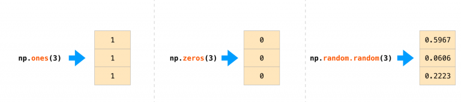
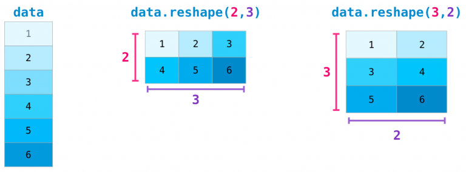
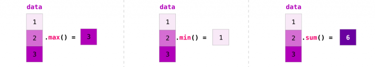
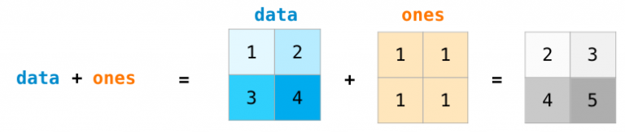

# 常用数据分析与可视化工具

## NumPy库介绍与应用

### numpy概述

1. Numerical Python，数值的Python，补充了Python语言所欠缺的数值计算能力。
2. Numpy是其它数据分析及机器学习库的底层库。
3. Numpy完全标准C语言实现，运行效率充分优化。
4. Numpy开源免费、快速、方便。

### 导入numpy

```python
import numpy as np
```

### 创建数组（array）

我们可以通过传递一个 `python` 列表，使用方法 `np.array()` 创建一个 NumPy 数组。


在很多场景下，我们希望 NumPy 能够帮我们初始化数组。

NumPy 提供了一些方法，比如 `ones(), zeros(), random.random()`。 我们只需要提供数组大小，如图：



```python
# 方式一
# 使用array函数从常规Python列表或元组中创建数组。得到的数组的类型是从Python列表中元素的类型推导出来的。
a = np.array([1,2,3,4])
print(a)  # [1 2 3 4]

b = np.array(range(10))
print(b)  # [0 1 2 3 4 5 6 7 8 9]

# 一个常见的错误，就是调用array的时候传入多个数字参数，而不是提供单个数字的列表类型作为参数。
# a = np.array(1,2,3,4)    # WRONG
a = np.array([1,2,3,4])  # RIGHT
print(a)  # [1 2 3 4]

# 方式二
#  NumPy提供了一个类似于range的函数，该函数返回数组array而不是列表list,
import numpy as np
c = np.arange(10)
print(c)  # [0 1 2 3 4 5 6 7 8 9]
list_c=list(range(10))
print(list_c)  # [0, 1, 2, 3, 4, 5, 6, 7, 8, 9]

# 方式三
#  zero方法或ones方法
import numpy as np
arry01=np.zeros((3))
print(arry01)
print('----------')
arry02=np.zeros((2,3))
print(arry02)
print('----------')
arry02=np.ones((2,3))
print(arry02)

# 输出
# [0. 0. 0.]
# ----------
# [[0. 0. 0.]
#  [0. 0. 0.]]
# ----------
# [[1. 1. 1.]
#  [1. 1. 1.]]
```

### 数组的形状

NumPy的数据结构为：`ndarray(N-Dimensional Array)`


```python
import numpy as np
# 一维数组
t1 = np.arange(12)
print(t1)  # [0 1 2 3 4 5 6 7 8 9 10 11]
print(t1.shape)  # (12,)
```

```python
import numpy as np
# 二维数组
t2 = np.array([[1,2,3],[4,5,6]])
print(t2)
# [[1 2 3]
#  [4 5 6]]
print(t2.shape)  # (2, 3)
```

```python
import numpy as np
# 三维数组
t3 = np.array([[[1,2,3],[4,5,6]],[[7,8,9],[10,11,12]]])
print(t3)
#  [[[ 1  2  3]
#   [ 4  5  6]]
#  [[ 7  8  9]
#   [10 11 12]]]
print(t3.shape)  # (2, 2, 3)
```

在大部分场合，处理一个新的维度只需要在 NumPy 的函数上参数上增加一个维度：

比如， `np.ones((4, 3, 2))` 将会打印如下：


```python
#举个例子
import numpy as np
arr_1= np.ones((4, 3, 2))
print(arr_1)

# [[[1. 1.]
#   [1. 1.]
#   [1. 1.]]
#  [[1. 1.]
#   [1. 1.]
#   [1. 1.]]

#  [[1. 1.]
#   [1. 1.]
#   [1. 1.]]

#  [[1. 1.]
#   [1. 1.]
#   [1. 1.]]]
```

### 数组维度操作

在高级的场合，可能需要变换矩阵的维度。机器学习中，常见。 比如当一个特定的模型需要一个一个特定维度的矩阵，而你的数据集的输入数据维度不一样的时候。

NumPy的reshape() 函数就变得有用了。 你只需指定你需要的新的矩阵的维度即可。你还可以通过将维度指定为 -1，NumPy 可以依据矩阵推断出正确的维度。



```python
import numpy as n
a = np.arange(1, 9)
print(a)        # [1 2 3 4 5 6 7 8]
b = a.reshape(2, 4) #变为2行4列的二维数组
print(b)  # [[1 2 3 4] [5 6 7 8]]
c = b.reshape(2, 2, 2) # 变为2页2行2列的三维数组
print(c)
# [[[1 2]
#   [3 4]] 
#  [[5 6]
#   [7 8]]]
```

```python
import numpy as np
c = np.array([[1,2,3,4], [5,6,7,8]])
print(c)
# [[1 2 3 4]
#  [5 6 7 8]]
e = c.flatten()
print(e)  # [1 2 3 4 5 6 7 8]
```

```python
import numpy as np
a = np.array([[1,2,3,4], [5,6,7,8]])
print(a)
# [[1 2 3 4]
#  [5 6 7 8]]
a.resize(2, 2, 2)
print(a)
# [[[1 2]
#  [3 4]]

# [[5 6]
#  [7 8]]]
```

```python
import numpy as np
# 三维数组中的形状(2,3,4)表示2个块数据，3行数据，4列数据
t5 = np.arange(24)
print(t5)
print('-------------------------')
t5 = t5.reshape((2,3,4))
print(t5)   
```

输出：

```txt
[0 1 2 3 4 5 6 7 8 9 10 11 12 13 14 15 16 17 18 19 20 21 22 23]
-------------------------
[[[ 0  1  2  3]
  [ 4  5  6  7]
  [ 8  9 10 11]]

 [[12 13 14 15]
  [16 17 18 19]
  [20 21 22 23]]]
```


```python
t5 = t5.reshape((4,6))
print(t5)
```

输出

```
[[ 0  1  2  3  4  5]
 [ 6  7  8  9 10 11]
 [12 13 14 15 16 17]
 [18 19 20 21 22 23]]
```

### 数组的计算

我们首先创建两个 NumPy 数组，一个是 data 数组，一个是 ones数组。


他们按照位置顺序（比如每行的值）相加，data + ones。


不只有加法，我们还可以以如下方式去计算：


计算一个数组和一个数字的操作（也称作对向量和标量的操作）。


可以看到 NumPy 的乘法机制是对每一个单元都进行计算，称作 广播（broadcast）机制。

### 索引/切片

我们可以对 NumPy 数组进行索引或者切片，就像对 python 列表一样的操作：

> * Numpy数组是同质数组，即所有元素的数据类型必须相同。
> * Numpy数组的下标从0开始，最后一个元素的下标为数组长度减1，同python的列表。


### 对于多维数组

数组对象 `[…, 页号, 行号, 列号]`

下标从0开始，到数组len-1结束。

```python
import numpy as np
a = np.array([[[1, 2],
               [3, 4]],
              [[5, 6],
               [7, 8]]])
print(a)
print('-------------------')
# print(a[0])
# print('-------------------')
# print(a[0][0])
# print('-------------------')
print(a[0][0][0])
```

输出：

```txt
[[[1 2]
  [3 4]]

 [[5 6]
  [7 8]]]
-------------------
1
```


```python
import numpy as np
a = np.arange(1, 10)
print(a) 
print('----------------------')
# print(a[0:3])  
# print(a[3:6])  
# print(a[6:])  
# print(a[::-1])  
print(a[-4:-1])  
```

输出：

```
[1 2 3 4 5 6 7 8 9]
----------------------
[6 7 8]
```


```python
import numpy as np
a = np.arange(1, 10)
print(a) 
print('----------------------')
# print(a[::])  
# print(a[:])  
# print(a[::3])  
print(a[1::3])  
```

输出：

```
[1 2 3 4 5 6 7 8 9]
----------------------
[2 5 8]
```


```python
import numpy as np
a = np.arange(1, 10)
a = a.reshape(3,3)
print(a)  
print('----------------------')
# print(a[0:3])  
# print(a[::])  
# print('----------------------')
print(a[::-1])  
```

输出：

```
[[1 2 3]
 [4 5 6]
 [7 8 9]]
----------------------
[[7 8 9]
 [4 5 6]
 [1 2 3]]
```


```python
import numpy as np
a = np.arange(1, 28)
a.resize(3,3,3)
print(a)
print('----------------------')
# 切出索引为1的模块 
print(a[1, :, :])
print('----------------------')
```

输出：

```txt
[[[ 1  2  3]
  [ 4  5  6]
  [ 7  8  9]]

 [[10 11 12]
  [13 14 15]
  [16 17 18]]

 [[19 20 21]
  [22 23 24]
  [25 26 27]]]
----------------------
[[10 11 12]
 [13 14 15]
 [16 17 18]]
----------------------
```


```python
import numpy as np
a = np.arange(1, 28)
a.resize(3,3,3)
print(a)
print('----------------------')
# #切出所有模块的索引为1行
# print(a[:, 1, :])
# print('----------------------')
#切出0模块的1行1列
print(a[0, :, 1])
```

输出：

```
[[[ 1  2  3]
  [ 4  5  6]
  [ 7  8  9]]

 [[10 11 12]
  [13 14 15]
  [16 17 18]]

 [[19 20 21]
  [22 23 24]
  [25 26 27]]]
----------------------
[2 5 8]
```

### numpy读取本地数据

np.loadtxt(fname, dtype=float, comments='#', delimiter=None,converters=None, skiprows=0, usecols=None, unpack=False,ndmin=0, encoding='bytes', max\_rows=None)

> - `loadtxt`：从文本文件中读取内容
> - `fname`：文件的位置
> - `dtype`：数据读取后指定数据的类型
> - `delimiter`：数据的分隔符，例如在csv中是逗号
> - `skiprows`：跳过哪一行，例如csv中第一行是标题，我们也可以跳过第一行
> - `usecols`：我们要使用哪些列，索引，元组类型
> - `unpack`：表示转置

```python
import numpy as np
us_file_path = "USvideos.csv"
t1 = np.loadtxt(us_file_path,delimiter=",")
# 当数据比较大的时候会用科学计数法
print(t1)
```

输出：

```
[[2.400000e+01 4.394029e+06 3.200530e+05 5.931000e+03 4.624500e+04]
 [2.800000e+01 7.860119e+06 1.858530e+05 2.667900e+04 0.000000e+00]
 [2.200000e+01 5.845909e+06 5.765970e+05 3.977400e+04 1.707080e+05]
 ...
 [1.000000e+01 1.429080e+05 7.088000e+03 6.800000e+01 4.370000e+02]
 [2.400000e+01 2.453200e+04 2.148000e+03 7.700000e+01 0.000000e+00]
 [2.800000e+01 1.440390e+05 1.574000e+03 5.900000e+01 0.000000e+00]]
```


```python
import numpy as np
us_file_path = "USvideos.csv"
t1 = np.loadtxt(us_file_path,delimiter=",",dtype='int')
print(t1)
```

输出：

```
[[     24 4394029  320053    5931   46245]
 [     28 7860119  185853   26679       0]
 [     22 5845909  576597   39774  170708]
 ...
 [     10  142908    7088      68     437]
 [     24   24532    2148      77       0]
 [     28  144039    1574      59       0]]
```

### numpy数组中数值的修改

```python
# 重新赋值
t1[:,0:2]=0
print(t1)
```

输出：

```
[[     0      0 320053   5931  46245]
 [     0      0 185853  26679      0]
 [     0      0 576597  39774 170708]
 ...
 [     0      0   7088     68    437]
 [     0      0   2148     77      0]
 [     0      0   1574     59      0]]
```


### 数组的拼接/拆分

```python
# 简单的一维数组组合方案
import numpy as np
a = np.arange(1,9)
b = np.arange(9,17)
print(a)
print('------------------------')
print(b)
```

输出：

```
[1 2 3 4 5 6 7 8]
------------------------
[ 9 10 11 12 13 14 15 16]
```


```python
# 把两个数组摞在一起成两行
c = np.row_stack((a, b))
print(c)
```

输出：

```
[[ 1  2  3  4  5  6  7  8]
 [ 9 10 11 12 13 14 15 16]]
```


```python
# 把两个数组组合在一起成两列
d = np.column_stack((a, b))
print(d)
```

输出：

```
[[ 1  9]
 [ 2 10]
 [ 3 11]
 [ 4 12]
 [ 5 13]
 [ 6 14]
 [ 7 15]
 [ 8 16]]
```


```python
# 垂直方向操作
import numpy as np
a = np.arange(1, 7).reshape(2, 3)
b = np.arange(7, 13).reshape(2, 3)
print(a)
print('--------------------------')
print(b)
```

输出：

```
[[1 2 3]
 [4 5 6]]
--------------------------
[[ 7  8  9]
 [10 11 12]]
```


```python
# 垂直方向完成组合操作，生成新数组
c = np.vstack((a, b)) # vertical 垂直的
print(c)
```

输出：

```
[[ 1  2  3]
 [ 4  5  6]
 [ 7  8  9]
 [10 11 12]]
```


```python
# 垂直方向完成拆分操作，生成两个数组
d, e = np.vsplit(c, 2)
print(d)
print('---------------------')
print(e)
```

输出：

```
[[1 2 3]
 [4 5 6]]
---------------------
[[ 7  8  9]
 [10 11 12]]
```


```python
x, y, z, w = np.vsplit(c, 4)
print(x)
print('---------------------')
print(y)
print('---------------------')
print(z)
print('---------------------')
print(w)
```

输出


```
[[1 2 3]]
---------------------
[[4 5 6]]
---------------------
[[7 8 9]]
---------------------
[[10 11 12]]
```


```python
# 水平方向操作
import numpy as np
a = np.arange(1, 7).reshape(2, 3)
b = np.arange(7, 13).reshape(2, 3)
print(a)
print('---------------------------')
print(b)
```

输出：

```
[[1 2 3]
 [4 5 6]]
---------------------------
[[ 7  8  9]
 [10 11 12]]
```


```python
# 水平方向完成组合操作，生成新数组 
c = np.hstack((a, b)) # horizontal,水平的
print(c)
```

输出：

```
[[ 1  2  3  7  8  9]
 [ 4  5  6 10 11 12]]
```


```python
# 水平方向完成拆分操作，生成两个数组
d, e = np.hsplit(c, 2)
print(d)
print('-----------------------------')
print(e)
```

输出：

```
[[1 2 3]
 [4 5 6]]
-----------------------------
[[ 7  8  9]
 [10 11 12]]
```

```python
x,y,z = np.hsplit(c, 3)
print(x)
print('-----------------------------')
print(y)
print('-----------------------------')
print(z)
```

输出：

```
[[1 2]
 [4 5]]
-----------------------------
[[ 3  7]
 [ 6 10]]
-----------------------------
[[ 8  9]
 [11 12]]
```


```python
# 多维数组组合与拆分的相关函数
a = np.arange(1, 7).reshape(2, 3)
b = np.arange(7, 13).reshape(2, 3)
print(a)
print('-----------------------')
print(b)
```

输出：

```
[[1 2 3]
 [4 5 6]]
-----------------------
[[ 7  8  9]
 [10 11 12]]
```


```python
# 通过axis作为关键字参数指定组合的方向，取值如下：
# 若待组合的数组都是二维数组：
#   0: 垂直方向组合
#   1: 水平方向组合
# 若待组合的数组都是三维数组：
#   0: 垂直方向组合
#   1: 水平方向组合
#   2: 深度方向组合
c = np.concatenate((a, b), axis=1)
print(c)
```

输出：

```txt
[[ 1  2  3  7  8  9]
 [ 4  5  6 10 11 12]]
```


```python
# 通过axis作为关键字参数指定组合的方向，取值如下：
# 若待组合的数组都是二维数组：
#   0: 垂直方向组合
#   1: 水平方向组合

# 若待组合的数组都是三维数组：
#   0: 垂直方向组合
#   1: 水平方向组合
#   2: 深度方向组合
# 通过给出的数组与要拆分的份数，按照某个方向进行拆分，axis的取值同上
d,e = np.split(c, 2, axis=0)
print(d)
print(e)
```

输出：

```txt
[[1 2 3 7 8 9]]
[[ 4  5  6 10 11 12]]
```

### numpy生成随机数

> `numpy.random.`


| 函数名称                                             | 函数功能                                                | 参数说明                                                                                                                    |
| ---------------------------------------------------- | ------------------------------------------------------- | --------------------------------------------------------------------------------------------------------------------------- |
| `rand(d0, d1, …, dn)`                               | 产生均匀分布的随机数                                    | dn为第n维数据的维度                                                                                                         |
| `randn(d0, d1, …, dn)`                              | 产生标准正态分布随机数                                  | dn为第n维数据的维度                                                                                                         |
| `randint(low[, high, size, dtype])`                  | 产生随机整数                                            | low：最小值；high：最大值；size：数据个数                                                                                   |
| `np.random.seed(n)`                                  | 函数用于生成指定随机数                                  | 参数比喻成“堆”；eg. seed(5)：表示第5堆种子                                                                                |
| `numpy.random.uniform(low,high,size)`                | 从一个均匀分布[low,high)中随机采样，包含low，不包含high | low: 采样下界，float类型，默认值为0；high: 采样上界，float类型，默认值为1；size: 输出样本数目，为int或元组(tuple)类型       |
| `numpy.random.normal(loc=0.0, scale=1.0, size=None)` | 从正态（高斯）分布中抽取随机样本                        | loc，浮点型数据或者浮点型数据组成的数组，分布的均值（中心）；scale，浮点型数据或者浮点型数据组成的数组 分布的标准差（宽度） |

```python
import numpy as np
# 产生均匀分布的随机数
np.random.rand(2,3) 
# array([[0.28352508, 0.69313792, 0.44045372],
#        [0.15686774, 0.54464902, 0.78031476]])
```

```python
# 产生标准正态分布随机数
import numpy as np
np.random.randn(2,3)
# array([[ 0.74505627,  1.97611078, -1.24412333],
#        [-0.62641691, -0.80376609, -2.41908317]])
```

```python
import numpy as np
a = np.random.seed(3)
b = np.random.randn(2,3)
print(b)
# [[1.78862847  0.43650985  0.09649747]
#  [-1.8634927  -0.2773882  -0.35475898]]
```

### numpy中常用统计函数

> * 求和：`t.sum(axis=None)`
> * 均值：`t.mean(a,axis=None)`，受离群点的影响较大
> * 中值：`np.median(t,axis=None)`
> * 最大值：`t.max(axis=None)`
> * 最小值：`t.min(axis=None)`
> * 极值：`np.ptp(t,axis=None)`，即最大值和最小值的差
> * 标准差：`t.std(axis=None)`，衡量一组数据平均值分散程度，反映出数据的波动稳定情况，标准差较大，代表大部分数值和其平均值之间差异较大，波动越大，越不稳定；标准差较小，代表这些数值较接近平均值。

NumPy 提供的另外一个优点是聚合功能。



除了 min, max 和 sum, 还有 mean 可以获取平均值，prod 可以获取所有元素相乘的结果， std 可以获取标准差，等等其他功能。

#### 矩阵聚合

与向量（数组）相同，可以对矩阵进行类似的聚合操作：


而且不仅可以对矩阵中的所有值进行聚合，还能对行或列进行单独的聚合操作，使用 axis 参数进行指定（axis是轴的意思）：


#### 矩阵运算

如果两个矩阵的行列数相同，我们可以使用运算符（+ - \* /）对矩阵进行运算。NumPy 也是基于位置来进行操作：



这些运算符也可以在不同的行列数的矩阵上使用。只要不同维度的矩阵，有一个是一维矩阵（例如，只有一行或一列），在这种形式上， NumPy 使用了 broadcast 规则来进行计算：


#### 矩阵索引

当我们使用矩阵的时候索引和切片功能将更加有用：


## SciPy库介绍与应用

SciPy包含许多专注于科学计算中的常见问题的工具箱。它的子模块对应于不同的应用，比如插值、积分、优化、图像处理、统计和特殊功能等。

### SciPy 安装

```sh
pip install -U scipy
```

### SciPy任务子模块

| 关键词参数          | 可选值             |
| ------------------- | ------------------ |
| `scipy.cluster`     | 向量计算           |
| `scipy.constants`   | 物理和数学常量     |
| `scipy.fftpack`     | 傅里叶变换         |
| `scipy.interpolate` | 插值               |
| `scipy.io`          | 数据输入和输出     |
| `scipy.linalg`      | 线性代数程序       |
| `scipy.ndimagen`    | 维图像包           |
| `scipy.odr`         | 正交距离回归       |
| `scipy.optimize`    | 优化               |
| `scipy.signal`      | 信号处理           |
| `scipy.sparse`      | 稀疏矩阵           |
| `scipy.spatial`     | 空间数据结构和算法 |
| `scipy.special`     | 一些特殊数学函数   |
| `scipy.stats`       | 统计               |

### 文件输入/输出

载入和保存matlab文件：

```python
import numpy as np
from scipy import stats 
from scipy import io as spio

# 创建一个3*3的矩阵，其中元素的值都为 1
a = np.ones((3, 3))
# 保存到文件中
spio.savemat('file.mat', {'a': a}) # savemat expects a dictionary

# 载入
data = spio.loadmat('file.mat', struct_as_record=True)#加载 MATLAB 文件
a_temp = data['a']
print(a_temp)
```

输出：

```txt
[[1. 1. 1.]
 [1. 1. 1.]
 [1. 1. 1.]]
```

`scipy.io.loadmat(file_name, mdict=None, appendmat=True, **kwargs)` 用法：
参数：

- `file_name`： `str`
- `mat` 文件的名称(如果 `appendmat==True`，则不需要 `.mat` 扩展名)。也可以通过打开的 `file-like` 对象。
- `mdict`： 字典，可选
- 在其中插入 `matfile` 变量的字典。
- `appendmat`： 布尔型，可选
- 如果不存在，则将 `.mat` 扩展名附加到给定文件名的末尾。默认为真。
- `byte_order`： `str` 或无，可选
- 默认情况下无，暗示从 `mat` 文件中猜测的字节顺序。否则可以是`(‘native’、'='、‘little’、'<'、'BIG'、'>')`之一。
- `mat_dtype`： 布尔型，可选，如果为 `True`，则返回与加载到 `MATLAB` 相同 `dtype` 的数组(而不是保存它们的 `dtype`)。
- `squeeze_me`： 布尔型，可选，是否压缩单位矩阵维度。
- `chars_as_strings`： 布尔型，可选，是否将 `char` 数组转换为字符串数组。
- `matlab_compatible`： 布尔型，可选，返回将由`MATLAB` 加载的矩阵(暗示 `squeeze_me=False、chars_as_strings=False、mat_dtype=True、struct_as_record=True`)。
- `struct_as_record`： 布尔型，可选，是否将 `MATLAB` 结构加载为 `NumPy` 记录数组，或者加载为 `dtype=object` 的 `old-style NumPy` 数组。将此标志设置为 `False` 会复制 `scipy` 版本 `0.7.x` 的行为（返回 `NumPy` 对象数组）。默认设置为 `True`，因为它允许更轻松地 round-trip 加载和保存 `MATLAB` 文件。
- `verify_compressed_data_integrity`： 布尔型，可选，是否应检查 `MATLAB` 文件中压缩序列的长度，以确保它们不会比我们预期的长。建议启用此函数(默认设置)，因为 `MATLAB` 文件中过长的压缩序列通常表明文件已发生某种损坏。
- `variable_names`： 无或序列，如果 `None` (默认值) - 读取文件中的所有变量。否则，`variable_names` 应该是一个字符串序列，给出要从文件中读取的 `MATLAB` 变量的名称。阅读器将跳过名称不在此序列中的任何变量，可能会节省一些读取处理。
- `simplify_cells`： 错误的，可选的，如果为 `True`，则返回简化的 `dict` 结构(如果 `mat` 文件包含元胞数组，这很有用)。请注意，这只影响结果的结构，而不影响其内容(这对于两个输出结构都是相同的)。如果为 `True`，这会自动将 `struct_as_record` 设置为 `False`，并将 `squeeze_me` 设置为 `True`，这是简化单元格所必需的。

### 线性代数操作

`scipy.linalg` 模块提供了标准的线性代数操作。

####  计算方阵的行列式

> `scipy.linalg.det()`

```python
# 线性代数操作
from scipy import linalg
arr = np.array([[1, 2],
                [3, 4]])
linalg.det(arr)  # 求取行列式的值 det 
# -2.0
```

:::warning 注意:warning:

`linalg.det()` 函数只能计算方阵行列式。

下面这段代码会报错：

```python
linalg.det(np.ones((3, 4)))
```

:::

#### 计算逆方阵

> `scipy.linalg.inv()`

```python
arr = np.array([[1, 2],
                 [3, 4]])
iarr = linalg.inv(arr)
iarr
```

输出：

```txt
array([[-2. ,  1. ],
       [ 1.5, -0.5]])
```

逆奇异矩阵不可做逆运算：

```python
# 最后计算逆奇异矩阵（行列式为0）将抛出 LinAlgError :
arr = np.array([[3, 2],
                [6, 4]])

try:
    linalg.inv(arr)
except np.linalg.LinAlgError as err:
    print(err)  # singular matrix
```

#### 判断矩阵与矩阵的逆乘积

> 是否为单位矩阵

```python
# 判断矩阵与矩阵的逆乘积是否为单位矩阵
np.allclose(np.dot(arr, iarr), np.eye(2))  # True
```

### 信号处理

> scipy.signal

`scipy.signal.detrend()`：从信号中删除线性趋势：

```python
# scipy.signal.detrend(): 从信号中删除线性趋势：
from scipy import signal
import numpy as np
import matplotlib.pyplot as plt

# 产生100个点
size = 100
# x个点放置到 x轴
x = np.linspace(0, 10, size)
# 构造一个线性函数
y_linear = 0.5*x + 1
# 绘制出该线性函数
plt.plot(x, y_linear, linewidth=1, color="blue")


# 随机产生 size 个点作为噪声
random_list = np.random.normal(size=size)
# 给线性函数加上噪声，使其具有随机性
y_random = y_linear + random_list
# 绘制出该函数
plt.plot(x, y_random, linewidth=1, color="orange")

# 从信号中删除线性趋势
y_detrend = signal.detrend(y_random)
# 绘制出该去除线性后的情况
plt.plot(x, y_detrend, linewidth=1, color="red")
```

