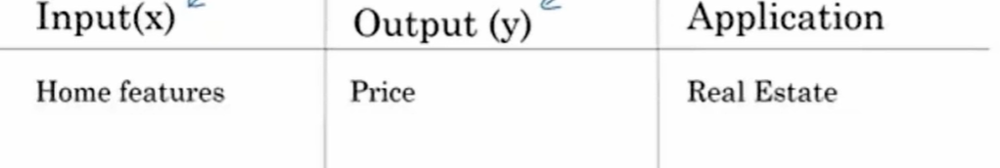
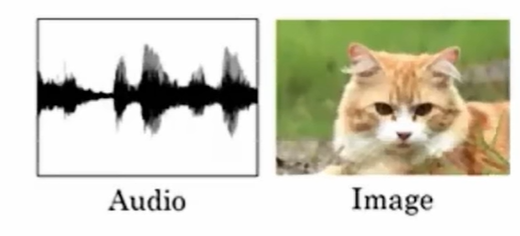
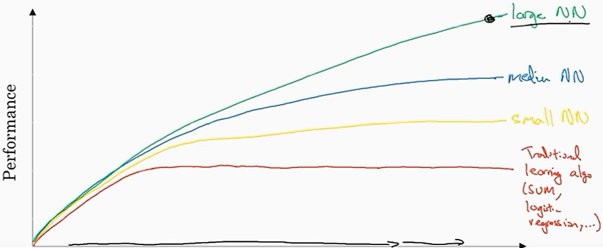
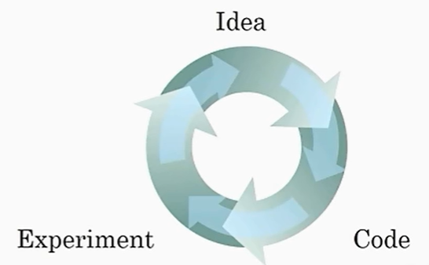

# 深度学习

> [深度学习-吴恩达](https://www.bilibili.com/video/BV1ev4y1U7j2)

## 神经网络

神经网络（`Neural Network`，`NN`）是一种模拟人类大脑工作方式的计算模型，它在深度学习和机器学习领域中扮演着重要角色]。

### 什么是神经网络

- 神经网络，也被称为人工神经网络（ANN），由大量相互关联的节点（或称为“神经元”）组成。这些节点按照分层结构排列，通过加权连接传输和处理数据。
- 神经网络的灵感来自于生物大脑的神经元之间的相互作用。它模拟了神经元之间的信号传递方式，使其能够处理复杂的数据输入并执行各种任务，例如分类、回归、模式识别等。
- 多层神经网络是深度学习算法的基础，因此也被称为深度神经网络。
- 神经网络的目标是通过学习数据来识别模式、分类数据以及预测未来事件。

输入特征 `x` 得到/预测 结果 `y` 

### 神经网络的工作原理

- 神经网络将输入分解为多个抽象层，每一层都由多个神经元组成。
- 每个神经元与其他神经元相连，具有关联的权重和阈值。如果某个神经元的输出高于指定的阈值，它将被激活，并将数据传递到网络的下一层。
- 神经网络依赖于训练数据来学习并提高其准确性。一旦对其准确性进行微调，它们就成为了强大的工具，用于数据分类、聚类和其他任务。
- 例如，Google 的搜索算法就是基于神经网络的。

#### 神经网络的类型

- 感知器是最古老的神经网络，由 `Frank Rosenblatt` 在 1958 年创建。它是神经网络的基本形式。
- 卷积神经网络（CNN）主要用于图像识别、模式识别和计算机视觉。
- 循环神经网络（RNN）用于处理时间序列数据，例如股票市场预测或销售预测。

## 监督学习与神经网络

 在监督学习中，首先输入`x`，然后通过`x`学习到一个函数，最后这个函数能够将`x`映射到`y`。

例如，根据房屋特征`x`去估计房屋的售价`y`：

此外如图片识别、语音识别等。

### 结构化和非结构化数据

#### 什么是结构化数据

结构化数据是基于数据库的数据。每个特征 `x` 都有清晰的定义。

举个例子：在房价预测中，也许会有一个数据库或列表，它将告诉你房屋面积和卧室数量等信息，这就是结构化数据。

#### 什么是非结构化数据

非结构化数据类似于音频、原始音频、图片或文本这种数据，这里特征也许是图片中的像素值或一段文本中的独立单词。

非结构化数据常常比结构化数据的学习要困难得多。

### 深度学习变欢迎的原因

对于传统学习算法处理问题时，在大量工作的效率往往不高或停滞，深度学习缓解了这个问题，提升工作效率，且与原始输入的数据大小成正比，即规模推动深度学习进步。

事实上今天，想要达到高性能，最可靠的方法之一是要么训练一个大网络，要么放更多的数据。然后这个在一定程度后也会达到瓶颈，因为最终你会用光所有数据，或者最终你的网络实在太大了，训练得花很长时间，但是，光是改善规模就足以帮助我们在深度学习里面前进一大步。

深度学习可以视为在**经验 --> 想法 --> 代码实现**进行重复循环。新/好的算法可以加速这一过程。

