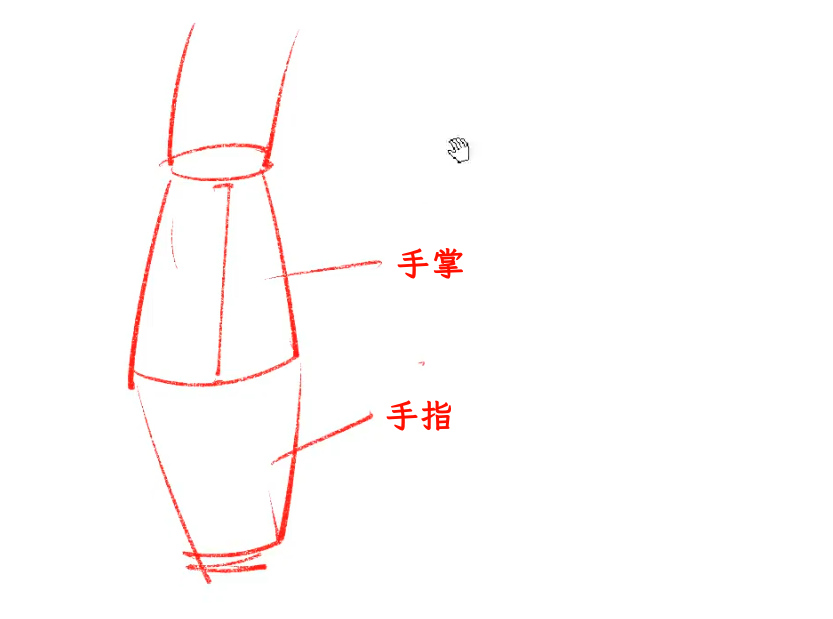
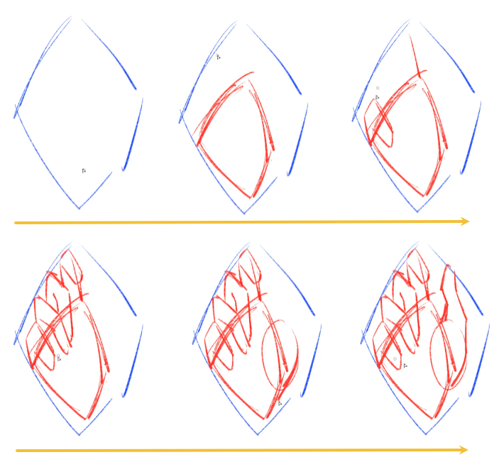
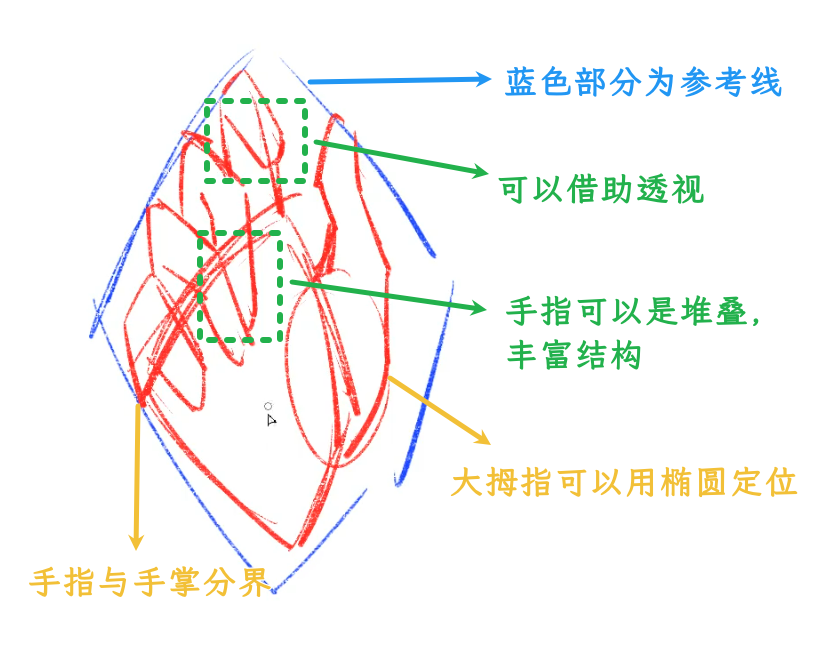
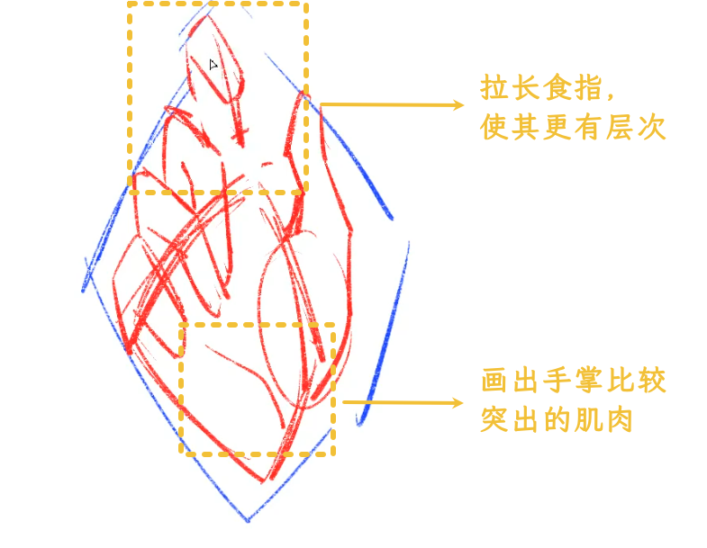
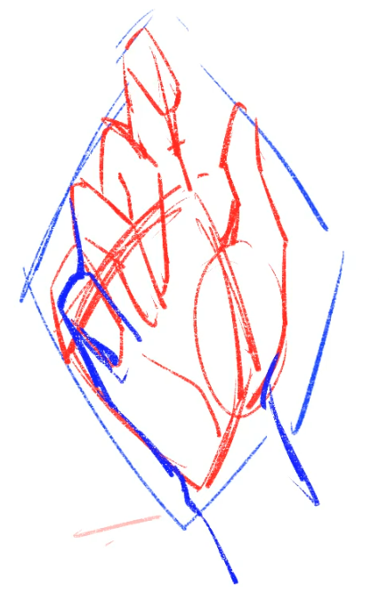
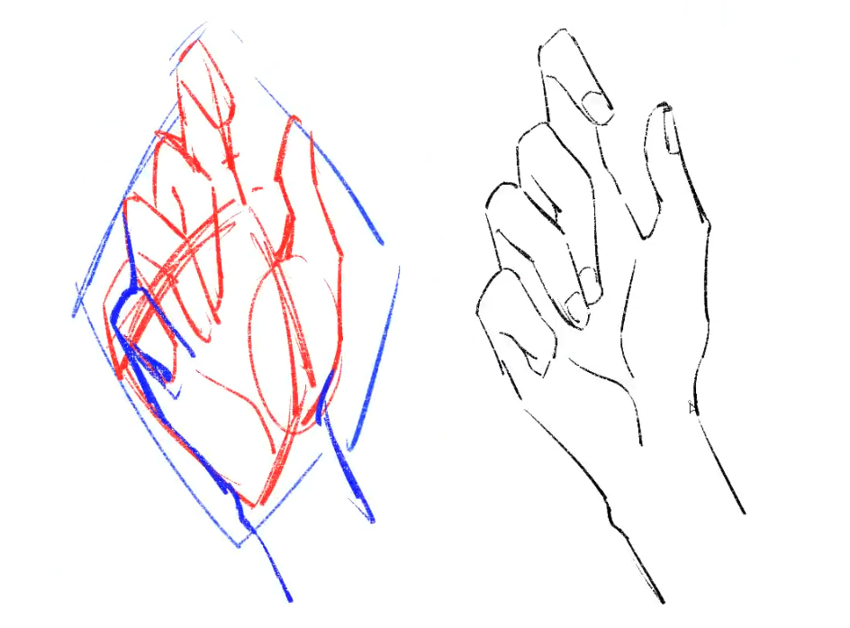
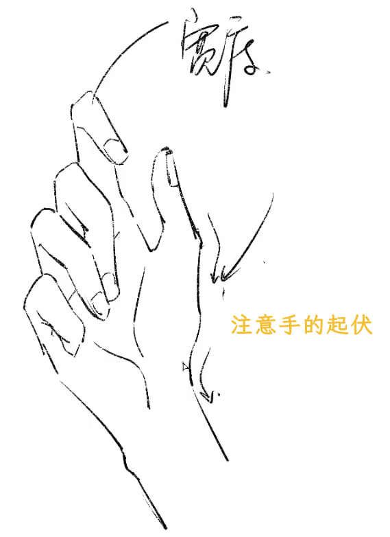
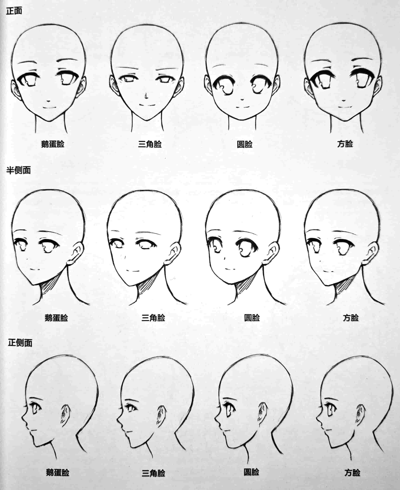

# 绘画

## 新手须知

### 一开始

- 无需在意绘画软件；
- 无需在意绘画数位板，入门即可；
- 无需在意绘画笔刷。

### 基本步骤

1. 参：多参照自己喜欢画师的构图、色彩、光影、动作、设计等；
2. 多看：多看画师的画；
3. 会用软件：对自己的工具有充分的理解和使用；
4. 造型/结构训练：即比例、动态、透视、对比、构图等基本要素要正确；

## 人体绘画

### 手

> 画好手

#### 手的结构

> 分三部分

手臂 --> 手掌 --> 手指

正常情况下：手掌的长度和手指的长度是一样的。

新手要多多注意手的结构，例如大拇指的位置等。

:::tip 提示

如果对手没有概念，可以对着真实的图片/插图去多看，多多注意透视关系、连接结构等。

:::

#### 示例

优化一下：

   画出手臂，并优化位置：

:::tip 提示

可以边画边优化。

:::

调低透明度，画出线稿：

:::tip 提示

- 多多找参考，不能只想像；

- 注意手部关节等比的宽度、厚度；

- 注意手部的骨骼、肌肉的起伏；

  

:::

### 脸

#### 常见脸型

一般来说，脸型分鹅蛋脸、三角脸、圆脸、方脸。

