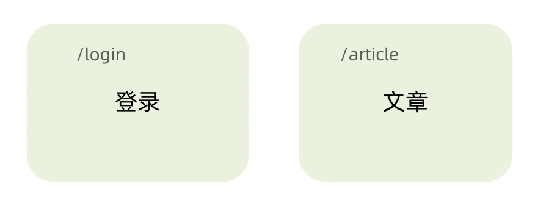
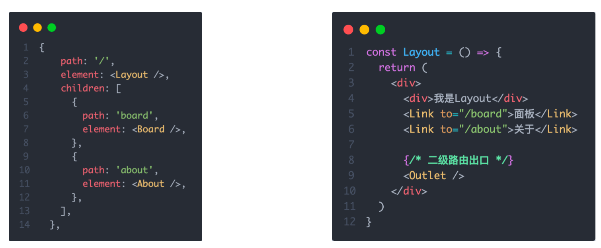
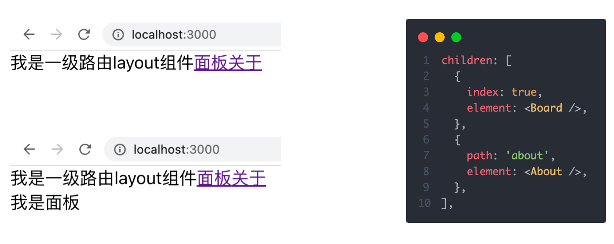
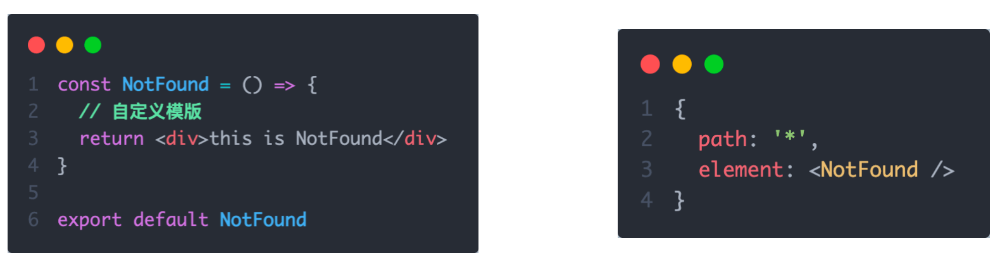

# React 路由

## 路由快速上手

### 什么是前端路由

一个路径 `path` 对应一个组件 `component` 当我们在浏览器中访问一个 `path` 的时候，`path` 对应的组件会在页面中进行渲染


### 创建路由开发环境

```bash
# 使用CRA创建项目
npm create-react-app react-router-pro

# 安装最新的ReactRouter包
npm i react-router-dom

# 启动项目
npm run start
```

### 快速开始



```jsx
import React from 'react'
import ReactDOM from 'react-dom/client'

const router = createBrowserRouter([
  {
    path:'/login',
    element: <div>登录</div>
  },
  {
    path:'/article',
    element: <div>文章</div>
  }
])

ReactDOM.createRoot(document.getElementById('root')).render(
  <RouterProvider router={router}/>
)
```

## 抽象路由模块


## 路由导航

### 什么是路由导航

路由系统中的多个路由之间需要进行路由跳转，并且在跳转的同时有可能需要传递参数进行通信


### 声明式导航

> 声明式导航是指通过在模版中通过 `<Link/> ` 组件描述出要跳转到哪里去，比如后台管理系统的左侧菜单通常使用这种方式进行


语法说明：通过给组件的 `to` 属性指定要跳转到路由 `path`，组件会被渲染为浏览器支持的 `a` 链接，如果需要传参直接通过字符串拼接的方式拼接参数即可

### 编程式导航

编程式导航是指通过 `useNavigate` 钩子得到导航方法，然后通过调用方法以命令式的形式进行路由跳转，比如想在登录请求完毕之后跳转就可以选择这种方式，更加灵活


语法说明：通过调用navigate方法传入地址path实现跳转

## 导航传参


## 嵌套路由配置

### 什么是嵌套路由

在一级路由中又内嵌了其他路由，这种关系就叫做嵌套路由，嵌套至一级路由内的路由又称作二级路由，例如：


### 嵌套路由配置

> 实现步骤
>
>     1. 使用 `children`属性配置路由嵌套关系  
>     2. 使用 `<Outlet/>` 组件配置二级路由渲染位置



### 默认二级路由

当访问的是一级路由时，默认的二级路由组件可以得到渲染，只需要在二级路由的位置去掉 `path`，设置 `index` 属性为 `true`



### 404路由配置

场景：当浏览器输入 `url` 的路径在整个路由配置中都找不到对应的 `path`，为了用户体验，可以使用 `404` 兜底组件进行渲染

实现步骤：

1. 准备一个 `NotFound` 组件
2. 在路由表数组的末尾，以 `*` 号作为路由 `path` 配置路由



### 俩种路由模式

各个主流框架的路由常用的路由模式有俩种，`history` 模式和 `hash` 模式, `ReactRouter` 分别由 `createBrowerRouter` 和 `createHashRouter` 函数负责创建

| 路由模式  | `url` 表现    | 底层原理                          | 是否需要后端支持 |
| --------- | ------------- | --------------------------------- | ---------------- |
| `history` | `url/login`   | `history` 对象 + `pushState` 事件 | 需要             |
| `hash`    | `url/#/login` | 监听 `hashChange` 事件            | 不需要           |