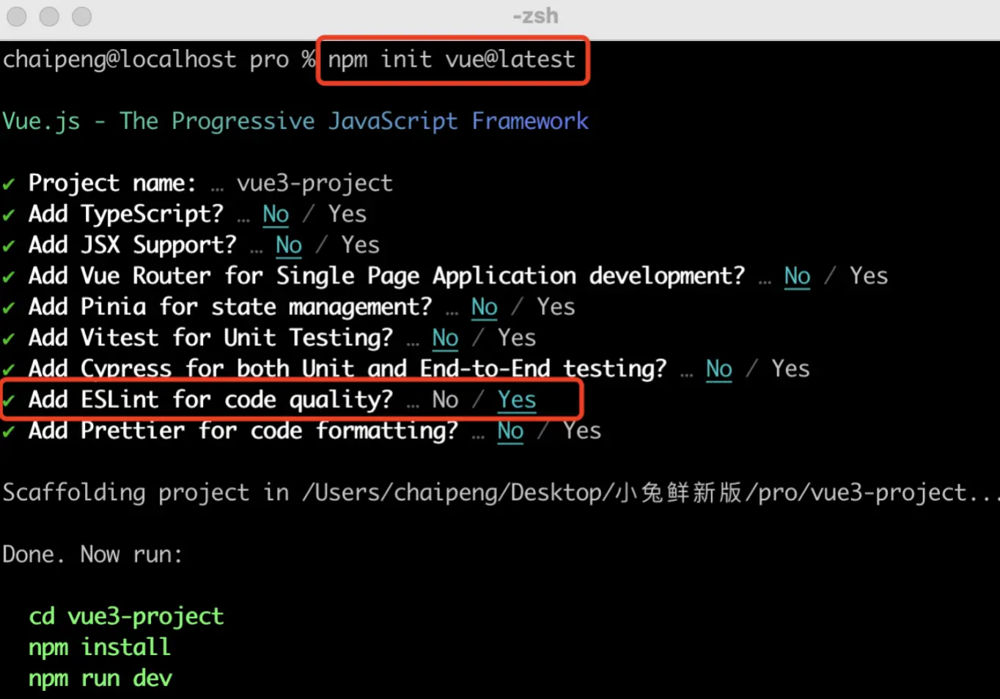
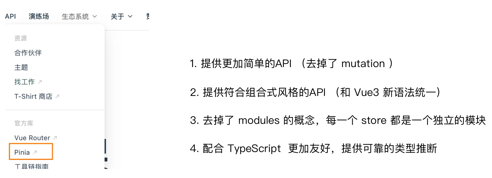
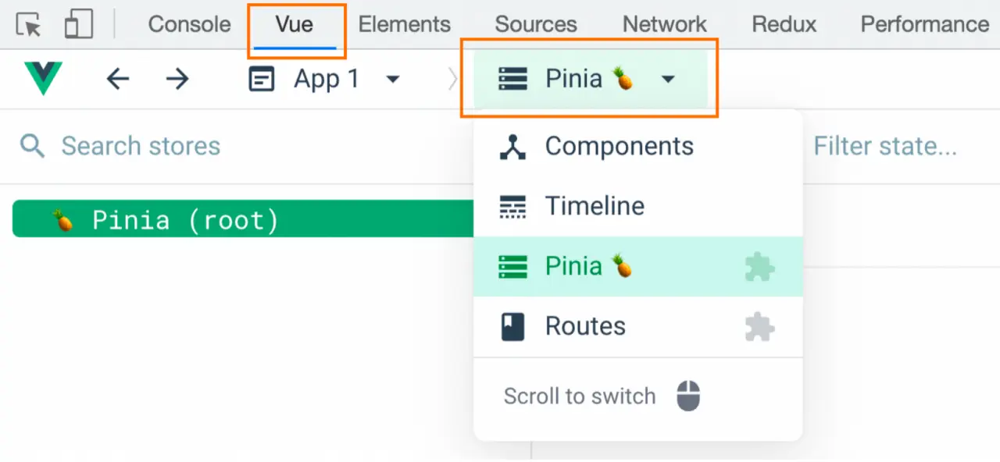

# Vue

> [Vue 官方文档](https://cn.vuejs.org/guide/introduction.html)
>
> 笔记来自 [黑马程序员](https://www.itheima.com/)

:::warning 提示 ⚠️

本教程使用 [Pnpm](https://pnpm.io/zh/) 进行包管理，请提前下载。

:::

## 选项式 vs  组合式

```vue
<script>
export default {
  data(){
    return {
      count:0
    }
  },
  methods:{
    addCount(){
      this.count++
    }
  }
}
</script>
```

```vue
<script setup>
import { ref } from 'vue'
const count = ref(0)
const addCount = ()=> count.value++
</script>
```

特点：

- 代码量变少；
- 分散式维护变成集中式维护。

## create-vue 搭建项目

### create-vue

> `create-vue` 是 `Vue` 官方新的脚手架工具，底层切换到了 `vite` （下一代前端工具链），为开发提供极速响应

### 使用 create-vue 创建项目

> 前置条件 - 已安装 `16.0` 或更高版本的 `Node.js`

执行如下命令，这一指令将会安装并执行 `create-vue`

```bash
pnpm create vue@latest
```



## 熟悉项目和关键文件


## setup 选项

### setup 选项的写法和执行时机

写法

```vue
<script>
  export default {
    setup(){
    
    },
    beforeCreate(){
    
    }
  }
</script>
```

执行时机

> 在 `beforeCreate` 钩子之前执行


### setup 中写代码的特点

> 在 `setup` 函数中写的数据和方法需要在末尾以对象的方式 `return`，才能给模版使用

```vue
<script>
  export default {
    setup(){
      const message = 'this is message'
      const logMessage = ()=>{
        console.log(message)
      }
      // 必须return才可以
      return {
        message,
        logMessage
      }
    }
  }
</script>
```

### `<script setup>` 语法糖

> `script` 标签添加 `setup` 标记，不需要再写导出语句，默认会添加导出语句

```vue
<script setup>
  const message = 'this is message'
  const logMessage = ()=>{
    console.log(message)
  }
</script>
```

## reactive 和 ref 函数

### reactive

> 接受对象类型数据的参数传入并返回一个响应式的对象

```vue
<script setup>
 // 导入
 import { reactive } from 'vue'
 // 执行函数 传入参数 变量接收
 const state = reactive({
   msg:'this is msg'
 })
 const setSate = ()=>{
   // 修改数据更新视图
   state.msg = 'this is new msg'
 }
</script>

<template>
  {{ state.msg }}
  <button @click="setState">change msg</button>
</template>
```

### ref

> 接收简单类型或者对象类型的数据传入并返回一个响应式的对象

```vue
<script setup>
 // 导入
 import { ref } from 'vue'
 // 执行函数 传入参数 变量接收
 const count = ref(0)
 const setCount = ()=>{
   // 修改数据更新视图必须加上.value
   count.value++
 }
</script>

<template>
  <button @click="setCount">{{count}}</button>
</template>
```

### reactive 对比 ref

1. 都是用来生成响应式数据
2. 不同点

   - `reactive` 不能处理简单类型的数据
   - `ref` 参数类型支持更好，但是必须通过 `.value` 做访问修改
   - `ref` 函数内部的实现依赖于 `reactive` 函数
3. 在实际工作中的推荐

   - 推荐使用 `ref` 函数，减少记忆负担。

## computed

```vue
<script setup>
// 导入
import {ref, computed } from 'vue'
// 原始数据
const count = ref(0)
// 计算属性
const doubleCount = computed(()=>count.value * 2)

// 原始数据
const list = ref([1,2,3,4,5,6,7,8])
// 计算属性list
const filterList = computed(item=>item > 2)
</script>
```

## watch

> 侦听一个或者多个数据的变化，数据变化时执行回调函数，俩个额外参数 `immediate` 控制立刻执行，`deep` 开启深度侦听

### 侦听单个数据

```vue
<script setup>
  // 1. 导入watch
  import { ref, watch } from 'vue'
  const count = ref(0)
  // 2. 调用watch 侦听变化
  watch(count, (newValue, oldValue)=>{
    console.log(`count发生了变化，老值为${oldValue},新值为${newValue}`)
  })
</script>
```

### 侦听多个数据

> 侦听多个数据，第一个参数可以改写成数组的写法

```vue
<script setup>
  // 1. 导入watch
  import { ref, watch } from 'vue'
  const count = ref(0)
  const name = ref('cp')
  // 2. 调用watch 侦听变化
  watch([count, name], ([newCount, newName],[oldCount,oldName])=>{
    console.log(`count或者name变化了，[newCount, newName],[oldCount,oldName])
  })
</script>
```

### immediate

> 在侦听器创建时立即出发回调，响应式数据变化之后继续执行回调

```vue
<script setup>
  // 1. 导入watch
  import { ref, watch } from 'vue'
  const count = ref(0)
  // 2. 调用watch 侦听变化
  watch(count, (newValue, oldValue)=>{
    console.log(`count发生了变化，老值为${oldValue},新值为${newValue}`)
  },{
    immediate: true
  })
</script>
```

### deep

> 通过watch监听的ref对象默认是浅层侦听的，直接修改嵌套的对象属性不会触发回调执行，需要开启deep

```vue
<script setup>
  // 1. 导入watch
  import { ref, watch } from 'vue'
  const state = ref({ count: 0 })
  // 2. 监听对象state
  watch(state, ()=>{
    console.log('数据变化了')
  })
  const changeStateByCount = ()=>{
    // 直接修改不会引发回调执行
    state.value.count++
  }
</script>

<script setup>
  // 1. 导入watch
  import { ref, watch } from 'vue'
  const state = ref({ count: 0 })
  // 2. 监听对象state 并开启deep
  watch(state, ()=>{
    console.log('数据变化了')
  },{deep:true})
  const changeStateByCount = ()=>{
    // 此时修改可以触发回调
    state.value.count++
  }
</script>

```

## 生命周期函数

### 选项式对比组合式

|      选项式API      |    组合式API    |
| :------------------: | :-------------: |
| beforeCreate/created |      setup      |
|     beforeMount     |  onBeforeMount  |
|       mounted       |    onMounted    |
|     beforeUpdate     | onBeforeUpdate |
|       updated       |    onUpdated    |
|    beforeUnmount    | onBeforeUnmount |
|      unmounted      |   onUnmounted   |

### 生命周期函数基本使用

> 1. 导入生命周期函数
> 2. 执行生命周期函数，传入回调

```vue
<script setup>
import { onMounted } from 'vue'
onMounted(()=>{
  // 自定义逻辑
})
</script>
```

### 执行多次

> 生命周期函数执行多次的时候，会按照顺序依次执行

```vue
<script setup>
import { onMounted } from 'vue'
onMounted(()=>{
  // 自定义逻辑
})

onMounted(()=>{
  // 自定义逻辑
})
</script>
```

## 父子通信

### 父传子

> - 父组件中给子组件绑定属性
> - 子组件内部通过 `props` 选项接收数据

父组件

```vue
<script setup>
  //引入子组件
  import sonComVue from'./son-com.vue'
</script>

<template>
  <!--1.绑定属性 message -->
  <sonComVue message="this is app message"/>
</template>
```

子组件

```vue
<script setup>
  //2.通过defineProps“编译器宏”接收子组件传递的数据
  const props = defineProps({
      message: String
  }) 
</script>

<template>
  {{ message }}
</template>
```

### 子传父

> - 父组件中给子组件标签通过 `@` 绑定事件
> - 子组件内部通过 `emit` 方法触发事件

父组件

```vue
<script setup>
  // 引入子组件
  import sonComVue from './son-com.vue"
  const getMessage = (msg) =>{
    console.log(msg)
  }
</script>

<template>
  <!-- 1．绑定自定义事件 -->
  <sonComVue @get-message="getMessage" />
</template>
```

子组件

```vue
<script setup>
  // 2.通过defineEmits编译器宏生成emit方法
  const emit = defineEmits(['get-message'])
  const sendMsg = () => {
      // 3.触发自定义事件并传递参数 
      emit('get-message'，'this is son msg')
  }
</script>

<template>
  <button @click="sendMsg">sendMsg</button>
</template>
```

## 模版引用

> 概念：通过 `ref` 标识 获取真实的 `dom` 对象或者组件实例对象

### 基本使用

实现步骤：

1. 调用 `ref` 函数生成一个 `ref` 对象
2. 通过 `ref` 标识绑定 `ref` 对象到标签

```vue
<script setup>
  import { ref } from 'vue'
  // 1． 调用ref函数得到ref对象
  const h1Ref = ref(null)
</script>

<template>
  <!-- 2． 通过ref标识绑定ref对象 -->
  <h1 ref="h1Ref">我是dom标签h1</h1>
</template>
```

### defineExpose

> 默认情况下在 `<script setup>` 语法糖下组件内部的属性和方法是不开放给父组件访问的，可以通过 `defineExpose` 编译宏指定哪些属性和方法容许访问
> 说明：指定 `testMessage` 属性可以被访问到

```vue
<script setup>
import {ref} from 'vue'
const testMessage = ref('this is test msg')
defineExpose({
    testMessage
})
</script>
```

## provide 和 inject

### 作用和场景

> 顶层组件向任意的底层组件传递数据和方法，实现跨层组件通信

### 跨层传递普通数据

实现步骤：

1. 顶层组件通过 `provide` 函数提供数据
2. 底层组件通过 `inject` 函数提供数据

顶层组件

```js
provide('key'，顶层组件中的数据)
```

底层组件

```js
const message = inject('key')
```

:::tip 提示

`key` 需要相同。

:::

### 跨层传递响应式数据

顶层组件

```js
provide('key'，ref对象)
```

底层组件

```js
const message = inject('key')
```

> 在调用 `provide` 函数时，第二个参数设置为 `ref` 对象

### 跨层传递方法

> 顶层组件可以向底层组件传递方法，底层组件调用方法修改顶层组件的数据

顶层组件

```js
const setCount = () => {
    count.value++
}

provide('setCount-key', setCount)
```

底层组件

```js
const setCount = inject('setCount-key')
```

## defineOptions

背景说明：

    有`<script setup>` 之前，如果要定义 `props`，`emits` 可以轻而易举地添加一个与 `setup` 平级的属性。但是用了 `<script setup>` 后，就没法这么干了 `setup` 属性已经没有了，自然无法添加与其平级的属性。

    为了解决这一问题，引入了`defineProps` 与 `defineEmits` 这两个宏。但这只解决了 `props` 与 `emits` 这两个属性。如果我们要定义组件的 `name` 或其他自定义的属性，还是得回到最原始的用法——再添加一个普通的 `<script>` 标签。这样就会存在两个 `<script>` 标签。让人无法接受。

    所以在`Vue 3.3` 中新引入了 `defineOptions` 宏。顾名思义，主要是用来定义 `Options API` 的选项。可以用 `defineOptions` 定义任意的选项， `props`，`emits`，`expose`，`slots` 除外（因为这些可以使用 `defineXXX` 来做到）

```vue
<scriptt setup>
defineoptions({
    name: 'Foo',
    inheritAttrs: false,
    // ..．更多自定义属性
})
</script>
```

## defineModel

在 `Vue3` 中，自定义组件上使用 `v-model`, 相当于传递一个 `modelValue` 属性，同时触发 `update:modelValue` 事件

```vue
<Child v-model="isVisible"/>
// 相当于 
<Child :modelValue="isVisible" @update:modelValue="isVisible=$event"/>
```

我们需要先定义 `props`，再定义 `emits` 。其中有许多重复的代码。如果需要修改此值，还需要手动调用 `emit` 函数。

于是乎 `defineModel` 诞生了。

```vue
<script setup>
    const modelValue = defineModel()
    modelValue.value++
</script>
```

生效需要配置 `vite.config.js`

```js
import { fileURLToPath, URL } from 'node:url'

import { defineConfig } from 'vite'
import vue from '@vitejs/plugin-vue'

// https://vitejs.dev/config/
export default defineConfig({
  plugins: [
    vue({
      script: {
        defineModel: true
      }
    }),
  ],
  resolve: {
    alias: {
      '@': fileURLToPath(new URL('./src', import.meta.url))
    }
  }
})
```

## Pinia 状态管理

### 什么是 Pinia

`Pinia` 是 `Vue` 的专属的最新状态管理库 ，是 `Vuex` 状态管理工具的替代品


### 添加 Pinia 到 Vue 项目

后面在实际开发项目的时候，`Pinia` 可以在项目创建时自动添加，现在我们初次学习，从零开始：

1. 使用 Vite 创建一个空的 Vue3项目

```bash
  pnpm add vite@latest
```

2. 按照官方文档安装 `pinia` 到项目中

### Pinia 基础使用

1. 定义 `store`
2. 组件使用 `store`

定义 `Store` (`state` + `action`)

```js
import { ref, computed } from 'vue'
import { defineStore } from 'pinia'

export const useCounterStore = defineStore('counter', () => {
  const count = ref(0)
  const doubleCount = computed(() => count.value * 2)
  function increment() {
    count.value++
  }

  return { count, doubleCount, increment }
})
```

组件使用 `Store`

```vue
<script setup>
  // 1.导入useCounterStore方法
  import { useCounterStore } from '@/stores/counter'
  // 2.执行方法得到counterStore对象
  const counterStore = useCounterStore()
</script>

<template>
  <button @click="counterStore.increment">
    {{ counterStore.count }}
  </button>
</template>
```

### getters 实现

`Pinia` 中的 `getters` 直接使用 `computed` 函数 进行模拟，组件中需要使用需要把 `getters` `return` 出去

```js
// 数据（state)
const count = ref(0)

// getter

const doubleCount = computed(() => count.value * 2)
```

### action 异步实现

方式：异步 `action` 函数的写法和组件中获取异步数据的写法完全一致

- 接口地址：[http://geek.itheima.net/v1_0/channels](http://geek.itheima.net/v1_0/channels)
- 请求方式：`get`
- 请求参数：无

```js
// 异步action
const getList = async ()=>{
    const res = await axios.request<接口数据类型>({})
}
```

需求：在 `Pinia` 中获取频道列表数据并把数据渲染 `App` 组件的模板中

### storeToRefs 工具函数

使用 `storeToRefs` 函数可以辅助保持数据（`state` + `getter`）的响应式解构

```js
// 响应式丢失视图不再更新
const { count, doubleCount } = counterStore

// 保持数据响应式
const { count, doubleCount } = storeToRefs(counterStore)
```

### Pinia的调试

`Vue` 官方的 `dev-tools` 调试工具对 `Pinia` 直接支持，可以直接进行调试


### Pinia持久化插件

> 官方文档：[https://prazdevs.github.io/pinia-plugin-persistedstate/zh/](https://prazdevs.github.io/pinia-plugin-persistedstate/zh/)

1. 安装插件 `pinia-plugin-persistedstate`

   ```sh
   pnpm add pinia-plugin-persistedstate
   ```
2. 使用 `main.js`

   ```js
   import persist from 'pinia-plugin-persistedstate'
   // ...
   app.use(createPinia().use(persist))
   ```
3. 配置 `store/counter.js`

   ```js
   import { defineStore } from 'pinia'
   import { computed, ref } from 'vue'

   export const useCounterStore = defineStore('counter', () => {
     // ...
     return {
       count,
       doubleCount,
       increment
     }
   }, {
     persist: true
   })
   ```
4. 其他配置，看官网文档即可
