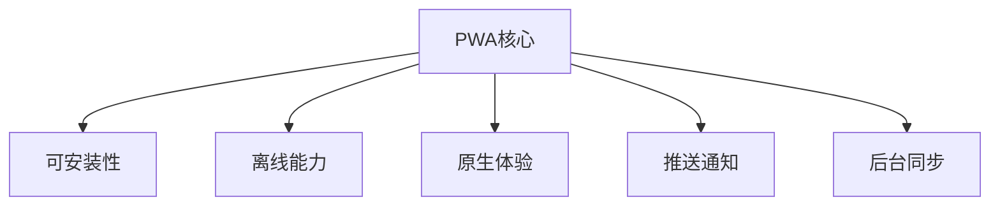

# 渐进式 Web 应用

## 一、核心特征



## 二、技术实现体系

### 1. Web App Manifest

```json
{
    "name": "Progressive Notes",
    "short_name": "PNotes",
    "start_url": "/?launcher=true",
    "display": "standalone",
    "background_color": "#2F3BA2",
    "theme_color": "#3F51B5",
    "orientation": "portrait-primary",
    "icons": [
        {
            "src": "/icons/icon-72x72.png",
            "sizes": "72x72",
            "type": "image/png",
            "purpose": "any"
        },
        {
            "src": "/icons/icon-512x512.png",
            "sizes": "512x512",
            "type": "image/png",
            "purpose": "maskable"
        }
    ],
    "screenshots": [
        {
            "src": "/screenshots/1.png",
            "sizes": "1080x1920",
            "type": "image/png"
        }
    ]
}
```

### 2. Service Worker架构

```javascript
// 生命周期管理
self.addEventListener("install", (e) => {
    e.waitUntil(
        caches.open("v1").then((cache) => {
            return cache.addAll(["/", "/styles/main.css", "/scripts/app.js", "/images/logo.svg"]);
        })
    );
});

self.addEventListener("fetch", (e) => {
    const strategy = new CacheFirst({
        cacheName: "runtime-cache",
        plugins: [
            new ExpirationPlugin({
                maxEntries: 50,
                maxAgeSeconds: 24 * 60 * 60, // 1天
            }),
        ],
    });
    e.respondWith(strategy.handle({ request: e.request }));
});
```

## 三、离线策略矩阵

| 策略类型 | 适用场景 | 实现方式                                            |
| -------- | -------- | --------------------------------------------------- |
| 缓存优先 | 静态资源 | `cache.addAll()` 预缓存                             |
| 网络优先 | 实时数据 | `fetch().then(networkResponse)`                     |
| 混合模式 | 动态内容 | `cache.match().then(cached => cached \|\| fetch())` |
| 失效更新 | 版本控制 | `caches.delete(oldCache)`                           |

## 四、高级能力实现

### 1. 后台同步

```javascript
// 注册同步任务
navigator.serviceWorker.ready.then((reg) => {
    reg.sync.register("sync-notes").then(() => {
        console.log("后台同步已注册");
    });
});

// Service Worker处理
self.addEventListener("sync", (event) => {
    if (event.tag === "sync-notes") {
        event.waitUntil(syncNotes());
    }
});
```

### 2. 推送通知

```javascript
// 请求权限
Notification.requestPermission().then((perm) => {
    if (perm === "granted") {
        navigator.serviceWorker.ready.then((reg) => {
            reg.pushManager.subscribe({
                userVisibleOnly: true,
                applicationServerKey: VAPID_PUBLIC_KEY,
            });
        });
    }
});

// 处理推送
self.addEventListener("push", (e) => {
    const data = e.data.json();
    self.registration.showNotification(data.title, {
        body: data.body,
        icon: "/icons/notification.png",
        vibrate: [200, 100, 200],
    });
});
```

## 五、性能优化指标

1. **核心指标**
    - 首次有效绘制 (FCP) < 1.8s
    - 最大内容绘制 (LCP) < 2.5s
    - 累计布局偏移 (CLS) < 0.1
    - 交互响应时间 < 100ms

2. **优化手段**
    - 预加载关键资源

    ```html
    <link rel="preload" href="critical.css" as="style" />
    ```

    - 代码分割

    ```javascript
    import('./module.js').then(module => {...});
    ```

    - 资源优化

    ```bash
    imagemin *.png --out-dir=optimized
    ```

## 六、调试工具链

1. **Chrome DevTools**
    - Application面板：查看Service Workers、Cache Storage
    - Lighthouse审计：PWA评分检测

2. **Workbox CLI**

    ```bash
    workbox generateSW workbox-config.js
    workbox injectManifest workbox-config.js
    ```

3. **测试矩阵**

| 测试项目 | 工具                       | 验证标准               |
| -------- | -------------------------- | ---------------------- |
| 离线功能 | Puppeteer                  | 断网状态可访问核心功能 |
| 安装性   | Web App Manifest Validator | 包含所有必填字段       |
| 性能     | WebPageTest                | Speed Index < 3.5s     |

## 七、安全规范

1. **强制要求**
    - 必须使用HTTPS（localhost除外）
    - 设置Content Security Policy

    ```http
    Content-Security-Policy: default-src 'self'
    ```

2. **安全头配置**
    ```nginx
    add_header Strict-Transport-Security "max-age=63072000";
    add_header X-Content-Type-Options "nosniff";
    ```

## 八、跨平台策略

### iOS适配方案

```html
<meta name="apple-mobile-web-app-capable" content="yes" />
<meta name="apple-mobile-web-app-status-bar-style" content="black-translucent" />
<link rel="apple-touch-icon" href="/icons/apple-icon-180x180.png" />
```

### Windows适配

```xml
<meta name="msapplication-config" content="/browserconfig.xml">
```

## 九、版本更新策略

```javascript
// 检测更新
const registerNewWorker = () => {
    navigator.serviceWorker.register("/sw.js").then((reg) => {
        reg.addEventListener("updatefound", () => {
            const newWorker = reg.installing;
            newWorker.addEventListener("statechange", () => {
                if (newWorker.state === "installed") {
                    showUpdateNotification();
                }
            });
        });
    });
};
```

## 十、未来演进方向

1. **新标准**
    - Web Share API（文件共享）
    - Web Bluetooth（设备连接）
    - File System Access API

2. **性能突破**
    - WebAssembly集成
    - WebGPU加速
    - Portals API实现无缝页面过渡

> **升级建议**：定期使用[PWA Builder](https://www.pwabuilder.com/)检测兼容性，保持对最新API标准的跟踪。
