# Redux

> [中文官网](https://cn.redux.js.org/)

## 介绍

Redux 是React最常用的集中状态管理工具，类似于 Vue 中的Pinia（Vuex），可以独立于框架运行
作用：通过集中管理的方式管理应用的状态

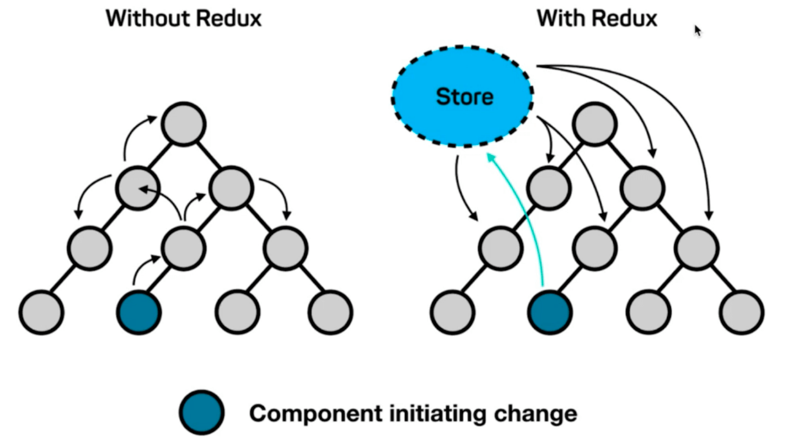
**为什么要使用Redux？**

1. 独立于组件，无视组件之间的层级关系，简化通信问题
2. 单项数据流清晰，易于定位 `bug`
3. 调试工具配套良好，方便调试

### Redux快速体验

#### 实现计数器

需求：不和任何框架绑定，不使用任何构建工具，使用纯 Redux 实现计数器

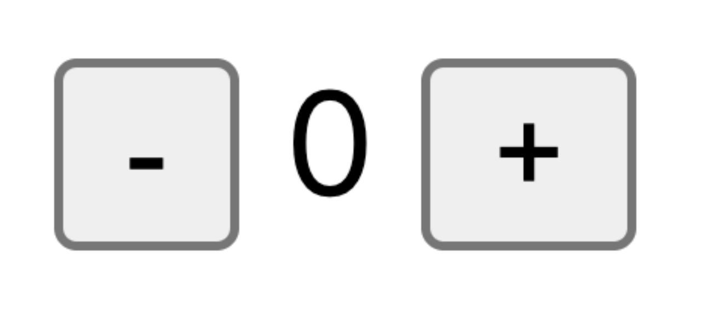
使用步骤：

1. 定义一个 `reducer` 函数 （根据当前想要做的修改返回一个新的状态）
2. 使用 `createStore` 方法传入 `reducer` 函数 生成一个 `store` 实例对象
3. 使用 `store` 实例的 `subscribe` 方法 订阅数据的变化（数据一旦变化，可以得到通知）
4. 使用 `store` 实例的 `dispatch` 方法提交 `action` 对象 触发数据变化（告诉 `reducer` 你想怎么改数据）
5. 使用 `store` 实例的 `getState` 方法 获取最新的状态数据更新到视图中

代码实现：

```html
<button id="decrement">-</button>
<span id="count">0</span>
<button id="increment">+</button>

<script src="https://unpkg.com/redux@latest/dist/redux.min.js"></script>

<script>
    // 定义reducer函数
    // 内部主要的工作是根据不同的action 返回不同的state
    function counterReducer(state = { count: 0 }, action) {
        switch (action.type) {
            case "INCREMENT":
                return { count: state.count + 1 };
            case "DECREMENT":
                return { count: state.count - 1 };
            default:
                return state;
        }
    }
    // 使用reducer函数生成store实例
    const store = Redux.createStore(counterReducer);

    // 订阅数据变化
    store.subscribe(() => {
        console.log(store.getState());
        document.getElementById("count").innerText = store.getState().count;
    });
    // 增
    const inBtn = document.getElementById("increment");
    inBtn.addEventListener("click", () => {
        store.dispatch({
            type: "INCREMENT",
        });
    });
    // 减
    const dBtn = document.getElementById("decrement");
    dBtn.addEventListener("click", () => {
        store.dispatch({
            type: "DECREMENT",
        });
    });
</script>
```

#### Redux 数据流架构

Redux 的难点是理解它对于数据修改的规则, 下图动态展示了在整个数据的修改中，数据的流向

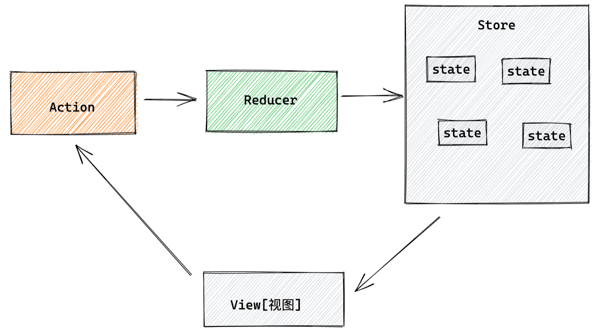
为了职责清晰，Redux 代码被分为三个核心的概念，我们学 Redux，其实就是学这三个核心概念之间的配合，三个概念分别是:

1. `state`：一个对象 存放着我们管理的数据
2. `action`：一个对象 用来描述你想怎么改数据
3. `reducer`：一个函数 根据action的描述更新state

## Redux与React

### 环境准备

Redux 虽然是一个框架无关可以独立运行的插件，但是社区通常还是把它与 React 绑定在一起使用，以一个计数器案例体验一下 Redux + React 的基础使用

#### 配套工具

在 React 中使用 Redux，官方要求安装俩个其他插件 - Redux Toolkit 和 react-redux

1. Redux Toolkit（RTK）- 官方推荐编写Redux逻辑的方式，是一套工具的集合集，简化书写方式

2. react-redux - 用来 链接 Redux 和 React组件 的中间件

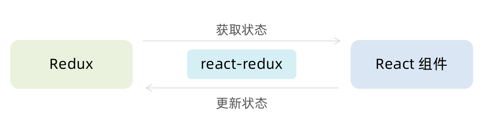

#### 配置基础环境

1. 使用 CRA 快速创建 React 项目

    ```bash
    npx create-react-app react-redux
    ```

2. 安装配套工具

    ```bash
    npm i @reduxjs/toolkit  react-redux
    ```

3. 启动项目

    ```bash
    npm run start
    ```

#### store目录结构设计

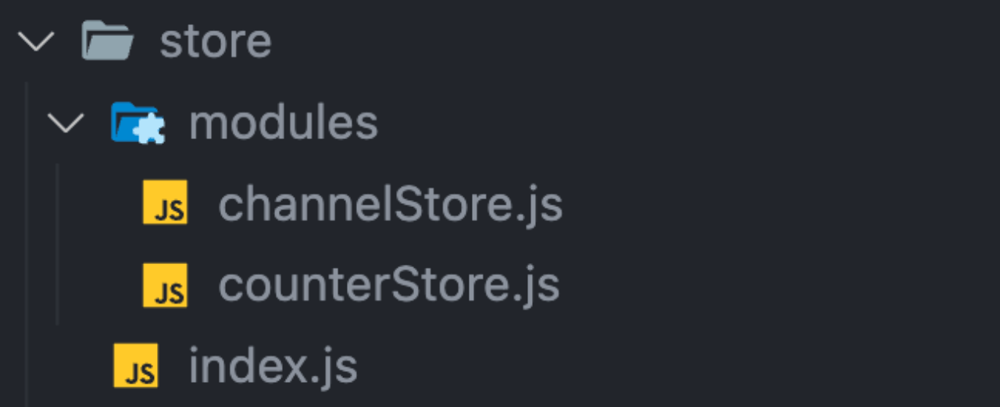

1. 通常集中状态管理的部分都会单独创建一个单独的 `store` 目录

2. 应用通常会有很多个子 `store` 模块，所以创建一个 `modules` 目录，在内部编写业务分类的子 `store`

3. `store` 中的入口文件 `index.js` 的作用是组合 `modules` 中所有的子模块，并导出 `store`

### 实现 counter

#### 整体路径熟悉


#### 使用React Toolkit 创建 counterStore

```javascript
import { createSlice } from "@reduxjs/toolkit";

const counterStore = createSlice({
    // 模块名称独一无二
    name: "counter",
    // 初始数据
    initialState: {
        count: 1,
    },
    // 修改数据的同步方法
    reducers: {
        increment(state) {
            state.count++;
        },
        decrement(state) {
            state.count--;
        },
    },
});
// 结构出actionCreater
const { increment, decrement } = counter.actions;

// 获取reducer函数
const counterReducer = counterStore.reducer;

// 导出
export { increment, decrement };
export default counterReducer;
```

```javascript
import { configureStore } from "@reduxjs/toolkit";

import counterReducer from "./modules/counterStore";

export default configureStore({
    reducer: {
        // 注册子模块
        counter: counterReducer,
    },
});
```

#### 为React注入store

`react-redux` 负责把 Redux 和 React 链接 起来，内置 `Provider` 组件 通过 `store` 参数把创建好的 `store` 实例注入到应用中，链接正式建立

```jsx
import React from "react";
import ReactDOM from "react-dom/client";
import App from "./App";
// 导入store
import store from "./store";
// 导入store提供组件Provider
import { Provider } from "react-redux";

ReactDOM.createRoot(document.getElementById("root")).render(
    // 提供store数据
    <Provider store={store}>
        <App />
    </Provider>
);
```

#### React 组件使用 store 中的数据

在 React 组件中使用 `store` 中的数据，需要用到一个钩子函数 - `useSelector`，它的作用是把 `store` 中的数据映射到组件中，使用样例如下：

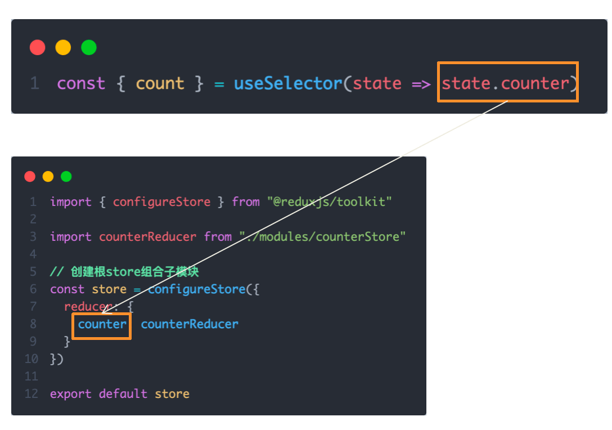

#### React 组件修改 store 中的数据

React 组件中修改 `store` 中的数据需要借助另外一个 `hook` 函数 - `useDispatch`，它的作用是生成提交 `action` 对象的`dispatch` 函数，使用样例如下：

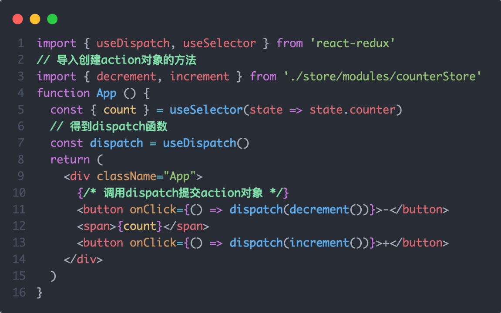

### 提交action传参

#### 需求

组件中有俩个按钮 `add to 10` 和 `add to 20` 可以直接把 `count` 值修改到对应的数字，目标 `count` 值是在组件中传递过去的，需要在提交 `action` 的时候传递参数

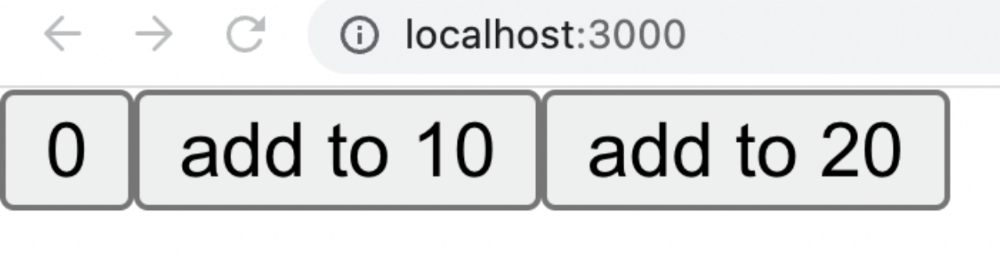

#### 实现方式

在 `reducers` 的同步修改方法中添加 `action` 对象参数，在调用 `actionCreater` 的时候传递参数，参数会被传递到 `action` 对象 `payload` 属性上

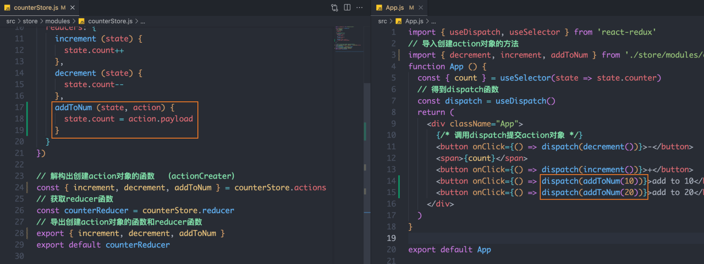

### 异步 action 处理

#### 需求理解

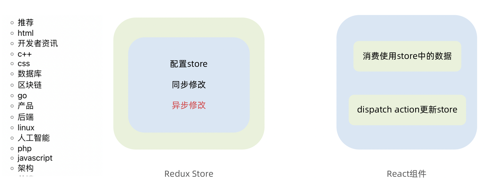

#### 实现步骤

1. 创建 `store` 的写法保持不变，配置好同步修改状态的方法
2. 单独封装一个函数，在函数内部return一个新函数，在新函数中
    1. 封装异步请求获取数据
    2. 调用同步 `actionCreater` 传入异步数据生成一个 `action` 对象，并使用 `dispatch` 提交
3. 组件中 `dispatch` 的写法保持不变

#### 代码实现

> 测试接口地址： [http://geek.itheima.net/v1_0/channels](http://geek.itheima.net/v1_0/channels')

```javascript
import { createSlice } from "@reduxjs/toolkit";
import axios from "axios";

const channelStore = createSlice({
    name: "channel",
    initialState: {
        channelList: [],
    },
    reducers: {
        setChannelList(state, action) {
            state.channelList = action.payload;
        },
    },
});

// 创建异步
const { setChannelList } = channelStore.actions;
const url = "http://geek.itheima.net/v1_0/channels";
// 封装一个函数 在函数中return一个新函数 在新函数中封装异步
// 得到数据之后通过dispatch函数 触发修改
const fetchChannelList = () => {
    return async (dispatch) => {
        const res = await axios.get(url);
        dispatch(setChannelList(res.data.data.channels));
    };
};

export { fetchChannelList };

const channelReducer = channelStore.reducer;
export default channelReducer;
```

```jsx
import { useEffect } from "react";
import { useSelector, useDispatch } from "react-redux";
import { fetchChannelList } from "./store/channelStore";

function App() {
    // 使用数据
    const { channelList } = useSelector((state) => state.channel);
    useEffect(() => {
        dispatch(fetchChannelList());
    }, [dispatch]);

    return (
        <div className="App">
            <ul>
                {channelList.map((task) => (
                    <li key={task.id}>{task.name}</li>
                ))}
            </ul>
        </div>
    );
}

export default App;
```

## Redux调试 - devtools

Redux 官方提供了针对于 Redux 的调试工具，支持实时 `state` 信息展示，`action` 提交信息查看等

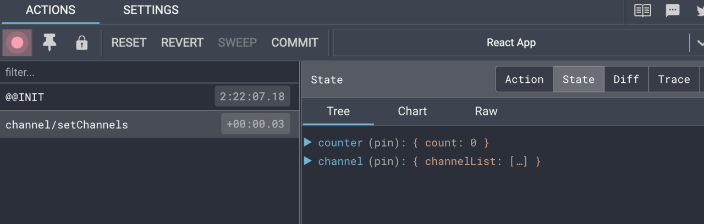
