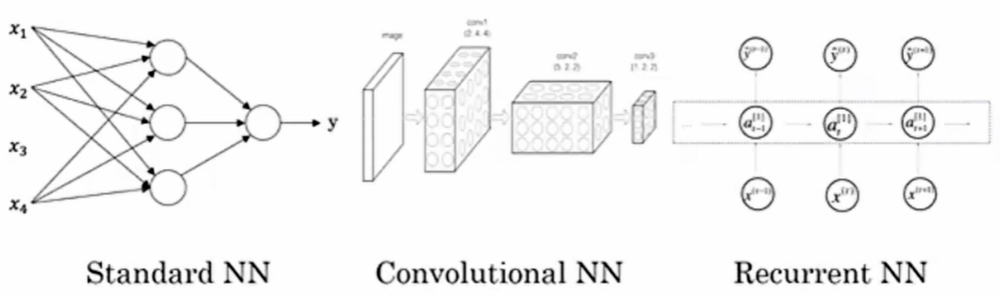
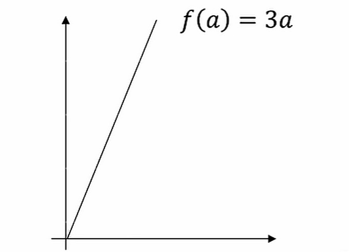

# 深度学习

> [深度学习-吴恩达](https://www.bilibili.com/video/BV1ev4y1U7j2)

## 神经网络

神经网络（`Neural Network`，`NN`）是一种模拟人类大脑工作方式的计算模型，它在深度学习和机器学习领域中扮演着重要角色。

### 什么是神经网络

- 神经网络，也被称为人工神经网络（ANN），由大量相互关联的节点（或称为“神经元”）组成。这些节点按照分层结构排列，通过加权连接传输和处理数据。
- 神经网络的灵感来自于生物大脑的神经元之间的相互作用。它模拟了神经元之间的信号传递方式，使其能够处理复杂的数据输入并执行各种任务，例如分类、回归、模式识别等。
- 多层神经网络是深度学习算法的基础，因此也被称为深度神经网络。
- 神经网络的目标是通过学习数据来识别模式、分类数据以及预测未来事件。

输入特征 `x` 得到/预测 结果 `y` 

### 神经网络的工作原理

- 神经网络将输入分解为多个抽象层，每一层都由多个神经元组成。
- 每个神经元与其他神经元相连，具有关联的权重和阈值。如果某个神经元的输出高于指定的阈值，它将被激活，并将数据传递到网络的下一层。
- 神经网络依赖于训练数据来学习并提高其准确性。一旦对其准确性进行微调，它们就成为了强大的工具，用于数据分类、聚类和其他任务。
- 例如，Google 的搜索算法就是基于神经网络的。

#### 神经网络的类型

- 感知器是最古老的神经网络，由 `Frank Rosenblatt` 在 1958 年创建。它是神经网络的基本形式。
- 卷积神经网络（CNN）主要用于图像识别、模式识别和计算机视觉。
- 循环神经网络（RNN）用于处理时间序列数据，例如股票市场预测或销售预测。

## 监督学习与神经网络

 在监督学习中，首先输入`x`，然后通过`x`学习到一个函数，最后这个函数能够将`x`映射到`y`。

例如，根据房屋特征`x`去估计房屋的售价`y`：

此外如图片识别、语音识别等。

### 结构化和非结构化数据

#### 什么是结构化数据

结构化数据是基于数据库的数据。每个特征 `x` 都有清晰的定义。

举个例子：在房价预测中，也许会有一个数据库或列表，它将告诉你房屋面积和卧室数量等信息，这就是结构化数据。

#### 什么是非结构化数据

非结构化数据类似于音频、原始音频、图片或文本这种数据，这里特征也许是图片中的像素值或一段文本中的独立单词。

非结构化数据常常比结构化数据的学习要困难得多。

### 深度学习变欢迎的原因

对于传统学习算法处理问题时，在大量工作的效率往往不高或停滞，深度学习缓解了这个问题，提升工作效率，且与原始输入的数据大小成正比，即规模推动深度学习进步。

事实上今天，想要达到高性能，最可靠的方法之一是要么训练一个大网络，要么放更多的数据。然后这个在一定程度后也会达到瓶颈，因为最终你会用光所有数据，或者最终你的网络实在太大了，训练得花很长时间，但是，光是改善规模就足以帮助我们在深度学习里面前进一大步。

深度学习可以视为在**经验 --> 想法 --> 代码实现**进行重复循环。新/好的算法可以加速这一过程。

## 二元分类

深度学习的二元分类是指使用深度神经网络（DNN）进行两类别（二元）问题的分类任务。这类任务通常涉及将输入数据分为两个不同的类别或类别之一的任务。例如，垃圾邮件检测、疾病诊断、图像识别中的二元分类等。

深度学习模型在二元分类任务中通常具有多层次的结构，这些结构可以学习数据中的复杂特征，以便做出正确的分类决策。

## 逻辑回归

逻辑回归是一种常用于二元分类问题的统计学习方法，它虽然带有“回归”一词，但实际上是一种分类算法。逻辑回归模型通过将线性函数与逻辑函数（也称为sigmoid函数）组合来进行二元分类。

### 逻辑分布

逻辑分布是一种连续型的概率分布，其**分布函数**和**密度函数**分别为：
$$
F(x) = P(X \leq x)=\frac{1}{1+e^{-(x-\mu)/\gamma}} 
$$

$$
f(x) = F^{'}(X \leq x)=\frac{e^{-(x-\mu)/\gamma}}{\gamma(1+e^{-(x-\mu)/\gamma})^{2}}
$$

其中：

- $x$ 是输入的特征值。
- $P(X \leq x)$ 是输入特征值 $x$ 对应的真实类别标签的概率。
- $\mu$ 和 $\gamma$ 是模型的参数，它们可以通过训练数据来学习。

$F(x)$：

$f(x)$：

:::tip 提示

上面图像为近似图像，非真实情况。

:::

逻辑回归模型将输入特征映射到一个概率值，该概率值表示输入特征属于某一类别的概率。通过比较概率值的大小，逻辑回归模型可以进行二元分类预测。

### 逻辑回归

以二分类为例，对于所给数据集假设存在这样的一条直线可以将数据完成线性可分。决策边界可以表示为 $w_1x_1+w_2x_2+b=0$，假设某个样本点 $w_1x_1+w_2x_2+b=0$ 那么可以判断它的类别为 1，这个过程其实是感知机。

逻辑回归还需要加一层，它要找到分类概率 `P(Y=1)` 与输入向量 `x` 的直接关系，然后通过比较概率值来判断类别。

考虑二分类问题，给定数据集：
$$
 D={(x_{1}, y_{1}),(x_{2},y_{2}),\cdots,(x_{N}, y_{N})}, x_{i} \subseteq R^{n}, y_{i} \in {0,1},i=1,2,\cdots,N
$$
考虑到 $w^{T}x+b$ 取值是连续的，因此它不能拟合离散变量。可以考虑用它来拟合条件概率 $p(Y=1|x)$，因为概率的取值也是连续的。

但是对于 𝑤≠0 （若等于零向量则没有什么求解的价值）， $w^{T}x+b$ 取值为 𝑅 ，不符合概率取值为 0 到 1，因此考虑采用广义线性模型。

最理想的是单位阶跃函数：

$$
p(y=1 | x)=\begin{cases} 0,& z\lt 0 \\ 0.5,& z = 0\\ 1,& z\gt 0\ \end{cases} ,\quad z=w^T x+b
$$

但是这个阶跃函数不可微，对数几率函数是一个常用的替代函数：

$$
y = \frac{1}{1+e^{-(w^{T} x + b)}}
$$

于是有：

$$
ln\frac{y}{1 - y} = w^{T}x + b
$$

我们将 y 视为 x 为正例的概率，则 1-y 为 x 为其反例的概率。两者的比值称为**几率（odds）**，指该事件发生与不发生的概率比值，若事件发生的**概率**为 p。则对数几率：

$$
ln(odds) = ln\frac{y}{1 - y}
$$

将 y 视为类后验概率估计，重写公式有：

$$
w^{T} x + b = ln\frac{P(Y=1|x)}{1-P(Y=1|x)}
$$

$$
P(Y=1|x) = \frac{1}{1+e^{-(w^{T} x + b)}}
$$

也就是说，输出 Y=1 的对数几率是由输入 x 的**线性函数**表示的模型，这就是**逻辑回归模型**。当  $w^{T} x + b$ 的值越接近正无穷， $P(Y=1|x)$ 概率值也就越接近 1。因此**逻辑回归的思路**是，先拟合决策边界(不局限于线性，还可以是多项式)，再建立这个边界与分类的概率联系，从而得到了二分类情况下的概率。

### 代价函数

逻辑回归模型的数学形式确定后，剩下就是如何去求解模型中的参数。在统计学中，常常使用极大似然估计法来求解，即找到一组参数，使得在这组参数下，我们的数据的似然度（概率）最大。

设：
$$
\begin{aligned} P(Y=1|x) &= p(x) \\  P(Y=0|x) &= 1- p(x) \end{aligned}
$$
似然函数：
$$
L(w)=\prod[p(x_{i})]^{y_{i}}[1-p(x_{i})]^{1-y_{i}}
$$
为了更方便求解，我们对等式两边同取对数，写成对数似然函数：
$$
 \begin{aligned} L(w)&=\sum[y_{i}lnp(x_{i})+(1-y_{i})ln(1-p(x_{i}))] \\ &=\sum[y_{i}ln\frac{p(x_{i})}{1-p(x_{i})}+ln(1-p(x_{i}))]  \\ &=\sum[y_{i}(w \cdot x_{i}) - ln(1+e^{w \cdot x_{i}})] \end{aligned}
$$
在机器学习中我们有损失函数的概念，其衡量的是模型预测错误的程度。如果取整个数据集上的平均对数似然损失，我们可以得到：
$$
J(w)=-\frac{1}{N}lnL(w)
$$
即在逻辑回归模型中，我们**最大化似然函数**和**最小化损失函数**实际上是等价的。

## 梯度回归

> 梯度 `logistic`

### 损失函数

损失函数(`loss function`)或代价函数(`cost function`)来度量预测错误程度。

机器学习算法中**有一类算法**就是产生一条曲线来拟合现有的数据，这样子就可以实现预测未来的数据，这个专业术语叫做回归。 **还有另外一种类**似也是产生一条曲线，但是这个曲线时用来将点分隔成两块，实现分类，在这个曲线一侧为一类另外一侧算一类。 算法产生的拟合曲线效果质量判断：误差，即预测值减去真实值最后取绝对值。
产生的拟合曲线并不是完全和现有的点重合，拟合曲线和真实值之间有一个误差。一个算法不同参数会产生不同拟合曲线，也意味着有不同的误差。 **损失函数就是一个自变量为算法的参数，函数值为误差值的函数。梯度下降就是找让误差值最小时候这个算法对应的参数。**

也就是说，对于一个机器学习算法，如何评价一个算法是否是比较好的算法，需要提前定义一个损失函数，来判断这个算法是否是最优的，而后面不断的优化求梯度下降，使得损失函数最小，应该也是为了让一个算法达到意义上的最优。

### 梯度下降

**梯度下降就是用来求某个函数最小值时自变量对应取值。**这个函数名字叫做损失函数（`cost/loss function`），直白点就是误差函数。一个算法不同参数会产生不同拟合曲线，也意味着有不同的误差。 **损失函数就是一个自变量为算法的参数，函数值为误差值的函数。梯度下降就是找让误差值最小时候算法取的参数。**

1. **梯度就是导数**
2. **梯度下降作用**是找到函数的最小值所对应的自变量的值（曲线最低点对应x的值）。**记住我们目的是为了找x.**
3. **梯度下降含义（具体操作）是：**改变x的值使得导数的绝对值变小，当导数小于0时候（情况1），我们要让目前x值大一点点，再看它导数值。当导数大于0时候（情况2），我们要让目前x值减小一点点，再看它导数值。**当导数接近0时候，我们就得到想要的自变量x了。也就是说找到这个算法最佳参数**，使得拟合曲线与真实值误差最小。

全局最优解或者接近全局最优解的地方就是函数的最低点。

## 导数

### 导数示例

一个函数$f(a) = 3a$，它是一条直线。下面我们来简单理解下导数。让我们看看函数中几个点，假定a = 6，那么是的3倍等于6，也就是说如果a = 2，那么函数$f(a) = 6$。假定稍微改变一点点的值，只增加一点，变为2.001，这时将向右做微小的移动。0.001的差别实在是太小了，不能在图中显示出来，我们把它右移一点，现在等于的3倍是6.003，画在图里，比例不太符合。请看绿色高亮部分的这个小三角形，如果向右移动0.001，那么$f(a)$增加0.003，$f(a)$的值增加3倍于右移的，因此我们说函数$f(a)$在a = 2，是这个导数的斜率，或者说，当a = 2时，斜率是3。导数这个概念意味着斜率，导数听起来是一个晦涩难懂的词，但是斜率以一种很友好的方式来描述导数这个概念。所以提到导数，我们把它当作函数的斜率就好了。更正式的斜率定义为在下图这个绿色的小三角形中，高除以宽。即斜率等于0.003除以0.001，等于3。或者说导数等于3，这表示当你将a右移0.001，$f(a)$的值增加3倍水平方向的量。

### 更多导数示例

画一个函数 $f(a)= a^2$，如果 $a = 2$ 的话，那么 $f(a) = 4$。让我们稍稍往右推进一点点，现在 ，则$f(a) = 4$（如果你用计算器算的话，这个准确的值应该为4.004。0.001 我只是为了简便起见，省略了后面的部分），如果你在这儿画，一个小三角形，你就会发现，如果把往右移动0.001，那么$f(a)$将增大四倍，即增大0.004。在微积分中我们把这个三角形斜边的斜率，称为 $f(a)$ 在点 $a = 2$ 处的导数(即为4)，或者写成微积分的形式，当 $a = 2$ 的时候， 由此可知，函数$f(a) = a^2$，在取不同值的时候，它的斜率是不同的，这和上个视频中的例子是不同的。

函数 $f(a) = a^2$ 的斜率（即导数）为 $2a$。这意味着任意给定一点 $a$，如果你稍微将 $a$，增大0.001，那么你会看到 $f(a)$ 将增大 $2a$，即增大的值为点在 $a$ 处斜率或导数，乘以你向右移动的距离。

### 总结

导数就是斜率，而函数的斜率，在一条直线上，任何点它的斜率都是相同的。但是在曲线上，斜率是变化的，所以它们的导数或者斜率，不同的点处是不同的。

## 计算图

可以说，一个神经网络的计算，都是按照前向或反向传播过程组织的。首先我们计算出一个新的网络的输出（前向过程），紧接着进行一个反向传输操作。后者我们用来计算出对应的梯度或导数。计算图解释了为什么我们用这种方式组织这些计算过程。让我们举一个比逻辑回归更加简单的，或者说不那么正式的神经网络的例子。

我们尝试计算函数 $J$ ，是由三个变量 $a , b , c$  组成的函数，这个函数是 $3(a + bc)$ 。计算这个函数实际上有三个不同的步骤，首先是计算 b  乘以 c ，我们把它储存在变量 u 中，因此 $u = bc$； 然后计算   $v = a + u$；最后输出 $J = 3v$，这就是要计算的函数 $J$ 。我们可以把这三步画成如下的计算图，我先在这画三个变量 a , b , c ，第一步就是计算 $u = bc$，我在这周围放个矩形框，它的输入是 b , c ，接着第二步 $v = a + u$ ，最后一步 $J = 3v$ 。 举个例子: $a = 5 , b = 3 , c = 2$ ， $u = bc$ 就是6， ， $v = a + u$ 就是5+6=11。 $J$ 是3倍的 ，因此。即 $3∗(5+3∗2)$ 。如果你把它算出来，实际上得到33就是 $J$ 的值。 当有不同的或者一些特殊的输出变量时，例如本例中的 $J$ 和逻辑回归中你想优化的代价函数 $J$ ，因此计算图用来处理这些计算会很方便。从这个小例子中我们可以看出，通过一个从左向右的过程，你可以计算出的 $J$ 值。为了计算导数，从右到左（红色箭头，和蓝色箭头的过程相反）的过程是用于计算导数最自然的方式。

## 计算图的导数计算

在理清一下流程图的描述，看看你如何利用它计算出函数的导数。

下面用到的公式：
$$
\frac{dJ}{du}=\frac{dJ}{dv}\frac{dv}{du},\ \frac{dJ}{db}=\frac{dJ}{du}\frac{du}{db},\ \frac{dJ}{da}=\frac{dJ}{du}\frac{du}{da}
$$
流程图如下：

