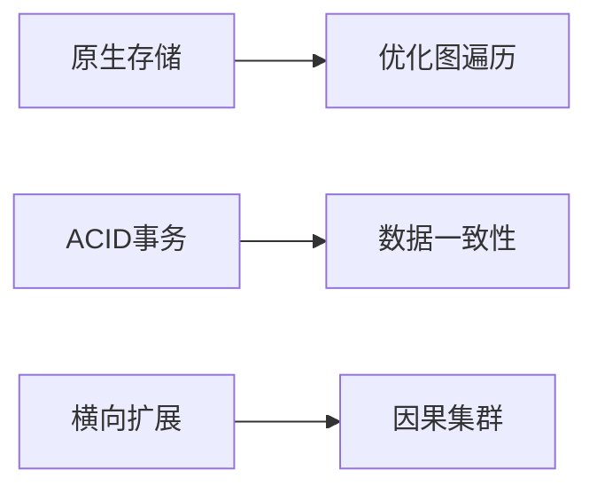

# Neo4j 使用指南

## 第一章：核心概念

### 1.1 什么是Neo4j？

- 高性能的NOSQL图形数据库
- 数据以网络结构存储而非表格
- 支持ACID事务特性
- 主要组件：节点(Node)、关系(Relationship)、属性(Property)

### 1.2 架构特性



### 1.3 核心优势

```cypher
// 示例：创建带属性的节点
CREATE (dept:Dept {
  deptno:10,
  dname:"Accounting",
  location:"Hyderabad"
})
```

- 直观表达关联数据
- 毫秒级关联查询
- 支持复杂网络分析
- 灵活的数据模型

## 第二章：安装配置

### 2.1 环境要求

- 推荐CentOS 7+
- Java 8+运行环境
- 最新版本下载：

```bash
wget https://neo4j.com/artifact.php?name=neo4j-community-3.4.1-unix.tar.gz
```

### 2.2 远程访问配置

```properties
# 配置文件路径：conf/neo4j.conf
# 3.0+版本配置
dbms.connectors.default_listen_address=0.0.0.0
```

## 第三章：CQL核心语法

### 3.1 数据操作命令

| 命令   | 功能                    | 示例                               |
| ------ | ----------------------- | ---------------------------------- |
| CREATE | 创建节点/关系           | `CREATE (e:Employee)`              |
| MATCH  | 查询数据                | `MATCH (e:Employee) RETURN e`      |
| WHERE  | 条件过滤                | `WHERE e.salary > 50000`           |
| MERGE  | 存在则返回/不存在则创建 | `MERGE (gp:GoogleProfile{Id:201})` |

### 3.2 高级查询

```cypher
// 多条件查询
MATCH (e:Employee)
WHERE e.name = 'Alice' OR e.dept = 'IT'
RETURN e.empid, e.name

// 分页查询
MATCH (e:Employee)
RETURN e
SKIP 5
LIMIT 10
```

## 第四章：索引与约束

### 4.1 索引管理

```cypher
CREATE INDEX ON :Customer(name)  -- 创建索引
DROP INDEX ON :Customer(name)    -- 删除索引
```

### 4.2 唯一约束

```cypher
CREATE CONSTRAINT ON (cc:CreditCard)
ASSERT cc.number IS UNIQUE
```

## 第五章：Spring集成

### 5.1 实体定义

```java
@NodeEntity(label = "Employee")
public class Employee {
    @Id @GeneratedValue
    private Long id;
    @Property(name = "name")
    private String name;
}
```

### 5.2 复杂查询

```java
@Query("MATCH (n:Employee)-[r:WORKS_IN]->(d:Dept) WHERE d.name = {0} RETURN n")
List<Employee> findByDepartment(String deptName);
```

## 第六章：管理维护

### 6.1 备份恢复

```bash
# 备份
./neo4j-admin dump --database=graph.db --to=/backup/neo4j.dump

# 恢复
./neo4j-admin load --from=/backup/neo4j.dump --database=graph.db --force
```

### 6.2 性能优化

```properties
# 配置JVM内存
dbms.memory.heap.initial_size=4g
dbms.memory.heap.max_size=8g
dbms.memory.pagecache.size=10g
```

## 附录：常用函数速查

| 类型   | 函数        | 说明         |
| ------ | ----------- | ------------ |
| 字符串 | UPPER()     | 转大写       |
| 聚合   | COUNT()     | 计数         |
| 关系   | STARTNODE() | 获取起始节点 |
| 时间   | timestamp() | 获取时间戳   |
