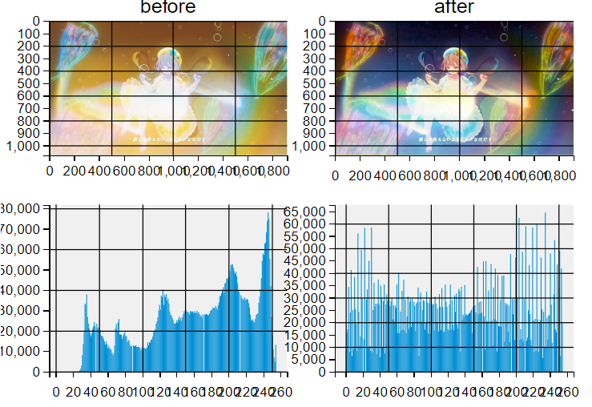

# 常用数据分析与可视化工具

## NumPy库介绍与应用

### numpy概述

1. Numerical Python，数值的Python，补充了Python语言所欠缺的数值计算能力。
2. Numpy是其它数据分析及机器学习库的底层库。
3. Numpy完全标准C语言实现，运行效率充分优化。
4. Numpy开源免费、快速、方便。

### 导入numpy

```python
import numpy as np
```

### 创建数组（array）

我们可以通过传递一个 `python` 列表，使用方法 `np.array()` 创建一个 NumPy 数组。


在很多场景下，我们希望 NumPy 能够帮我们初始化数组。

NumPy 提供了一些方法，比如 `ones(), zeros(), random.random()`。 我们只需要提供数组大小，如图：


```python
# 方式一
# 使用array函数从常规Python列表或元组中创建数组。得到的数组的类型是从Python列表中元素的类型推导出来的。
a = np.array([1,2,3,4])
print(a)  # [1 2 3 4]

b = np.array(range(10))
print(b)  # [0 1 2 3 4 5 6 7 8 9]

# 一个常见的错误，就是调用array的时候传入多个数字参数，而不是提供单个数字的列表类型作为参数。
# a = np.array(1,2,3,4)    # WRONG
a = np.array([1,2,3,4])  # RIGHT
print(a)  # [1 2 3 4]

# 方式二
#  NumPy提供了一个类似于range的函数，该函数返回数组array而不是列表list,
import numpy as np
c = np.arange(10)
print(c)  # [0 1 2 3 4 5 6 7 8 9]
list_c=list(range(10))
print(list_c)  # [0, 1, 2, 3, 4, 5, 6, 7, 8, 9]

# 方式三
#  zero方法或ones方法
import numpy as np
arry01=np.zeros((3))
print(arry01)
print('----------')
arry02=np.zeros((2,3))
print(arry02)
print('----------')
arry02=np.ones((2,3))
print(arry02)

# 输出
# [0. 0. 0.]
# ----------
# [[0. 0. 0.]
#  [0. 0. 0.]]
# ----------
# [[1. 1. 1.]
#  [1. 1. 1.]]
```

### 数组的形状

NumPy的数据结构为：`ndarray(N-Dimensional Array)`


```python
import numpy as np
# 一维数组
t1 = np.arange(12)
print(t1)  # [0 1 2 3 4 5 6 7 8 9 10 11]
print(t1.shape)  # (12,)
```

```python
import numpy as np
# 二维数组
t2 = np.array([[1,2,3],[4,5,6]])
print(t2)
# [[1 2 3]
#  [4 5 6]]
print(t2.shape)  # (2, 3)
```

```python
import numpy as np
# 三维数组
t3 = np.array([[[1,2,3],[4,5,6]],[[7,8,9],[10,11,12]]])
print(t3)
#  [[[ 1  2  3]
#   [ 4  5  6]]
#  [[ 7  8  9]
#   [10 11 12]]]
print(t3.shape)  # (2, 2, 3)
```

在大部分场合，处理一个新的维度只需要在 NumPy 的函数上参数上增加一个维度：

比如， `np.ones((4, 3, 2))` 将会打印如下：


```python
#举个例子
import numpy as np
arr_1= np.ones((4, 3, 2))
print(arr_1)

# [[[1. 1.]
#   [1. 1.]
#   [1. 1.]]
#  [[1. 1.]
#   [1. 1.]
#   [1. 1.]]

#  [[1. 1.]
#   [1. 1.]
#   [1. 1.]]

#  [[1. 1.]
#   [1. 1.]
#   [1. 1.]]]
```

### 数组维度操作

在高级的场合，可能需要变换矩阵的维度。机器学习中，常见。 比如当一个特定的模型需要一个一个特定维度的矩阵，而你的数据集的输入数据维度不一样的时候。

NumPy的reshape() 函数就变得有用了。 你只需指定你需要的新的矩阵的维度即可。你还可以通过将维度指定为 -1，NumPy 可以依据矩阵推断出正确的维度。


```python
import numpy as n
a = np.arange(1, 9)
print(a)        # [1 2 3 4 5 6 7 8]
b = a.reshape(2, 4) #变为2行4列的二维数组
print(b)  # [[1 2 3 4] [5 6 7 8]]
c = b.reshape(2, 2, 2) # 变为2页2行2列的三维数组
print(c)
# [[[1 2]
#   [3 4]]
#  [[5 6]
#   [7 8]]]
```

```python
import numpy as np
c = np.array([[1,2,3,4], [5,6,7,8]])
print(c)
# [[1 2 3 4]
#  [5 6 7 8]]
e = c.flatten()
print(e)  # [1 2 3 4 5 6 7 8]
```

```python
import numpy as np
a = np.array([[1,2,3,4], [5,6,7,8]])
print(a)
# [[1 2 3 4]
#  [5 6 7 8]]
a.resize(2, 2, 2)
print(a)
# [[[1 2]
#  [3 4]]

# [[5 6]
#  [7 8]]]
```

```python
import numpy as np
# 三维数组中的形状(2,3,4)表示2个块数据，3行数据，4列数据
t5 = np.arange(24)
print(t5)
print('-------------------------')
t5 = t5.reshape((2,3,4))
print(t5)
```

输出：

```txt
[0 1 2 3 4 5 6 7 8 9 10 11 12 13 14 15 16 17 18 19 20 21 22 23]
-------------------------
[[[ 0  1  2  3]
  [ 4  5  6  7]
  [ 8  9 10 11]]

 [[12 13 14 15]
  [16 17 18 19]
  [20 21 22 23]]]
```

```python
t5 = t5.reshape((4,6))
print(t5)
```

输出

```
[[ 0  1  2  3  4  5]
 [ 6  7  8  9 10 11]
 [12 13 14 15 16 17]
 [18 19 20 21 22 23]]
```

### 数组的计算

我们首先创建两个 NumPy 数组，一个是 data 数组，一个是 ones数组。


他们按照位置顺序（比如每行的值）相加，data + ones。


不只有加法，我们还可以以如下方式去计算：


计算一个数组和一个数字的操作（也称作对向量和标量的操作）。


可以看到 NumPy 的乘法机制是对每一个单元都进行计算，称作 广播（broadcast）机制。

### 索引/切片

我们可以对 NumPy 数组进行索引或者切片，就像对 python 列表一样的操作：

> - Numpy数组是同质数组，即所有元素的数据类型必须相同。
> - Numpy数组的下标从0开始，最后一个元素的下标为数组长度减1，同python的列表。


### 对于多维数组

数组对象 `[…, 页号, 行号, 列号]`

下标从0开始，到数组len-1结束。

```python
import numpy as np
a = np.array([[[1, 2],
               [3, 4]],
              [[5, 6],
               [7, 8]]])
print(a)
print('-------------------')
# print(a[0])
# print('-------------------')
# print(a[0][0])
# print('-------------------')
print(a[0][0][0])
```

输出：

```txt
[[[1 2]
  [3 4]]

 [[5 6]
  [7 8]]]
-------------------
1
```

```python
import numpy as np
a = np.arange(1, 10)
print(a)
print('----------------------')
# print(a[0:3])
# print(a[3:6])
# print(a[6:])
# print(a[::-1])
print(a[-4:-1])
```

输出：

```
[1 2 3 4 5 6 7 8 9]
----------------------
[6 7 8]
```

```python
import numpy as np
a = np.arange(1, 10)
print(a)
print('----------------------')
# print(a[::])
# print(a[:])
# print(a[::3])
print(a[1::3])
```

输出：

```
[1 2 3 4 5 6 7 8 9]
----------------------
[2 5 8]
```

```python
import numpy as np
a = np.arange(1, 10)
a = a.reshape(3,3)
print(a)
print('----------------------')
# print(a[0:3])
# print(a[::])
# print('----------------------')
print(a[::-1])
```

输出：

```
[[1 2 3]
 [4 5 6]
 [7 8 9]]
----------------------
[[7 8 9]
 [4 5 6]
 [1 2 3]]
```

```python
import numpy as np
a = np.arange(1, 28)
a.resize(3,3,3)
print(a)
print('----------------------')
# 切出索引为1的模块
print(a[1, :, :])
print('----------------------')
```

输出：

```txt
[[[ 1  2  3]
  [ 4  5  6]
  [ 7  8  9]]

 [[10 11 12]
  [13 14 15]
  [16 17 18]]

 [[19 20 21]
  [22 23 24]
  [25 26 27]]]
----------------------
[[10 11 12]
 [13 14 15]
 [16 17 18]]
----------------------
```

```python
import numpy as np
a = np.arange(1, 28)
a.resize(3,3,3)
print(a)
print('----------------------')
# #切出所有模块的索引为1行
# print(a[:, 1, :])
# print('----------------------')
#切出0模块的1行1列
print(a[0, :, 1])
```

输出：

```
[[[ 1  2  3]
  [ 4  5  6]
  [ 7  8  9]]

 [[10 11 12]
  [13 14 15]
  [16 17 18]]

 [[19 20 21]
  [22 23 24]
  [25 26 27]]]
----------------------
[2 5 8]
```

### numpy读取本地数据

np.loadtxt(fname, dtype=float, comments='#', delimiter=None,converters=None, skiprows=0, usecols=None, unpack=False,ndmin=0, encoding='bytes', max_rows=None)

> - `loadtxt`：从文本文件中读取内容
> - `fname`：文件的位置
> - `dtype`：数据读取后指定数据的类型
> - `delimiter`：数据的分隔符，例如在csv中是逗号
> - `skiprows`：跳过哪一行，例如csv中第一行是标题，我们也可以跳过第一行
> - `usecols`：我们要使用哪些列，索引，元组类型
> - `unpack`：表示转置

```python
import numpy as np
us_file_path = "USvideos.csv"
t1 = np.loadtxt(us_file_path,delimiter=",")
# 当数据比较大的时候会用科学计数法
print(t1)
```

输出：

```
[[2.400000e+01 4.394029e+06 3.200530e+05 5.931000e+03 4.624500e+04]
 [2.800000e+01 7.860119e+06 1.858530e+05 2.667900e+04 0.000000e+00]
 [2.200000e+01 5.845909e+06 5.765970e+05 3.977400e+04 1.707080e+05]
 ...
 [1.000000e+01 1.429080e+05 7.088000e+03 6.800000e+01 4.370000e+02]
 [2.400000e+01 2.453200e+04 2.148000e+03 7.700000e+01 0.000000e+00]
 [2.800000e+01 1.440390e+05 1.574000e+03 5.900000e+01 0.000000e+00]]
```

```python
import numpy as np
us_file_path = "USvideos.csv"
t1 = np.loadtxt(us_file_path,delimiter=",",dtype='int')
print(t1)
```

输出：

```
[[     24 4394029  320053    5931   46245]
 [     28 7860119  185853   26679       0]
 [     22 5845909  576597   39774  170708]
 ...
 [     10  142908    7088      68     437]
 [     24   24532    2148      77       0]
 [     28  144039    1574      59       0]]
```

### numpy数组中数值的修改

```python
# 重新赋值
t1[:,0:2]=0
print(t1)
```

输出：

```
[[     0      0 320053   5931  46245]
 [     0      0 185853  26679      0]
 [     0      0 576597  39774 170708]
 ...
 [     0      0   7088     68    437]
 [     0      0   2148     77      0]
 [     0      0   1574     59      0]]
```

### 数组的拼接/拆分

```python
# 简单的一维数组组合方案
import numpy as np
a = np.arange(1,9)
b = np.arange(9,17)
print(a)
print('------------------------')
print(b)
```

输出：

```
[1 2 3 4 5 6 7 8]
------------------------
[ 9 10 11 12 13 14 15 16]
```

```python
# 把两个数组摞在一起成两行
c = np.row_stack((a, b))
print(c)
```

输出：

```
[[ 1  2  3  4  5  6  7  8]
 [ 9 10 11 12 13 14 15 16]]
```

```python
# 把两个数组组合在一起成两列
d = np.column_stack((a, b))
print(d)
```

输出：

```
[[ 1  9]
 [ 2 10]
 [ 3 11]
 [ 4 12]
 [ 5 13]
 [ 6 14]
 [ 7 15]
 [ 8 16]]
```

```python
# 垂直方向操作
import numpy as np
a = np.arange(1, 7).reshape(2, 3)
b = np.arange(7, 13).reshape(2, 3)
print(a)
print('--------------------------')
print(b)
```

输出：

```
[[1 2 3]
 [4 5 6]]
--------------------------
[[ 7  8  9]
 [10 11 12]]
```

```python
# 垂直方向完成组合操作，生成新数组
c = np.vstack((a, b)) # vertical 垂直的
print(c)
```

输出：

```
[[ 1  2  3]
 [ 4  5  6]
 [ 7  8  9]
 [10 11 12]]
```

```python
# 垂直方向完成拆分操作，生成两个数组
d, e = np.vsplit(c, 2)
print(d)
print('---------------------')
print(e)
```

输出：

```
[[1 2 3]
 [4 5 6]]
---------------------
[[ 7  8  9]
 [10 11 12]]
```

```python
x, y, z, w = np.vsplit(c, 4)
print(x)
print('---------------------')
print(y)
print('---------------------')
print(z)
print('---------------------')
print(w)
```

输出

```
[[1 2 3]]
---------------------
[[4 5 6]]
---------------------
[[7 8 9]]
---------------------
[[10 11 12]]
```

```python
# 水平方向操作
import numpy as np
a = np.arange(1, 7).reshape(2, 3)
b = np.arange(7, 13).reshape(2, 3)
print(a)
print('---------------------------')
print(b)
```

输出：

```
[[1 2 3]
 [4 5 6]]
---------------------------
[[ 7  8  9]
 [10 11 12]]
```

```python
# 水平方向完成组合操作，生成新数组
c = np.hstack((a, b)) # horizontal,水平的
print(c)
```

输出：

```
[[ 1  2  3  7  8  9]
 [ 4  5  6 10 11 12]]
```

```python
# 水平方向完成拆分操作，生成两个数组
d, e = np.hsplit(c, 2)
print(d)
print('-----------------------------')
print(e)
```

输出：

```
[[1 2 3]
 [4 5 6]]
-----------------------------
[[ 7  8  9]
 [10 11 12]]
```

```python
x,y,z = np.hsplit(c, 3)
print(x)
print('-----------------------------')
print(y)
print('-----------------------------')
print(z)
```

输出：

```
[[1 2]
 [4 5]]
-----------------------------
[[ 3  7]
 [ 6 10]]
-----------------------------
[[ 8  9]
 [11 12]]
```

```python
# 多维数组组合与拆分的相关函数
a = np.arange(1, 7).reshape(2, 3)
b = np.arange(7, 13).reshape(2, 3)
print(a)
print('-----------------------')
print(b)
```

输出：

```
[[1 2 3]
 [4 5 6]]
-----------------------
[[ 7  8  9]
 [10 11 12]]
```

```python
# 通过axis作为关键字参数指定组合的方向，取值如下：
# 若待组合的数组都是二维数组：
#   0: 垂直方向组合
#   1: 水平方向组合
# 若待组合的数组都是三维数组：
#   0: 垂直方向组合
#   1: 水平方向组合
#   2: 深度方向组合
c = np.concatenate((a, b), axis=1)
print(c)
```

输出：

```txt
[[ 1  2  3  7  8  9]
 [ 4  5  6 10 11 12]]
```

```python
# 通过axis作为关键字参数指定组合的方向，取值如下：
# 若待组合的数组都是二维数组：
#   0: 垂直方向组合
#   1: 水平方向组合

# 若待组合的数组都是三维数组：
#   0: 垂直方向组合
#   1: 水平方向组合
#   2: 深度方向组合
# 通过给出的数组与要拆分的份数，按照某个方向进行拆分，axis的取值同上
d,e = np.split(c, 2, axis=0)
print(d)
print(e)
```

输出：

```txt
[[1 2 3 7 8 9]]
[[ 4  5  6 10 11 12]]
```

### numpy生成随机数

> `numpy.random.`

| 函数名称                                             | 函数功能                                                | 参数说明                                                                                                                    |
| ---------------------------------------------------- | ------------------------------------------------------- | --------------------------------------------------------------------------------------------------------------------------- |
| `rand(d0, d1, …, dn)`                                | 产生均匀分布的随机数                                    | dn为第n维数据的维度                                                                                                         |
| `randn(d0, d1, …, dn)`                               | 产生标准正态分布随机数                                  | dn为第n维数据的维度                                                                                                         |
| `randint(low[, high, size, dtype])`                  | 产生随机整数                                            | low：最小值；high：最大值；size：数据个数                                                                                   |
| `np.random.seed(n)`                                  | 函数用于生成指定随机数                                  | 参数比喻成“堆”；eg. seed(5)：表示第5堆种子                                                                                  |
| `numpy.random.uniform(low,high,size)`                | 从一个均匀分布[low,high)中随机采样，包含low，不包含high | low: 采样下界，float类型，默认值为0；high: 采样上界，float类型，默认值为1；size: 输出样本数目，为int或元组(tuple)类型       |
| `numpy.random.normal(loc=0.0, scale=1.0, size=None)` | 从正态（高斯）分布中抽取随机样本                        | loc，浮点型数据或者浮点型数据组成的数组，分布的均值（中心）；scale，浮点型数据或者浮点型数据组成的数组 分布的标准差（宽度） |

```python
import numpy as np
# 产生均匀分布的随机数
np.random.rand(2,3)
# array([[0.28352508, 0.69313792, 0.44045372],
#        [0.15686774, 0.54464902, 0.78031476]])
```

```python
# 产生标准正态分布随机数
import numpy as np
np.random.randn(2,3)
# array([[ 0.74505627,  1.97611078, -1.24412333],
#        [-0.62641691, -0.80376609, -2.41908317]])
```

```python
import numpy as np
a = np.random.seed(3)
b = np.random.randn(2,3)
print(b)
# [[1.78862847  0.43650985  0.09649747]
#  [-1.8634927  -0.2773882  -0.35475898]]
```

### numpy中常用统计函数

> - 求和：`t.sum(axis=None)`
> - 均值：`t.mean(a,axis=None)`，受离群点的影响较大
> - 中值：`np.median(t,axis=None)`
> - 最大值：`t.max(axis=None)`
> - 最小值：`t.min(axis=None)`
> - 极值：`np.ptp(t,axis=None)`，即最大值和最小值的差
> - 标准差：`t.std(axis=None)`，衡量一组数据平均值分散程度，反映出数据的波动稳定情况，标准差较大，代表大部分数值和其平均值之间差异较大，波动越大，越不稳定；标准差较小，代表这些数值较接近平均值。

NumPy 提供的另外一个优点是聚合功能。


除了 min, max 和 sum, 还有 mean 可以获取平均值，prod 可以获取所有元素相乘的结果， std 可以获取标准差，等等其他功能。

#### 矩阵聚合

与向量（数组）相同，可以对矩阵进行类似的聚合操作：


而且不仅可以对矩阵中的所有值进行聚合，还能对行或列进行单独的聚合操作，使用 axis 参数进行指定（axis是轴的意思）：


#### 矩阵运算

如果两个矩阵的行列数相同，我们可以使用运算符（+ - \* /）对矩阵进行运算。NumPy 也是基于位置来进行操作：


这些运算符也可以在不同的行列数的矩阵上使用。只要不同维度的矩阵，有一个是一维矩阵（例如，只有一行或一列），在这种形式上， NumPy 使用了 broadcast 规则来进行计算：


#### 矩阵索引

当我们使用矩阵的时候索引和切片功能将更加有用：


## SciPy库介绍与应用

SciPy包含许多专注于科学计算中的常见问题的工具箱。它的子模块对应于不同的应用，比如插值、积分、优化、图像处理、统计和特殊功能等。

### SciPy 安装

```shell
pip install -U scipy
```

### SciPy任务子模块

| 关键词参数          | 可选值             |
| ------------------- | ------------------ |
| `scipy.cluster`     | 向量计算           |
| `scipy.constants`   | 物理和数学常量     |
| `scipy.fftpack`     | 傅里叶变换         |
| `scipy.interpolate` | 插值               |
| `scipy.io`          | 数据输入和输出     |
| `scipy.linalg`      | 线性代数程序       |
| `scipy.ndimagen`    | 维图像包           |
| `scipy.odr`         | 正交距离回归       |
| `scipy.optimize`    | 优化               |
| `scipy.signal`      | 信号处理           |
| `scipy.sparse`      | 稀疏矩阵           |
| `scipy.spatial`     | 空间数据结构和算法 |
| `scipy.special`     | 一些特殊数学函数   |
| `scipy.stats`       | 统计               |

### 文件输入/输出

载入和保存matlab文件：

```python
import numpy as np
from scipy import stats
from scipy import io as spio

# 创建一个3*3的矩阵，其中元素的值都为 1
a = np.ones((3, 3))
# 保存到文件中
spio.savemat('file.mat', {'a': a}) # savemat expects a dictionary

# 载入
data = spio.loadmat('file.mat', struct_as_record=True)#加载 MATLAB 文件
a_temp = data['a']
print(a_temp)
```

输出：

```txt
[[1. 1. 1.]
 [1. 1. 1.]
 [1. 1. 1.]]
```

`scipy.io.loadmat(file_name, mdict=None, appendmat=True, **kwargs)` 用法：
参数：

- `file_name`： `str`
- `mat` 文件的名称(如果 `appendmat==True`，则不需要 `.mat` 扩展名)。也可以通过打开的 `file-like` 对象。
- `mdict`： 字典，可选
- 在其中插入 `matfile` 变量的字典。
- `appendmat`： 布尔型，可选
- 如果不存在，则将 `.mat` 扩展名附加到给定文件名的末尾。默认为真。
- `byte_order`： `str` 或无，可选
- 默认情况下无，暗示从 `mat` 文件中猜测的字节顺序。否则可以是`(‘native’、'='、‘little’、'<'、'BIG'、'>')`之一。
- `mat_dtype`： 布尔型，可选，如果为 `True`，则返回与加载到 `MATLAB` 相同 `dtype` 的数组(而不是保存它们的 `dtype`)。
- `squeeze_me`： 布尔型，可选，是否压缩单位矩阵维度。
- `chars_as_strings`： 布尔型，可选，是否将 `char` 数组转换为字符串数组。
- `matlab_compatible`： 布尔型，可选，返回将由`MATLAB` 加载的矩阵(暗示 `squeeze_me=False、chars_as_strings=False、mat_dtype=True、struct_as_record=True`)。
- `struct_as_record`： 布尔型，可选，是否将 `MATLAB` 结构加载为 `NumPy` 记录数组，或者加载为 `dtype=object` 的 `old-style NumPy` 数组。将此标志设置为 `False` 会复制 `scipy` 版本 `0.7.x` 的行为（返回 `NumPy` 对象数组）。默认设置为 `True`，因为它允许更轻松地 round-trip 加载和保存 `MATLAB` 文件。
- `verify_compressed_data_integrity`： 布尔型，可选，是否应检查 `MATLAB` 文件中压缩序列的长度，以确保它们不会比我们预期的长。建议启用此函数(默认设置)，因为 `MATLAB` 文件中过长的压缩序列通常表明文件已发生某种损坏。
- `variable_names`： 无或序列，如果 `None` (默认值) - 读取文件中的所有变量。否则，`variable_names` 应该是一个字符串序列，给出要从文件中读取的 `MATLAB` 变量的名称。阅读器将跳过名称不在此序列中的任何变量，可能会节省一些读取处理。
- `simplify_cells`： 错误的，可选的，如果为 `True`，则返回简化的 `dict` 结构(如果 `mat` 文件包含元胞数组，这很有用)。请注意，这只影响结果的结构，而不影响其内容(这对于两个输出结构都是相同的)。如果为 `True`，这会自动将 `struct_as_record` 设置为 `False`，并将 `squeeze_me` 设置为 `True`，这是简化单元格所必需的。

### 线性代数操作

`scipy.linalg` 模块提供了标准的线性代数操作。

#### 计算方阵的行列式

> `scipy.linalg.det()`

```python
# 线性代数操作
from scipy import linalg
arr = np.array([[1, 2],
                [3, 4]])
linalg.det(arr)  # 求取行列式的值 det
# -2.0
```

:::warning 注意:warning:

`linalg.det()` 函数只能计算方阵行列式。

下面这段代码会报错：

```python
linalg.det(np.ones((3, 4)))
```

:::

#### 计算逆方阵

> `scipy.linalg.inv()`

```python
arr = np.array([[1, 2],
                 [3, 4]])
iarr = linalg.inv(arr)
iarr
```

输出：

```txt
array([[-2. ,  1. ],
       [ 1.5, -0.5]])
```

逆奇异矩阵不可做逆运算：

```python
# 最后计算逆奇异矩阵（行列式为0）将抛出 LinAlgError :
arr = np.array([[3, 2],
                [6, 4]])

try:
    linalg.inv(arr)
except np.linalg.LinAlgError as err:
    print(err)  # singular matrix
```

#### 判断矩阵与矩阵的逆乘积

> 是否为单位矩阵

```python
# 判断矩阵与矩阵的逆乘积是否为单位矩阵
np.allclose(np.dot(arr, iarr), np.eye(2))  # True
```

### 信号处理

> scipy.signal

`scipy.signal.detrend()`：从信号中删除线性趋势：

```python
# scipy.signal.detrend(): 从信号中删除线性趋势：
from scipy import signal
import numpy as np
import matplotlib.pyplot as plt

# 产生100个点
size = 100
# x个点放置到 x轴
x = np.linspace(0, 10, size)
# 构造一个线性函数
y_linear = 0.5*x + 1
# 绘制出该线性函数
plt.plot(x, y_linear, linewidth=1, color="blue")


# 随机产生 size 个点作为噪声
random_list = np.random.normal(size=size)
# 给线性函数加上噪声，使其具有随机性
y_random = y_linear + random_list
# 绘制出该函数
plt.plot(x, y_random, linewidth=1, color="orange")

# 从信号中删除线性趋势
y_detrend = signal.detrend(y_random)
# 绘制出该去除线性后的情况
plt.plot(x, y_detrend, linewidth=1, color="red")
plt.show()
```

### 优化

优化是寻找最小化或等式的数值解的问题。

`scipy.optimize` 模块提供了函数最小化（标量或多维度）、曲线拟合和求根等常用算法。

```python
from scipy import optimize
import numpy as np
import matplotlib.pyplot as plt
```

#### 寻找标量函数的最小值

```python
# 定义函数
def f(x):
    return x**2 + 30*np.sin(x)

# 设置自变量 x
x = np.arange(-10, 10, 0.1)
# 设置因变量 y
y = f(x)

# 绘制图像
plt.plot(x, y)
plt.show()
```

输出：


找到这个函数的最小值的常用有效方式是从给定的初始点开始进行一个**梯度下降**。

**BFGS算法**（较好方式）：

```python
from scipy import optimize

optimize.fmin_bfgs(f, 0) #其中，f是函数，0是初始位置
```

输出：

```txt
Optimization terminated successfully.
         Current function value: -27.686928
         Iterations: 4
         Function evaluations: 12
         Gradient evaluations: 6
```

这个方法的一个可能问题是，如果这个函数有一些局部最低点，算法可能找到这些局部最低点而不是全局最低点，这取决于初始点，如：

```python
optimize.fmin_bfgs(f, 3)
```

输出：

```txt
Optimization terminated successfully.
         Current function value: -9.190945
         Iterations: 5
         Function evaluations: 14
         Gradient evaluations: 7
```

显然，`-9.190945` 是局部最低点，不是全局最低点。

如果我们不知道全局最低点，并且使用其临近点来作为初始点，那么我们需要付出昂贵的代价来获得全局最优。要找到全局最优点，最简单的算法是暴力算法，算法中会评估给定网格内的每一个点：

```python
grid = (-10, 10, 0.1)
# 用暴力方法找到给定范围内的每一个点
xmin_global = optimize.brute(f, (grid,))
print(xmin_global)  # [-1.47246094]
```

对于更大的网格，`scipy.optimize.brute()` 变得非常慢。 `scipy.optimize.anneal()` 提供了一个替代的算法，使用模拟退火算法。

#### 找出局部最低点

我们用 `scipy.optimize.fminbound` 将变量限制在 `(0,10)` 区间：

```python
xmin_local = optimize.fminbound(f, 0, 10)
print(xmin_local)  # 3.8374671194983834
```

### 插值

在数学的数值分析领域中，插值（`interpolation`）是一种通过已知的、离散的数据点，在范围内推求新数据点的过程或方法。简单来说插值是一种在给定的点之间生成点的方法。

在机器学习中我们经常处理数据缺失的数据，插值通常可用于替换这些值。这种填充值的方法称为插补。除了插补，插值经常用于我们需要平滑数据集中离散点的地方。

`scipy.interpolate` 从实验数据中拟合出函数，进而插入新的点。

#### 一维插值

> 在一维插值中，点是针对单个曲线拟合的

一维数据的插值运算可以通过方法 `interp1d()` 完成。该方法接收两个参数 `x` 点和 `y` 点。返回值是可调用函数，该函数可以用新的 `x` 调用并返回相应的 `y`，其中 `y = f(x)`。

假想一个接近 `sine` 函数的实验数据：

```python
measured_time = np.linspace(0, 1, 10)
noise = (np.random.random(10)*2 - 1) * 1e-1
measures = np.sin(2 * np.pi * measured_time) + noise
# 绘制图像
# plt.figure(figsize=(6, 4))
plt.plot(measured_time, measures, 'o', ms=6, label='measures')
plt.show()
```


`scipy.interpolate.interp1d` 类可以建立一个线性插值函数：

```python
linear_interp = interp1d(measured_time, measures, kind="linear")  # 默认是 linear
print(type(linear_interp))  # <class 'scipy.interpolate._interpolate.interp1d'>
computed_time = np.linspace(0, 1, 50)
linear_results = linear_interp(computed_time)   # 默认是 linear
plt.plot(computed_time, linear_results, label='linear interp')
plt.show()
```


通过提供可选的参数 `kind` 也可以选择进行立方插值：

```python
cubic_interp = interp1d(measured_time, measures, kind='cubic')
cubic_results = cubic_interp(computed_time)

plt.plot(computed_time, cubic_results, label='cubic interp')
plt.show()
```


现在结果可以被整合为下面的 `Matplotlib` 图片:

```python
plt.plot(measured_time, measures, 'o', ms=6, label='measures')
plt.plot(computed_time, linear_results, label='linear interp')
plt.plot(computed_time, cubic_results, label='cubic interp')
plt.show()
```


#### 单变量插值

> 在样条插值中，点是针对使用多项式分段定义的函数拟合的。

单变量插值使用 `UnivariateSpline()` 函数，该函数接受 `xs` 和 `ys` 并生成一个可调用函数，该函数可以用新的 `xs` 调用。

分段函数：就是对于自变量 `x` 的不同的取值范围，有着不同的解析式的函数。

为非线性点找到 `2.1、2.2...2.9` 的单变量样条插值：

```python
from scipy.interpolate import UnivariateSpline
import numpy as np

xs = np.arange(10)
ys = xs**2 + np.sin(xs) + 1

interp_func = UnivariateSpline(xs, ys)

newarr = interp_func(np.arange(2.1, 3, 0.1))

print(newarr)   # [5.62826474 6.03987348 6.47131994 6.92265019 7.3939103 7.88514634 8.39640439 8.92773053 9.47917082]
```

#### 径向基函数插值

径向基函数是对应于固定参考点定义的函数。

曲面插值里我们一般使用径向基函数插值。

`Rbf()` 函数接受 `xs` 和 `ys` 作为参数，并生成一个可调用函数，该函数可以用新的 `xs` 调用。

```python
from scipy.interpolate import Rbf
import numpy as np

xs = np.arange(10)
ys = xs**2 + np.sin(xs) + 1

interp_func = Rbf(xs, ys)

newarr = interp_func(np.arange(2.1, 3, 0.1))

print(newarr)  # [6.25748981 6.62190817 7.00310702 7.40121814 7.8161443  8.24773402 8.69590519 9.16070828 9.64233874]
```

### 稀疏矩阵

稀疏矩阵（`sparse matrix`）指的是在数值分析中绝大多数数值为零的矩阵。反之，如果大部分元素都非零，则这个矩阵是稠密的(`Dense`)。


上图中左边就是一个稀疏矩阵，可以看到包含了很多 0 元素，右边是稠密的矩阵，大部分元素不是 0。


上述稀疏矩阵仅包含 9 个非零元素，另外包含 26 个零元。其稀疏度为 74%，密度为 26%。

SciPy 的 `scipy.sparse` 模块提供了处理稀疏矩阵的函数。

主要使用以下两种类型的稀疏矩阵：

- `CSC` - 压缩稀疏列（`Compressed Sparse Column`），按列压缩。
- `CSR` - 压缩稀疏行（`Compressed Sparse Row`），按行压缩。

#### CSR 矩阵

通过向 `scipy.sparse.csr_matrix()` 函数传递数组来创建一个 `CSR` 矩阵。

```python
import numpy as np
from scipy.sparse import csr_matrix

arr = np.array([0, 0, 0, 0, 0, 1, 1, 0, 2])

print(csr_matrix(arr))
# (0, 5)	1
# (0, 6)	1
# (0, 8)	2
```

结果解析：

- 第一行：在矩阵第一行（索引值 0 ）第六（索引值 5 ）个位置有一个数值 1。
- 第二行：在矩阵第一行（索引值 0 ）第七（索引值 6 ）个位置有一个数值 1。
- 第三行：在矩阵第一行（索引值 0 ）第九（索引值 8 ）个位置有一个数值 2。

#### CSR 矩阵方法

使用 `data` 属性查看存储的数据（不含 0 元素）：

```python
import numpy as np
from scipy.sparse import csr_matrix

arr = np.array([
                [0, 0, 0],
                [0, 0, 1],
                [3, 0, 2]
               ])

print(csr_matrix(arr).data)  # [1 3 2]
```

使用 `count_nonzero()` 方法计算非 0 元素的总数：

```python
import numpy as np
from scipy.sparse import csr_matrix

arr = np.array([
                [0, 0, 0],
                [0, 0, 1],
                [3, 0, 2]
               ])

print(csr_matrix(arr).count_nonzero())  # 3
```

使用 `eliminate_zeros()` 方法删除矩阵中 0 元素：

```python
import numpy as np
from scipy.sparse import csr_matrix

arr = np.array([
                [0, 0, 0],
                [0, 0, 1],
                [3, 0, 2]
               ])

mat = csr_matrix(arr)
mat.eliminate_zeros()

print(mat)
# (1, 2)	1
# (2, 0)	3
# (2, 2)	2
```

使用 `sum_duplicates()` 方法来删除重复项:

```python
import numpy as np
from scipy.sparse import csr_matrix

arr = np.array([
                [0, 0, 0],
                [0, 0, 1],
                [3, 0, 2]
               ])

mat = csr_matrix(arr)
mat.sum_duplicates()

print(mat)
# (1, 2)	1
# (2, 0)	3
# (2, 2)	2
```

`csr` 转换为 `csc` 使用 `tocsc()` 方法：

```python
import numpy as np
from scipy.sparse import csr_matrix

arr = np.array([
                [0, 0, 0],
                [0, 0, 1],
                [3, 0, 2]
               ])

newarr = csr_matrix(arr).tocsc()

print(newarr)
# (2, 0)	3
# (1, 2)	1
# (2, 2)	2
```

## Pandas模块

Pandas 是基于NumPy的一种工具，能帮助我们处理数值型的数组，还能处理字符串、时间序列、列表、字典等数据类型的数据。

### Series 使用

Series：本质上是由两个数组构成，一个数组构成对象的键(index)，一个数组构成对象的值(values)。可以理解为一个一维的数组，它的 index 名称可以自己改动。类似于定长的有序字典，有Index和 value。

#### Series 创建

空系列：

```python
import pandas as pd
import numpy as np


# 创建一个空的系列
s = pd.Series()
print(s)  # Series([], dtype: float64)
```

有值系列：

```python
import pandas as pd
import numpy as np

# 从ndarray创建一个Series
data = np.array(['张三','李四','王五','赵柳'])
print(data)

print('---------------------')
s = pd.Series(data)
print(s)
# ['张三' '李四' '王五' '赵柳']
# ---------------------
# 0    张三
# 1    李四
# 2    王五
# 3    赵柳
# dtype: object
```

指定 `index`

```python
import pandas as pd
import numpy as np

# 从ndarray创建一个Series
data = np.array(['张三','李四','王五','赵柳'])
print(data)

print('---------------------')
s = pd.Series(data,index=['100','101','102','103'])
print(s)
# ['张三' '李四' '王五' '赵柳']
# ---------------------
# 100    张三
# 101    李四
# 102    王五
# 103    赵柳
# dtype: object
```

从字典创建一个 Series

```python
data = {'100' : '张三', '101' : '李四', '102' : '王五'}
s = pd.Series(data)
print(s)
# 100    张三
# 101    李四
# 102    王五
# dtype: object
```

#### 访问数据

访问Series中的数据：

```python
import pandas as pd
# 使用索引检索元素
s = pd.Series([1,2,3,4,5],index = ['a','b','c','d','e'])
print(s)
print('-----------------')
print(s[0])
# a    1
# b    2
# c    3
# d    4
# e    5
# dtype: int64
# -----------------
# 1
```

```python
import pandas as pd
# 使用索引检索元素
s = pd.Series([1,2,3,4,5],index = ['a','b','c','d','e'])
print(s)
print('-----------------')

print(s[:3])

# a    1
# b    2
# c    3
# d    4
# e    5
# dtype: int64
# -----------------
# a    1
# b    2
# c    3
# dtype: int64
```

```python
# 使用索引检索元素
s = pd.Series([1,2,3,4,5],index = ['a','b','c','d','e'])
print(s)

print('-----------------')
print(s[-3:])

# a    1
# b    2
# c    3
# d    4
# e    5
# dtype: int64
# -----------------
# c    3
# d    4
# e    5
# dtype: int64
```

```python
# 使用标签检索数据
s = pd.Series([1,2,3,4,5],index = ['a','b','c','d','e'])
print(s)
print('------------------')
print(s['a'])
print('------------------')
print(s[['a','c','d']])

# a    1
# b    2
# c    3
# d    4
# e    5
# dtype: int64
# ------------------
# 1
# ------------------
# a    1
# c    3
# d    4
# dtype: int64
```

#### Series常用属性

| 属性        | 解释           |
| ----------- | -------------- |
| `s1.values` | 获取值         |
| `s1.index`  | 获取索引       |
| `s1.dtype`  | 获取数据类型   |
| `s1.size`   | 包含了多少元素 |
| `s1.ndim`   | 获取维度       |
| `s1.shape`  | 获取形状       |

```python
import pandas as pd

data = {'Name':['Tom', 'Jack', 'Steve', 'Ricky'],'Age':[28,34,29,42]}
df = pd.DataFrame(data, index=['s1','s2','s3','s4'])
df['score']=pd.Series([90, 80, 70, 60], index=['s1','s2','s3','s4'])
print(df)
print('--------------------')

print(df.tail(3)) # df的后三行

#      Name  Age  score
# s1    Tom   28     90
# s2   Jack   34     80
# s3  Steve   29     70
# s4  Ricky   42     60
# --------------------
#      Name  Age  score
# s2   Jack   34     80
# s3  Steve   29     70
# s4  Ricky   42     60
```

#### 数据结构操作

访问列：

```python
# DataFrame的单列数据为一个Series。

import pandas as pd
d = {'one' : pd.Series([1, 2, 3], index=['a', 'b', 'c']),
     'two' : pd.Series([1, 2, 3, 4], index=['a', 'b', 'c', 'd']),
     'three' : pd.Series([1, 3, 4], index=['a', 'c', 'd'])}

df = pd.DataFrame(d)
print(df)
print('-------------------')

print(df[['one','two']])

#     one  two  three
# a  1.0    1    1.0
# b  2.0    2    NaN
# c  3.0    3    3.0
# d  NaN    4    4.0
# -------------------
#   one	two
# a	1.0	1
# b	2.0	2
# c	3.0	3
# d	NaN	4
```

添加列：

```python
# DataFrame添加一列的方法非常简单，只需要新建一个列索引。并对该索引下的数据进行赋值操作即可。
import pandas as pd
d = {'one' : pd.Series([1, 2, 3], index=['a', 'b', 'c']),
     'two' : pd.Series([1, 2, 3, 4], index=['a', 'b', 'c', 'd']),
     'three' : pd.Series([1, 3, 4], index=['a', 'c', 'd'])}

df = pd.DataFrame(d)
print(df)
print('-------------------')
df['four']=pd.Series([90, 80, 70, 60], index=['a', 'b', 'c', 'd'])
print(df)

#    one  two  three
# a  1.0    1    1.0
# b  2.0    2    NaN
# c  3.0    3    3.0
# d  NaN    4    4.0
# -------------------
#    one  two  three  four
# a  1.0    1    1.0    90
# b  2.0    2    NaN    80
# c  3.0    3    3.0    70
# d  NaN    4    4.0    60
```

#### 处理日期类型数据

```python
# pandas日期类型数据处理
# pandas识别的日期字符串格式
import pandas as pd
dates = pd.Series(['2011', '2011-02', '2011-03-01', '2011/04/01', '2011/05/01 01:01:01', '01 Jun 2011'])
print(dates)

# 0                   2011
# 1                2011-02
# 2             2011-03-01
# 3             2011/04/01
# 4    2011/05/01 01:01:01
# 5            01 Jun 2011
# dtype: object
```

规范化日期：

```python
# to_datetime() 转换日期数据类型
dates = pd.to_datetime(dates)
print(dates)
print('---------------------')

# 获取时间的某个日历字段的数值
print(dates.dt.year)

# 0   2011-01-01 00:00:00
# 1   2011-02-01 00:00:00
# 2   2011-03-01 00:00:00
# 3   2011-04-01 00:00:00
# 4   2011-05-01 01:01:01
# 5   2011-06-01 00:00:00
# dtype: datetime64[ns]
# ---------------------
# 0    2011
# 1    2011
# 2    2011
# 3    2011
# 4    2011
# 5    2011
# dtype: int64
```

#### Series切片和索引

创建数据，使用具体索引查找值：

```python
import pandas as pd
t3 = {'age': 789, 'tel' : 123456789, 'id' : 202201}
t3 = pd.Series(t3)
print(t3)
print('----------------')
print(t3["age"])
print('----------------')
print(t3["tel"])
print('----------------')
print(t3[0])  # pandas自动的索引

# age          789
# tel    123456789
# id        202201
# dtype: int64
# ----------------
# 789
# ----------------
# 123456789
# ----------------
# 789
```

```python
import pandas as pd
t3 = {'age': 789, 'tel' : 123456789, 'id' : 202201}
t3 = pd.Series(t3)
print(t3)

print('--------------------')

# 连续的行
print(t3[:2])

# age          789
# tel    123456789
# id        202201
# dtype: int64
# --------------------
# age          789
# tel    123456789
# dtype: int64
```

```python
# 取到不连续的行
import pandas as pd
t3 = {'age': 789, 'tel' : 123456789, 'id' : 202201}
t3 = pd.Series(t3)
print(t3)

print('--------------------')
# 取到不连续的行
print(t3[[0,2]])
print('--------------------')
print(t3[t3>10000])

# age          789
# tel    123456789
# id        202201
# dtype: int64
# --------------------
# age       789
# id     202201
# dtype: int64
# --------------------
# tel    123456789
# id        202201
# dtype: int64
```

### DataFrame 使用

#### DataFrame 创建

创建一个空的`DataFrame`：

```python
import pandas as pd

# 创建一个空的DataFrame
df = pd.DataFrame()
print(df)

# Empty DataFrame
# Columns: []
# Index: []
```

从列表创建 `DataFrame`：

```python
import pandas as pd

data = [1,2,3,4,5,6]
dfS = pd.Series(data)
df = pd.DataFrame(data)

print(dfS)
print('--------------------')
print(df)

# 0    1
# 1    2
# 2    3
# 3    4
# 4    5
# 5    6
# dtype: int64
# --------------------
#    0
# 0  1
# 1  2
# 2  3
# 3  4
# 4  5
# 5  6
```

```python
import pandas as pd

data = [['Alex',10],['Bob',12],['Clarke',13]]
df = pd.DataFrame(data,columns=['Name','Age'])
print(df)

# 	   Name   Age
# 0    Alex  10.0
# 1     Bob  12.0
# 2  Clarke  13.0
```

从字典来创建 `DataFrame`：

```python
import pandas as pd

data = {'Name':['Tom', 'Jack', 'Steve', 'Ricky'],'Age':[28,34,29,42]}
df = pd.DataFrame(data, index=['s1','s2','s3','s4'])
print(df)

#      Name  Age
# s1    Tom   28
# s2   Jack   34
# s3  Steve   29
# s4  Ricky   42
```

#### DataFrame 常用属性

| 编号 | 属性或方法 | 描述                                  |
| ---- | ---------- | ------------------------------------- |
| 1    | `axes`     | 返回 行/列 标签（index）列表。        |
| 2    | `columns`  | 返回列标签                            |
| 3    | `index`    | 返回行标签                            |
| 4    | `dtype`    | 返回对象的数据类型(`dtype`)。         |
| 5    | `empty`    | 判断dateframe是否为空，则返回`True`。 |
| 6    | `ndim`     | 返回底层数据的维数，默认定义：`1`。   |
| 7    | `size`     | 返回基础数据中的元素数。              |
| 8    | `values`   | 将系列作为`ndarray`返回。             |
| 9    | `head(n)`  | 返回前`n`行。                         |
| 10   | `tail(n)`  | 返回最后`n`行。                       |

```python
# 实例代码：

import pandas as pd

data = {'Name':['Tom', 'Jack', 'Steve', 'Ricky'],'Age':[28,34,29,42]}
df = pd.DataFrame(data, index=['s1','s2','s3','s4'])

df['score']=pd.Series([90, 80, 70, 60], index=['s1','s2','s3','s4'])
print(df)
print('--------------------')
print(df.axes)     #返回 行/列 标签（index）列表

#      Name  Age  score
# s1    Tom   28     90
# s2   Jack   34     80
# s3  Steve   29     70
# s4  Ricky   42     60
# --------------------
# [Index(['s1', 's2', 's3', 's4'], dtype='object'), Index(['Name', 'Age', 'score'], dtype='object')]
```

#### 数据结构操作

访问列：

```python
# DataFrame的单列数据为一个Series。

import pandas as pd
d = {'one' : pd.Series([1, 2, 3], index=['a', 'b', 'c']),
     'two' : pd.Series([1, 2, 3, 4], index=['a', 'b', 'c', 'd']),
     'three' : pd.Series([1, 3, 4], index=['a', 'c', 'd'])}

df = pd.DataFrame(d)
print(df)
print('-------------------')

print(df[['one','two']])

#    one  two  three
# a  1.0    1    1.0
# b  2.0    2    NaN
# c  3.0    3    3.0
# d  NaN    4    4.0
# -------------------
#    one  two
# a  1.0    1
# b  2.0    2
# c  3.0    3
# d  NaN    4
```

添加列：

```python
# DataFrame添加一列的方法非常简单，只需要新建一个列索引。并对该索引下的数据进行赋值操作即可。
import pandas as pd
d = {'one' : pd.Series([1, 2, 3], index=['a', 'b', 'c']),
     'two' : pd.Series([1, 2, 3, 4], index=['a', 'b', 'c', 'd']),
     'three' : pd.Series([1, 3, 4], index=['a', 'c', 'd'])}

df = pd.DataFrame(d)
print(df)
print('-------------------')
df['four'] = pd.Series([90, 80, 70, 60], index=['a', 'b', 'c', 'd'])
print(df)

#    one  two  three
# a  1.0    1    1.0
# b  2.0    2    NaN
# c  3.0    3    3.0
# d  NaN    4    4.0
# -------------------
#    one  two  three  four
# a  1.0    1    1.0    90
# b  2.0    2    NaN    80
# c  3.0    3    3.0    70
# d  NaN    4    4.0    60
```

## Matplotlib库介绍与应用

`Matplotlib`：最流行的 Python底层绘图库，主要做数据可视化图表，使数据更直观地呈现、使数据更加客观、更具有说服力。

> [官网地址](https://matplotlib.org/stable/index.html)

可以绘制多种图形：

- 折线图

- 散点图

- 柱状图

- 饼状图

使用 `import` 导入 `pyplot` 库，并设置一个别名 `plt`：

`import matplotlib.pyplot as plt`

或者

`from matplotlib import pyplot as plt`

- Pyplot 是 Matplotlib 的子库，提供了和 MATLAB 类似的绘图 API。
- Pyplot 是常用的绘图模块，能很方便让用户绘制 2D 图表。
- Pyplot 包含一系列绘图函数的相关函数，每个函数会对当前的图像进行一些修改，例如：给图像加上标记，生新的图像，在图像中产生新的绘图区域等等。

### plot 函数

`plt.plot()` 函数是 `matplotlib.pyplot` 用于画图的函数。

`plt.plot(x, y, format_string, **kwargs)`：

- `x`: X轴数据，列表或数组，可选
- `y`: Y轴数据，列表或数组
- `format_string`: 控制曲线的格式字符串，可选
- `**kwargs`: 第二组或更多(`x,y,format_string`)，可画多条曲线

#### 基本使用

```python
import matplotlib.pyplot as plt


def fun_01():
    x = [1, 2, 3, 4, 5]
    y = [3, 4, 5, 6, 7]

    plt.plot(x, y)
    plt.show()


if __name__ == '__main__':
    fun_01()
```


#### 省略x

```python
import numpy as np
from matplotlib import pyplot as plt

#当x省略的时候，默认[0,1…,N-1]递增
y = [30, 40, 50, 60, 70]
plt.plot(y)
plt.show()
```


#### 传多个值

```python
import matplotlib.pyplot as plt

# 也可以传多个值，这时x不能省略
x=[1,2,3,4,5]
y=[3,4,5,6,7]
z=[3,3,3,3,3]

plt.plot(x,y,x,z)
plt.show()
```


#### 传二维数组

```python
import matplotlib.pyplot as plt
import numpy as np

# 这个时候要注意，每一列是一组值
xpoints = np.array([0, 6])
ypoints = np.array([0, 100])

plt.plot(xpoints, ypoints)
plt.show()
```


#### 绘制坐标

```python
import matplotlib.pyplot as plt
import numpy as np

xpoints = np.array([1, 8])
ypoints = np.array([3, 10])

#绘制坐标 (1, 3) 和 (8, 10) 的两个点
#我们只想绘制两个坐标点，而不是一条线，可以使用 o 参数，表示一个实心圈的标记
plt.plot(xpoints, ypoints, 'o')
plt.show()
```


#### 绘制任意数量的点

```python
import matplotlib.pyplot as plt
import numpy as np

#我们也可以绘制任意数量的点，只需确保两个轴上的点数相同即可。
#绘制一条不规则线，坐标为 (1, 3) 、 (2, 8) 、(6, 1) 、(8, 10)，对应的两个数组为：[1, 2, 6, 8] 与 [3, 8, 1, 10]。
xpoints = np.array([1, 2, 6, 8])
ypoints = np.array([3, 8, 1, 10])

plt.plot(xpoints, ypoints)
plt.show()
```


### 折线图

#### 基本使用

```python
import matplotlib.pyplot as plt
import numpy as np

ypoints = np.array([3, 8, 1, 10, 5, 7])

plt.plot(ypoints)
plt.show()
```


#### 实心圆标记

```python
import matplotlib.pyplot as plt
import numpy as np

ypoints = np.array([1, 3, 4, 5, 8, 9, 6, 1, 3, 4, 5, 2, 4])

# 绘图过程如果我们想要给坐标自定义一些不一样的标记，就可以使用 plot() 方法的 marker 参数来定义
# 定义了实心圆标记
plt.plot(ypoints, marker = 'o')
plt.show()
```


#### 定义颜色类型

```python
import matplotlib.pyplot as plt
import numpy as np

ypoints = np.array([6, 2, 13, 10])

# 可以自定义颜色类型
plt.plot(ypoints, 'r')
plt.show()
```


定义线条类型

```python
import matplotlib.pyplot as plt
import numpy as np

ypoints = np.array([6, 2, 13, 10])

#可以自定义颜色类型
plt.plot(ypoints, ':')
plt.show()
```


#### 定义星星标记

```python
import matplotlib.pyplot as plt
import numpy as np

ypoints = np.array([1, 3, 4, 5, 8, 9])

# 绘图过程如果我们想要给坐标自定义一些不一样的标记，就可以使用 plot() 方法的 marker 参数来定义
# 定义了星星标记
plt.plot(ypoints, marker = '*')
plt.show()
```


#### 综合使用

```python
import matplotlib.pyplot as plt
import numpy as np

ypoints = np.array([6, 2, 13, 10])

#o:r，o 表示实心圆标记，: 表示虚线，r 表示颜色为红色。
plt.plot(ypoints, 'o:r')
plt.show()
```


#### 设置线宽

```py
# 线的宽度可以使用 linewidth 参数来定义，简写为 lw，值可以是浮点数，如：1、2.5、13 等。
import matplotlib.pyplot as plt
import numpy as np

ypoints = np.array([6, 2, 13, 10])

plt.plot(ypoints,linewidth = '13')
plt.show()
```


#### 绘制多条线

```python
import matplotlib.pyplot as plt
import numpy as np

y1 = np.array([3, 7, 5, 9])
y2 = np.array([6, 2, 13, 10])

# 如果我们不指定 x 轴上的点，则 x 会根据 y 的值来设置为 0, 1, 2, 3..N-1
plt.plot(y1)
plt.plot(y2)

plt.show()
# 从结果可以看出 x 的值默认设置为 [0, 1, 2, 3]。
```


#### 设置轴及标签

- 使用 `xlabel()` 和 `ylabel()` 方法来设置 `x` 轴和 `y` 轴的标签。

- 使用 `title()` 方法来设置标题。

```python
import numpy as np
import matplotlib.pyplot as plt

x = np.array([1, 2, 3, 4])
y = np.array([1, 4, 9, 16])
plt.plot(x, y)

plt.title("this is title")
plt.xlabel("x - label")
plt.ylabel("y - label")

plt.show()
```


:::warning 中文乱码

Matplotlib 默认情况不支持中文，显示中文时会有乱码问题。

解决方法：

```python
import numpy as np
from matplotlib import pyplot as plt
import matplotlib

# fname 为 你下载的字体库路径，
# 本次我们使用思源黑体
# 注意下载好字体之后， SourceHanSansSC-Bold.otf 字体的路径
zhfont= matplotlib.font_manager.FontProperties(fname="SourceHanSansSC-Bold.otf")

x = np.arange(1,11)
y =  2  * x +  5
plt.title("这是中文标题", fontproperties=zhfont)

# fontproperties 设置中文显示，fontsize 设置字体大小
plt.xlabel("x 轴", fontproperties=zhfont)
plt.ylabel("y 轴", fontproperties=zhfont)
plt.plot(x,y)
plt.show()
```

:::

#### 绘制网格线

使用 `pyplot` 中的 `grid()` 方法来设置图表中的网格线。

`grid()` 方法语法格式如下：

`matplotlib.pyplot.grid(b=None, which='major', axis='both', )`

参数说明：

- `color`：`b` 蓝色，`m` 洋红色，`g` 绿色，`y` 黄色，`r` 红色，`k` 黑色，`w` 白色，`c` 青绿色，`#008000` RGB 颜色符串。

- `linestyle`：`‐` 实线，`‐‐` 破折线，`‐.` 点划线，`:` 虚线。

- `linewidth`：设置线的宽度，可以设置一个数字。

```python
import numpy as np
import matplotlib.pyplot as plt

x = np.array([1, 2, 3, 4])
y = np.array([1, 4, 9, 16])


plt.title("grid()")
plt.xlabel("x - label")
plt.ylabel("y - label")

plt.plot(x, y)
plt.grid()
plt.show()
```


设置 `x` 轴方向显示网格线：

```python
import numpy as np
import matplotlib.pyplot as plt

x = np.array([1, 2, 3, 4])
y = np.array([1, 4, 9, 16])


plt.title("grid()")
plt.xlabel("x - label")
plt.ylabel("y - label")

plt.plot(x, y)
plt.grid(axis='x') # axis 参数使用 x，设置 x 轴方向显示网格线
plt.show()
```


```python
import numpy as np
import matplotlib.pyplot as plt

x = np.array([1, 2, 3, 4])
y = np.array([1, 4, 9, 16])


plt.title("grid")
plt.xlabel("x - label")
plt.ylabel("y - label")

plt.plot(x, y)
plt.grid(color = 'b', linestyle = '--', linewidth = 1)
plt.show()
```


#### 绘制多图

使用 `pyplot` 中的 `subplot()` 方法来绘制多个子图。

`subplot(nrows, ncols, index, **kwargs)`

`subplot()` 将整个绘图区域分成 `nrows` 行和 `ncols` 列，然后从左到右，从上到下的顺序对每个子区域进行编号 1...N ，左上的子区域的编号为 1、右下的区域编号为 N，编号可以通过参数 index 来设置。

```python
import matplotlib.pyplot as plt
import numpy as np

#plot 1:
xpoints = np.array([0, 6])
ypoints = np.array([0, 100])

plt.subplot(1, 2, 1)
plt.plot(xpoints,ypoints)
plt.title("plot 1")

#plot 2:
x = np.array([1, 2, 3, 4])
y = np.array([1, 4, 9, 16])

plt.subplot(1, 2, 2)
plt.plot(x,y)
plt.title("plot 2")

plt.suptitle("subplot Test")
plt.show()
```


### 散点图

```python
import matplotlib.pyplot as plt
import numpy as np

x = np.array([1, 2, 3, 4, 5, 6, 7, 8])
y = np.array([1, 4, 9, 16, 7, 11, 23, 18])

plt.scatter(x, y)
plt.show()
```


#### 设置图标大小

```python
import matplotlib.pyplot as plt
import numpy as np

x = np.array([1, 2, 3, 4, 5, 6, 7, 8])
y = np.array([1, 4, 9, 16, 7, 11, 23, 18])

# sizes= 100
sizes = np.array([20,50,100,200,500,1000,60,90]) # 点的大小，默认 20，也可以是个数组，数组每个参数为对应点的大小。

plt.scatter(x, y, s=sizes)
plt.show()
```


#### 自定义点的颜色

```python
import matplotlib.pyplot as plt
import numpy as np

x = np.array([1, 2, 3, 4, 5, 6, 7, 8])
y = np.array([1, 4, 9, 16, 7, 11, 23, 18])

# colors = 'green'

colors = np.array(["red","green","black","orange","purple","beige","cyan","magenta"])

plt.scatter(x, y, c=colors) #点的颜色，默认蓝色 'b'，也可以是个 RGB 或 RGBA 二维行数组。
plt.show()
```


### 柱形图

使用 `pyplot` 中的 `bar()` 方法来绘制柱形图。

#### 基本使用

```python
import matplotlib.pyplot as plt
import numpy as np

x = np.array(["A", "B", "C", "D"])
y = np.array([12, 22, 6, 18])

plt.bar(x,y)
plt.show()
```


```python
import matplotlib.pyplot as plt
import numpy as np

# x = np.array(["A", "B", "C", "D"])
x = np.array(["2009", "2012", "2015", "2018"])
y = np.array([12, 22, 6, 18])

plt.barh(x,y)
plt.show()
```


#### 自定义属性

```python
import matplotlib.pyplot as plt
import numpy as np

x = np.array(["A", "B", "C", "D"])
y = np.array([12, 22, 6, 18])
# plt.bar(x, y, color = "red") #设置柱形图颜色
plt.bar(x, y, color = ["red","blue","red","red"],width =0.5) #设置柱形图宽度
plt.show()
```


### 饼状图

使用 `pyplot` 中的 `pie()` 方法来绘制饼图。

#### 基本使用

```python
import matplotlib.pyplot as plt
import numpy as np

y = np.array([35, 25, 25, 15])  # 浮点型数组，表示每个扇形的面积

plt.pie(y)
plt.show()
```


```python
import matplotlib.pyplot as plt
import numpy as np

y = np.array([35, 25, 25, 15])  #浮点型数组，表示每个扇形的面积

plt.pie(y,
        labels=['A','B','C','D'],  # 设置饼图标签
        colors=["red","blue","yellow","green"],  # 设置饼图颜色
       )
plt.title("Pie")  # 设置标题
plt.show()
```


#### 突出显示

```python
import matplotlib.pyplot as plt
import numpy as np

y = np.array([35, 25, 25, 15])

plt.pie(y,
        labels=['A','B','C','D'], # 设置饼图标签
        colors=["red","blue","yellow","green"], # 设置饼图颜色
        explode=(0, 0.2, 0, 0), # explode：数组，表示各个扇形之间的间隔，默认值为0。值越大，距离中心越远
        autopct='%.2f%%', # 格式化输出百分比
       )

#注意：默认情况下，第一个扇形的绘制是从 x 轴开始并逆时针移动：
plt.title("Pie")
plt.show()
```


## Seaborn库

### Seaborn的定义

`seaborn` 是基于 `Matplotlib` 的 Python 数据可视化库。它提供了一个高级界面，用于绘制引人入胜且内容丰富的统计图形 只是在 `Matplotlib` 上进行了更高级的API封装，从而使作图更加容易

`seaborn` 是针对统计绘图的，能满足数据分析 90% 的绘图需求，需要复杂的自定义图形还需要使用到 `Matplotlib`

> [Seaborn官网](https://seaborn.pydata.org/)

安装 seaborn 库

```shell
pip install seaborn
pip install --upgrade seaborn
pip install --upgrade numpy
pip install --upgrade pandas
```

安装完需要重启内核。

```python
import seaborn as sns

print(sns.__version__)
0.12.1
```

### 直方图

直方图一般用于连续型数字特征的可视化。

> 注意： 直方图和条形图的区别：条形图有空隙，直方图没有。条形图一般用于类别特征

```python
import seaborn as sns
import numpy as np
import pandas as pd

# %matplotlib inline
get_ipython().run_line_magic('matplotlib', 'inline')

sns.set()           # 显式调用set()获取默认绘图

np.random.seed(0)   # 确定随机数生成器的种子
x = np.random.randn(100)     # 生成随机数组
print(x)

# [ 1.76405235  0.40015721  0.97873798  2.2408932   1.86755799 -0.97727788
#   0.95008842 -0.15135721 -0.10321885  0.4105985   0.14404357  1.45427351
#   0.76103773  0.12167502  0.44386323  0.33367433  1.49407907 -0.20515826
#   0.3130677  -0.85409574 -2.55298982  0.6536186   0.8644362  -0.74216502
#   2.26975462 -1.45436567  0.04575852 -0.18718385  1.53277921  1.46935877
#   0.15494743  0.37816252 -0.88778575 -1.98079647 -0.34791215  0.15634897
#   1.23029068  1.20237985 -0.38732682 -0.30230275 -1.04855297 -1.42001794
#  -1.70627019  1.9507754  -0.50965218 -0.4380743  -1.25279536  0.77749036
#  -1.61389785 -0.21274028 -0.89546656  0.3869025  -0.51080514 -1.18063218
#  -0.02818223  0.42833187  0.06651722  0.3024719  -0.63432209 -0.36274117
#  -0.67246045 -0.35955316 -0.81314628 -1.7262826   0.17742614 -0.40178094
#  -1.63019835  0.46278226 -0.90729836  0.0519454   0.72909056  0.12898291
#   1.13940068 -1.23482582  0.40234164 -0.68481009 -0.87079715 -0.57884966
#  -0.31155253  0.05616534 -1.16514984  0.90082649  0.46566244 -1.53624369
#   1.48825219  1.89588918  1.17877957 -0.17992484 -1.07075262  1.05445173
#  -0.40317695  1.22244507  0.20827498  0.97663904  0.3563664   0.70657317
#   0.01050002  1.78587049  0.12691209  0.40198936]

ax = sns.histplot(x) # 绘制直方图
plt.show()
```


### 分箱

#### 手动设置分箱个数

调整分箱个数，设置 `bins` 参数。

```python
ax = sns.histplot(x, bins=5) # 绘制直方图
```


#### 手动设置分箱宽度

设置 `shrink` 参数，可以缩放分箱的宽度。

```python
ax = sns.histplot(x, bins=5, shrink=0.5) # 绘制直方图
```


### 核密度估计曲线

直方图会因为条柱数量的不同导致图表的效果有着很大的差异，为了解决这个问题，可以绘制核密度估计曲线进行展现。

核密度估计是在概率论中用来估计未知的密度函数，属于非参数检验方法之一，可以比较直观的看出数据样本本身的分布特征。

```python
# 创建包含500个位于[0，100]之间整数的随机数组
array_random = np.random.randint(0, 100, 500)

# 绘制核密度估计曲线
sns.kdeplot(array_random)
```


在一个图中既包含直方图又包含核密度估计曲线：

```python
# 绘制核密度估计曲线
sns.histplot(array_random, kde=True)
```


### 散点图

散点图是统计可视化的重要组成部分。它是用点来描述两个变量的联合分布，其中每个点代表数据集中的一个样本。散点图可以辅助开发者观察、推断两个变量之间的关系。
在seaborn中有多种绘制散点图的方法。最基本的散点图工具是 scatterplot() 函数。
散点图可视化分类数据的专门工具。

`scatterplot` 函数：

```python
seaborn.scatterplot(
    x=None, y=None,
    hue=None,
    style=None,
    size=None,
    data=None,
    palette=None,
    hue_order=None,
    hue_norm=None,
    sizes=None,
    size_order=None,
    size_norm=None,
    markers=True,
    style_order=None,
    x_bins=None,
    y_bins=None,
    units=None,
    estimator=None,
    ci=95,
    n_boot=1000,
    alpha='auto',
    x_jitter=None,
    y_jitter=None,
    legend='brief',
    ax=None,
    **kwargs)
```

在使用 `seaborn` 绘图时，函数中参数数量通常都很多。但是不用担心，大部分参数是相同的，只有少部分存在差异，有些通过对单词的理解就可知道其含义。为了凸出重点，这里根据每个具体的图形对其中重要的参数做解释介绍这些常用参数的含义。

- `x, y`：容易理解就是你需要传入的数据，一般为dataframe中的列；

- `hue`：也是具体的某一可以用做分类的列，作用是分类；

- `data`：是你的数据集，可要可不要，一般都是dataframe；

- `style`：绘图的风格；

- `size`：绘图的大小；

- `palette`：调色板；

- `markers`：绘图的形状；

- `ci`：允许的误差范围（空值误差的百分比，0-100之间），可为‘sd’，则采用标准差（默认95）；

- `n_boot(int)`：计算置信区间要使用的迭代次数；

- `alpha`：透明度；

- `x_jitter, y_jitter`：设置点的抖动程度。

```python
import numpy as np
import pandas as pd
import seaborn as sns

# 加载数据
tips=pd.read_csv(r'./tips.csv')

# 展示数据
print(tips)
```

|     | total_bill |  tip |    sex | smoker |  day |   time | size |
| --: | ---------: | ---: | -----: | -----: | ---: | -----: | ---: |
|   0 |      16.99 | 1.01 | Female |     No |  Sun | Dinner |    2 |
|   1 |      10.34 | 1.66 |   Male |     No |  Sun | Dinner |    3 |
|   2 |      21.01 | 3.50 |   Male |     No |  Sun | Dinner |    3 |
|   3 |      23.68 | 3.31 |   Male |     No |  Sun | Dinner |    2 |
|   4 |      24.59 | 3.61 | Female |     No |  Sun | Dinner |    4 |
| ... |        ... |  ... |    ... |    ... |  ... |    ... |  ... |
| 239 |      29.03 | 5.92 |   Male |     No |  Sat | Dinner |    3 |
| 240 |      27.18 | 2.00 | Female |    Yes |  Sat | Dinner |    2 |
| 241 |      22.67 | 2.00 |   Male |    Yes |  Sat | Dinner |    2 |
| 242 |      17.82 | 1.75 |   Male |     No |  Sat | Dinner |    2 |
| 243 |      18.78 | 3.00 | Female |     No | Thur | Dinner |    2 |

```python
# 使用seaborn 加载数据
tips = sns.load_dataset('tips')
```

在 `seaborn` 中，绘制散点图的函数有 `scatterplot` 和 `relplot`。
`seaborn` 绘制散点图最简单的方式是使用 `scatterplot` 方法，指定 `data` 参数和 `x` 和 `y` 参数

```python
# 绘制散点图
sns.scatterplot(x='total_bill', y='tip', data=tips)
plt.show()
```


#### hue 参数

添加 hue 参数，设置点的分组颜色。可以用做分类的列，作用是分类显示 观察数据集中的 time 列，可以发现该列只有两个候选值：Dinner 和 Lunch。所以，可以观察到按照 time 列标记后，有两种颜色的点。

```python
# 设置 hue 值
sns.scatterplot(x='total_bill', y='tip', data=tips, hue='time')
```


#### size 参数

添加 size 参数，设置点的分组样式。可以用做分类的列，作用是分类显示 观察数据集中的 size 列，可以发现该列只有6个候选值：分别是数字1-6。所以，可以观察到按照 size 列标记后，6中大小的圆。

```python
# 设置size
sns.scatterplot(data=tips,x='total_bill', y='tip', size='size')
```


#### 设置多个参数

同时设置多个参数 hue、style 或 size。

```python
sns.scatterplot(data=tips,x='total_bill', y='tip', hue='time', style='sex')
```


#### 在多个分面显示

同时设置过多参数之后，显示效果就太友好了。例如同时设置 hue、style 或 size，那么就会发现显示效果已经不太好看了所以可以使用分面散点图用的方式来显示。

```python
sns.scatterplot(data=tips,x='total_bill', y='tip', hue='time', style='sex', size="size")
```


分面散点图的函数是 `sns.relplot()`
这个函数有三个重要的设置参数：

- `kind`：有两个可选值 `scatter`，`line`
    - `scatter`：散点图
    - `line`：线图
- `col`：列
- `row`：行

```python
# 分面散点图----1行分2列
sns.relplot(data=tips, x="total_bill", y="tip", col="time", style="smoker", hue="day", size="size", kind="scatter")
```


```python
# 分面散点图----2行分2列
sns.relplot(data=tips, x="total_bill", y="tip", col="time", row="smoker", hue="day", size="size", kind="scatter")
```


### 分类散点图

分类散点图的意思就是按照不同类别对样本数据进行绘制。
分类散点图通常使用 `stripplot()` 函数来绘制。
分布散点图一般并不单独绘制，它常常与 箱线图（`boxplot`） 和 小提琴图（`violinplot`） 联合起来绘制，作为这两种图的补充。

```python
import numpy as np
import pandas as pd
import seaborn as sns

# 加载数据
tips=pd.read_csv(r'tips.csv')

# 使用seaborn 加载数据
tips = sns.load_dataset('tips')
```

分类散点图的目的是绘制分类的情况

```python
# x周为星期，y轴为总账单
sns.stripplot(data=tips, x="day", y="total_bill", jitter=False)
plt.show()
```


可以观察到按照 星期数完成了分类，但是看不清楚
可以显示的控制 参数 `jitter`（晃动、抖动）。将 `jitter` 设置为 `True`，会更容易看清楚情况

```python
# x周为星期，y轴为总账单，打开抖动
sns.stripplot(data=tips, x="day", y="total_bill", jitter=True)
```


观察该图能够发现，周五的客流量较小而且单额也偏低。
即使使用了抖动，但是仍旧有相当的数据是重叠的。
于是，可以更进一步将数据展开以便观察的更清楚。
这里使用到 另一个函数 `swarmplot()`；
这个方法适用于数据量比较小的情况，这种展示方法类似于“蜂群”。

```python
# x周为星期，y轴为总账单
sns.swarmplot(data=tips, x="day", y="total_bill")
```


为了更好的展示数据可以加入 `hue`、`size`、`style`

```python
# 加入颜色控制
sns.swarmplot(data=tips, x="day", y="total_bill", hue="sex")
```


还可以对显示顺序排序。
这就需要加入 `order` 参数。

```python
# 加入顺序控制
sns.swarmplot(data=tips, x="day", y="total_bill", hue="sex", order=["Sun", "Sat", "Fri", "Thur"])
```


总结 `stripplot` 函数

```python
seaborn.stripplot(
    x=None,
    y=None,
    hue=None,
    data=None,
    order=None,
    hue_order=None,
    jitter=True,
    dodge=False,
    orient=None,
    color=None,
    palette=None,
    size=5,
    edgecolor='gray',
    linewidth=0,
    ax=None,
    **kwargs)
```

对重要的参数做些解释：

- `x，y，data`：输入数据可以多种格式传递，在大多数情况下，使用 `Numpy` 或 `Python` 对象是可能的，但是更可取的是`pandas` 对象，因为相关的名称将用于对轴进行注释。此外，还可以对分组变量使用分类类型来控制情节元素的顺序。
- `order`：用 `order` 参数进行筛选分类类别，例如：`order=['sun', 'sat']`；
- `jitter`：抖动项，表示抖动程度，可以使 `float`，或者 `True`；
- `dodge`：重叠区域是否分开，当使用 `hue` 时，将其设置为 `True`，将沿着分类轴将不同色调级别的条带分开。
- `orient:"v" | "h"`，`vertical`（垂直） 和 `horizontal`（水平）的意思；

> `swarmplot` 和 `stripplot` 参数上基本一致，少了 `jitter`，因为它显示的是分布密度，不需要添加抖动项。

### 比较分布

随着数据集大小的增长，分类散点图在提供关于每个类别内值分布的信息方面能力就显得不足了。
发生这种情况时，有2种方法可以汇总分布信息，以便于跨类别级别进行轻松比较。
常用的方法： **箱线图** 和 **小提琴图**

```python
import numpy as np
import pandas as pd
import seaborn as sns

# 加载数据
tips=pd.read_csv(r'tips.csv')

# 使用seaborn 加载数据
tips = sns.load_dataset('tips')
```

#### 箱线图

箱线图概念稍稍复杂，我们先看看箱线图的样子，然后在解释其意义。

```python
# 绘制 箱线图
sns.boxplot(data=tips, x="day", y="total_bill")

plt.show()
```


箱形图（英文：Box plot），又称为盒须图、盒式图、盒状图或箱线图，是一种用作显示一组数据分散情况的统计图。因型状如箱子而得名。
箱形图于1977年由美国著名统计学家约翰·图基（John Tukey）发明。它能显示出一组数据的最大值、最小值、中位数、及上下四分位数。
它主要用于反映原始数据分布的特征，还可以进行多组数据分布特征的比较。

#### 详解箱线图

箱形图包含数学统计量，不仅能够分析不同类别数据各层次水平差异，还能揭示数据间离散程度、异常值、分布差异等等。

- 在箱线图中，箱子的中间有一条线，代表了数据的**中位数**。
- 箱子的上下底，分别是数据的**上四分位数（Q3）** 和 **下四分位数（Q1）**，
- 这意味着箱体包含了50%的数据。因此，箱子的高度在一定程度上反映了数据的波动程度。
- 上边缘则代表了该组数据的**最大值**。
- 下边缘则代表了该组数据的**最小值**。
- 有时候箱子外部会有一些点，可以理解为数据中的 **“异常值”**。

:::tip 四分位数
一组数据按照从小到大顺序排列后，把该组数据四等分的数，称为四分位数。 第一四分位数 (`Q1`)、第二四分位数 (`Q2`，也叫“中位数”)和第三四分位数 (`Q3`)分别等于该样本中所有数值由小到大排列后第`25%`、第`50%`和第`75%`的数字。第三四分位数与第一四分位数的差距又称四分位距（`interquartile range, IQR`）。

:::

虽然箱线图看起来元素比较多，看起来很复杂，但是其功能也很强大。

1. 发现异常值
   箱形图可以用来观察数据整体的分布情况，箱体上边界和下边界之外的，就是异常数据。

1. 判断偏态和尾重
   对于标准正态分布的大样本，中位数位于上下四分位数的中央，箱形图的方盒关于中位线对称。中位数越偏离上下四分位数的中心位置，分布偏态性越强。异常值集中在较大值一侧，则分布呈现右偏态；异常值集中在较小值一侧，则分布呈现左偏态。

    :::tip 提示

    **偏态**： 与正态分布相对，指的是非对称分布的偏斜状态。 在统计学上，众数和平均数之差可作为分配偏态的指标之一：如平均数大于众数，称为正偏态（或右偏态）；相反，则称为负偏态（或左偏态）。

    **众数**：众数是样本观测值在频数分布表中频数最多的那一组的组中值，主要应用于大面积普查研究之中。一般来说，一组数据中，出现次数最多的数就叫这组数据的众数。 例如：1，2，3，3，4的众数是3。 例如：1，2，2，3，3，4的众数是2和3。

    :::

1. 比较多批数据的形状
   箱子的上下限，分别是数据的上四分位数和下四分位数。这意味着箱子包含了50%的数据。因此，箱子的宽度在一定程度上反映了数据的波动程度。箱体越扁说明数据越集中，端线（虚线）越短也说明数据集中。

```python
# 箱线图，添加颜色
sns.boxplot(data=tips, x="day", y="total_bill", hue="smoker")
```


#### 小提琴图

另一种常用的比较分布方法是 violinplot() ，它将箱线图与核密度估计过程相结合。
小提琴图用于显示数据的分布状态和概率密度，它同时具有箱线图和密度图的特征，用于显示数据的分布形状。

在小提琴图中，我们可以获取与箱形图中相同的信息。

- 中位数（小提琴图上的一个白点)
- 四分位数范围（小提琴中心的黑色条）。
- 较低/较高的相邻值（黑色条形图）：分别定义为第一四分位数`-1.5 IQR`和第三四分位数 `+1.5 IQR`。这些值可用于简单的离群值检测技术,即位于这些 "栅栏"之外的值可被视为离群值。

与箱形图相比，小提琴图的优势在于：除了显示上述的统计数据外，它还显示了数据的整体分布。这个差异点很有意义，特别是在处理多模态数据时，即有多峰值的分布。

```python
sns.violinplot(data=tips, x="day", y="total_bill")
```


添加颜色：

```python
# 添加颜色
sns.violinplot(data=tips, x="day", y="total_bill", hue="smoker")
```


此方法使用核密度估计来提供更丰富的值分布描述。

此外，箱线图中的四分位数和虚线值显示在小提琴内。当色调参数只有两个级别时，也可以“拆分”小提琴，这样可以更有效地利用空间：

```python
# 添加拆分项
sns.violinplot(data=tips, x="day", y="total_bill", hue="smoker", split=True)
```


#### 复合图像

箱线图与散点分类图：

```python
# 箱线图与散点分类图
sns.boxplot(x="day", y="total_bill", data=tips, whis=np.inf)
sns.stripplot(x="day", y="total_bill", data=tips,jitter=True, color="c")
```


箱线图与蜂群图：

```python
# 箱线图与蜂群图
sns.boxplot(x="day", y="total_bill", data=tips, whis=np.inf)
sns.swarmplot(x="day", y="total_bill", data=tips, color="c")
```


小提琴图与散点分类图：

```python
# 小提琴图与散点分类图
sns.violinplot(x="day", y="total_bill", data=tips)
sns.stripplot(x="day", y="total_bill", data=tips,jitter=True, color="c")
```


小提琴图与蜂群图：

```python
# 小提琴图与蜂群图
sns.violinplot(x="day", y="total_bill", data=tips, whis=np.inf)
sns.swarmplot(x="day", y="total_bill", data=tips, color="c")
```


### 变量关系组图

`seaborn` 中有两个重要绘图函数，可以在单个图中表示数据集的多个方面。这两个函数分别是 `jointplot()` 和 `pairplot()`

#### 联合图

联合图 `jointpolot` 的函数原型：

```python
seaborn.jointplot(x,
                  y,
                  data=None,
                  kind='scatter',
                  stat_func=None,
                  color=None,
                  height=6,
                  ratio=5,
                  space=0.2,
                  dropna=True,
                  xlim=None,
                  ylim=None,
                  joint_kws=None,
                  marginal_kws=None,
                  annot_kws=None,
                  **kwargs)
```

参数的意义：

- `x,y,hue`：数据字段变量名(如上表，`date,name,age,sex`为数据字段变量名)
- `data`： `DataFrame`
- `kind`：`{"scatter"| "reg"| "resid"| "kde"| "hex"}` 作用：指定要绘制的类型
- `color`： `matplotlib color`
- `height`：数字，指定图的大小（图是正方形的）
- `ratio`：数字 ，指定主轴（`x,y`轴）与边缘轴（正方形四边除`x,y`轴外的其它轴)）高度的比率
- `space`：数字，指定主轴与边缘轴之间的空间
- `dropna`：bool，如果为 `True`，则删除 `x` 和 `y` 中缺少的观测值。

```python
import numpy as np
import pandas as pd
import seaborn as sns
# 加载数据
tips=pd.read_csv(r'tips.csv')

# 使用seaborn 加载数据
tips = sns.load_dataset('tips')
sns.jointplot(x="total_bill", y="tip", data=tips)
```


```python
# 添加回归和核密度拟合
sns.jointplot(x="total_bill", y="tip", data=tips, kind="reg")
```


#### 双变量关系图

双变量关系图 `pairplot` 中 `pair` 是成对的意思，`pairplot` 主要展现的是变量两两之间的关系（线性或非线性，有无较为明显的相关关系），照例来总览一下 `pairplot` 的 `API`。

```python
seaborn.pairplot(
    data,
    *,
    hue=None,
    hue_order=None,
    palette=None,
    vars=None,
    x_vars=None,
    y_vars=None,
    kind='scatter',
    diag_kind='auto',
    markers=None,
    height=2.5,
    aspect=1,
    corner=False,
    dropna=False,
    plot_kws=None,
    diag_kws=None,
    grid_kws=None,
    size=None
)
```

常用参数解释：

- `va`：`data` 中的子集，否则使用 `data` 中的每一列
- `x_vars / y_vars`：可以具体细分，谁与谁比较
- `kind`：`{'scatter', 'reg'}`，散点图或者回归图
- `diag_kind`：`{'auto', 'hist', 'kde'}`。单变量图（自己与自己比较）的绘图，对角线子图的图样。默认情况取决于是否使用 `hue`。

`pairplot` 的示例使用鸢尾花数据集。

**鸢尾花数据集**：

数据集最初由Edgar Anderson 测量得到，而后在著名的统计学家和生物学家R.A Fisher于1936年发表的文章「The use of multiple measurements in taxonomic problems」中被使用，用其作为线性判别分析（Linear Discriminant Analysis）的一个例子，证明分类的统计方法，从此而被众人所知，尤其是在机器学习这个领域。

数据中的两类鸢尾花记录结果是在加拿大加斯帕半岛上，于同一天的同一个时间段，使用相同的测量仪器，在相同的牧场上由同一个人测量出来的。这是一份有着70年历史的数据，虽然老，但是却很经典，详细数据集可以在 [UCI 数据库](http://archive.ics.uci.edu/ml/datasets/Iris) 中找到。

鸢尾花数据集（Iris），是一类多重变量分析的数据集，常用在分类操作中。数据集包含150个数据样本，分为3类，每类50个数据，每个数据包含4个属性。 该数据集包含了4个属性：

- 花萼长度，`Sepal.Length`，单位是 `cm`;
- 花萼宽度，`Sepal.Width`，单位是 `cm`;
- 花瓣长度，`Petal.Length`，单位是 `cm`;
- 花瓣宽度，`Petal.Width`，单位是 `cm`;

该数据集包含了3个种类：

- 山鸢尾，`Iris Setosa`
- 杂色鸢尾，`Iris Versicolour`
- 维吉尼亚鸢尾，I`ris Virginica`

可通过花萼长度，花萼宽度，花瓣长度，花瓣宽度4个属性预测鸢尾花卉属于（Setosa，Versicolour，Virginica）三个种类中的哪一类。

```python
import numpy as np
import pandas as pd
import seaborn as sns

# 导入seaborn自带iris数据集
iris = sns.load_dataset("iris")
# 直接调用 pairplot
sns.pairplot(data=iris)
```


可以看到对角线上是各个属性的直方图（分布图），而非对角线上是两个不同属性之间的相关图，从图中我们发现，花瓣的长度和宽度之间以及萼片的长短和花瓣的长、宽之间具有比较明显的相关关系。

`pairplot` 主要的参数及其用法

- `kind`：用于控制非对角线上的图的类型，可选 `scatter` 与 `reg`
- `diag_kind`：控制对角线上的图的类型，可选 `hist` 与 `kde`

```python
sns.pairplot(iris, kind="reg", diag_kind="kde")
```


将 `kind` 参数设置为 `reg` 会为非对角线上的散点图拟合出一条回归直线，更直观地显示变量之间的关系。

那对于不同种类的花，其花萼和花瓣有什么比较鲜明的特征吗？我们通过hue参数把不同种类的花区分开，进行进一步分析。

`hue` ：针对某一字段进行分类

```python
# 不同类别的点会以不同的颜色显现出来
sns.pairplot(iris, hue="species")
```


我们可以从经过 `hue` 分类后的 `pairplot` 中发现，不论是从对角线上的分布图还是从分类后的散点图，都可以看出对于不同种类的花，其萼片长、花瓣长、花瓣宽的分布差异较大，换句话说，这些属性是可以帮助我们去识别不同种类的花的。

比如，对于萼片、花瓣长度较短，花瓣宽度较窄的花，那么它大概率是山鸢尾。

当然，可以通过 `palette` 参数来调出自己想要的颜色

```python
# palette：控制色调
sns.pairplot(iris, hue="species", palette="husl")
```


当我们想单独研究某两个（或多个）变量的关系时，我们只需要通过vars参数指定你想研究的变量

`vars,x_vars,y_vars`：选择数据中的特定字段，以 `list` 形式传入

```python
#单独用vars参数选择"萼片长 "和"花瓣长"两种属性
sns.pairplot(iris, vars=["sepal_length", "petal_length"])
```


## OpenCV库介绍和应用

### 基本操作

#### 下载 opencv

```shell
pip install opencv-python
```

#### 导入cv库

```python
# 导入opencv
import cv2

# 查看opencv的版本
print(cv2.__version__)
# 4.9.0
```

#### 读取图片并展示

```python
# 通过imread函数，读取图片；
# imread函数有两个参数，第一个参数是图片路径，第二个参数表示读取图片的形式：
# cv2.IMREAD_COLOR（默认）：加载彩色图片，可以直接写1。
# cv2.IMREAD_GRAYSCALE：以灰度模式加载图片，可以直接写0。
# cv2.IMREAD_UNCHANGED：通道数包括alpha（透明度），可以直接写-1

img = cv2.imread('./work/fox.jpg', 1)
print(img)
print(img.shape)
#image表示显示窗口名称

# opencv显示图片（本地）
# cv2.imshow('image',img)  # 本地环境就会正常显示

# OpenCV默认采用BGR模式读入图片，如果正常显示图片，往往需要将其转为RGB模式
# img_result = img[:,:,::-1] # 转换方式1  注意： img[...,::-1]=img[:,:,::-1]
img_result1 = cv2.cvtColor(img, cv2.COLOR_BGR2RGB) # 转换方式2
plt.imshow(img_result1)
plt.show()
```

#### 保存图片

```python
import cv2
img = cv2.imread('./work/fox.jpg',0)

# cv2.imwrite表示保存图像，
# 第一个参数是保存的图像的路径，第二个参数是要保存的图像。
cv2.imwrite('./data/fox_deal.png',img)
```

#### 图片的有损保存

```python
import cv2
img = cv2.imread('./work/fox.jpg',1)
# cv2.imwrite的参数
# cv2.CV_IMWRITE_JPEG_QUALITY  设置图片格式为.jpeg或者.jpg的图片质量，其值为0---100（数值越大质量越高），默认95
# cv2.CV_IMWRITE_WEBP_QUALITY  设置图片的格式为.webp格式的图片质量，值为0--100
# cv2.CV_IMWRITE_PNG_COMPRESSION  设置.png格式的压缩比，其值为0--9（数值越大，压缩比越大），默认为3
plt.imshow(img)
cv2.imwrite('./data/fox_copy.jpg',img,[cv2.IMWRITE_JPEG_QUALITY,0])
img2 = cv2.imread('./data/fox_copy.jpg',1)
plt.imshow(img2)
```

#### 图片缩放

```python
import cv2
original = cv2.imread('./work/tiger.jpg', 1)
imgInfo = original.shape

# 读出的图片信息是多维矩阵
# 我们可以把这个矩阵信息打印出来
print(imgInfo)
img_result = original[:,:,::-1]
plt.imshow(img_result)

height = imgInfo[0]
width = imgInfo[1]
channel = imgInfo[2]
dstHeight = int(height*0.5)
dstWidth = int(width*0.5)

# 缩放到原来的二分之一，输出尺寸格式为（宽，高）
tiger_resized_1 = cv2.resize(original,(dstWidth,dstHeight))
# tiger_resized_1 = cv2.resize(original,(dstHeight,dstWidth))
img_result = tiger_resized_1[:,:,::-1]
plt.imshow(img_result)
# 保存
cv2.imwrite('./data/tiger_resized_1.jpg',tiger_resized_1)
```

#### 图片剪切

```
import cv2
img_original = cv2.imread('./work/tiger.jpg',1)

# 获得图片的形状
imgInfo = img_original.shape
print(imgInfo)

# 截取原图的一部分
# 参数1 是高度的范围，参数2是宽度的范围
img_cropped = img_original[500:1000,400:800]

plt.imshow(img_cropped)
```

#### 图片平移

平移是对象位置的转换。 如果我们知道（`x, y`）方向的偏移，让它为（`Δx, Δy`），你可以创建变换矩阵M，如下所示：

`[1001Δ𝑥Δ𝑦] [10Δ𝑥01Δ𝑦] `

图像的坐标原点在：图像的左上角。

可以将其设置为 `np.float32` 类型的 `Numpy` 数组，并将其传递给 `cv.warpAffine()`函数.

```python
# 图片平移
import cv2
import numpy as np
import matplotlib.pyplot as plt
tiger_original = cv2.imread('./work/tiger.jpg',1)
imgInfo = tiger_original.shape

height = imgInfo[0]
width = imgInfo[1]

M = np.float32([[1,0,-50],[0,1,200]])# 2*3的变换矩阵
# tiger_translation = cv2.warpAffine(tiger_original,M,(height,width))
tiger_translation = cv2.warpAffine(tiger_original,M,(width,height))
print(tiger_translation.shape)
# 移位 矩阵
plt.imshow(tiger_translation)
```

#### 镜像翻转

```python
import cv2
import matplotlib.pyplot as plt
bird_original = cv2.imread("./work/bird.jpg")
plt.imshow(bird_original)
# 水平镜像
bird_flip_Horizontally = cv2.flip(bird_original,1)
plt.imshow(bird_flip_Horizontally)

#垂直镜像
bird_flip_Vertically=cv2.flip(bird_original,0)
plt.imshow(bird_flip_Vertically)

#水平垂直镜像
bird_flip_Horizontally_Vertically=cv2.flip(bird_original,-1)
plt.imshow(bird_flip_Horizontally_Vertically)
```

#### 仿射变换

1. `OpenCV` 中，主要是先通过 `cv2.getAffineTransform` 函数得到图像的变换矩阵 `M`。
2. 然后再通过**仿射**变换函数warpAffine得到变换后的图像。

> `cv2.warpAffine(src, M, dsize,dst=None,flags=None,borderMode=None,borderValue=None)` **cv2.warpAffine:**
>
> - `src`：输入的图像
> - `M`：`2 X 3` 的变换矩阵
> - `dsize`：输出的图像的size大小
> - `dst`：输出的图像
> - `flags`：输出图像的插值方法
> - `borderMode`：图像边界的处理方式
> - `borderValue`：当图像边界处理方式为 `BORDER_CONSTANT` 时的填充值

```python
import numpy as np
import cv2

#对图像进行变换（三点得到一个变换矩阵）
# 我们知道三点确定一个平面，我们也可以通过确定三个点的关系来得到转换矩阵
# 然后再通过warpAffine来进行变换
tree_original=cv2.imread("./work/tree.jpg")
plt.imshow(tree_original)

imgInfo = tree_original.shape
print("tree_original's shape :", imgInfo)

height = imgInfo[0]
width = imgInfo[1]

# 原图上的三个点的位置
matSrc = np.float32([[0,0],[0,600],[400,0]])

# 变换后这三个点的位置
matDst = np.float32([[50,50],[300,height-300],[width-200,100]])

# 得到仿射变换矩阵M
matAffine = cv2.getAffineTransform(matSrc,matDst)

# 进行仿射变换
tree_affine = cv2.warpAffine(tree_original,matAffine,(width+200,height))
plt.imshow(tree_affine)
```

#### 图片旋转

`OpenCV` 中对图像的旋转主要是先通过 `getRotationMatrix2D` 函数得到图像的旋转矩阵 `M`，然后再通过仿射变换函数`warpAffine` 得到旋转后的图像。

> `cv2.getRotationMatrix2D(center, angle, scale)`

参数说明：

**cv2.getRotationMatrix2D:**

- `center`：表示旋转的中心点
- `angle`：表示旋转的角度degrees
- `scale`：图像缩放因子

```python
import cv2
import numpy as np
img_original = cv2.imread('./work/back.jpg',1)
plt.imshow(img_original)
imgInfo = img_original.shape
height = imgInfo[0]
width = imgInfo[1]
print(imgInfo)

matRotate = cv2.getRotationMatrix2D((height*0.5,width*0.5),45,0.5)# 缩放因子为0.5
img_rotation = cv2.warpAffine(img_original,matRotate,(width,height),borderValue=(0,0,255))
plt.imshow(img_rotation)
```

### 直方图

#### 直方图获取

`cv2.calcHist()` 可以帮助我们统计像素并得到直方图，格式:

`calcHist(images, channels, mask, histSize, ranges, hist=None, accumulate=None)`

参数:

- `images`：输入图像
- `channels`： 颜色通道
- `mask`：掩模
- `histSize`： `bin` 的数目, 用中括号括起来
- `ranges`：像素范围 `[0, 256]`

:::tip 提示

以下处理基于这张图片


:::

#### 灰度直方图

```python
import cv2
from matplotlib import pyplot as plt

# matplotlib绘图样式
#方式一：参数可以是一个 URL 或者 路径，自定义一个style
#方式二：matplotlib预置了一系列样式风格，可直接使用；用plt.style.available可以查出:可用的样式列表
plt.style.use("fivethirtyeight")

# 读取图片, 并转换成灰度图
img = cv2.imread("flower.jpg", 0)

# 获取直方图
hist = cv2.calcHist([img], [0], None, [256], [0, 256])  # 可以查看一下这个方法如何使用
# print(hist)
print(hist.shape[0])

# 直方图展示
plt.figure(figsize=(12, 6))
plt.plot(hist)
plt.title("hist of image")
plt.show()
```


#### 彩色直方图

```python
import cv2
from matplotlib import pyplot as plt

plt.style.use("fivethirtyeight")
plt.figure(figsize=(12, 6))

# 读取图片
img = cv2.imread("flower.jpg")
print(img.shape)
# 颜色通道
color = ["b", "g", "r"]

# 获取直方图
for i, c in enumerate(color):
    hist = cv2.calcHist([img], [i], None, [256], [0, 256])
    plt.plot(hist, color=c)

# 直方图展示
plt.legend(["B Channel", "G Channel", "R Channel"])
plt.title("RGB hist of image")

plt.show()
```


#### 直方图均衡化

> Histogram Equalization

直方图均衡化，是一种增强图片对比度的方法。将一副图像的直方图分布变成近似均匀分布。

`cv2.equalizeHist(src, dst=None)`

```python
import cv2
from matplotlib import pyplot as plt

plt.style.use("fivethirtyeight")

# 读取图片, 并转换成灰度图
img = cv2.imread("flower.jpg", 0)

# 均衡化
img_equ = cv2.equalizeHist(img)

# 直方图
# subplots 一次性创建并返回所有的子图和其 axe 对象
fig, ax = plt.subplots(2, 2, figsize=(16, 16))
# subplots(nrows=1, ncols=1, sharex=False, sharey=False, squeeze=True, subplot_kw=None, gridspec_kw=None, **fig_kw)
# fig和ax是两个subplots()的返回对象，名称可以自定义
#实际的含义是什么呢？
# fig-------即figure，画窗
# ax-------即axex，画窗中创建的笛卡尔坐标区
ax[0, 0].imshow(img)
ax[0, 0].set_title("before")
ax[0, 1].imshow(img_equ)
ax[0, 1].set_title("after")

# Axes.hist()函数用于绘制直方图,和cv2.calcHist()方法类似
# matplotlib.pyplot.hist(x
# X：是用来绘制图形的数据，即x轴的数据（不能是3维数据，因此，需要将其拉成一维）
# bins：当bin为整数时，则等于柱子的个数
ax[1, 0].hist(img.ravel(), 256)  #将其拉成一维
ax[1, 1].hist(img_equ.ravel(), 256) # 将其拉成一维

plt.show()
```


#### Axes.imshow

`Axes.imshow(X, cmap=None)`

> X：此参数是图像的数据。

`cmap`：此参数是颜色图实例或注册的颜色图名称。

- `cmap`，接受一个值（每个值代表一种配色方案），并将该值对应的颜色图分配给当前图窗
- 形象化理解：若将当前图窗比作一幅画，则 `cmap` 就代表颜料盘的配色，用所提供的颜料盘自动给当前简笔画上色

```python
import cv2
from matplotlib import pyplot as plt
import numpy as np

plt.style.use("fivethirtyeight")

# 读取图片, 并转换成灰度图
img = cv2.imread("flower.jpg")

# 均衡化
img_equ_0 = cv2.equalizeHist(img[:,:,0])
img_equ_1 = cv2.equalizeHist(img[:,:,1])
img_equ_2 = cv2.equalizeHist(img[:,:,2])
img_equ_0=np.expand_dims(img_equ_0,axis=-1)
img_equ_1=np.expand_dims(img_equ_1,axis=-1)
img_equ_2=np.expand_dims(img_equ_2,axis=-1)

# 注意通道的顺序RGB和BGR
img_equ=np.concatenate([img_equ_2,img_equ_1,img_equ_0],axis=2)

# 直方图
fig, ax = plt.subplots(2, 2, figsize=(16, 16))
ax[0, 0].imshow(img)
ax[0, 0].set_title("before")
ax[0, 1].imshow(img_equ)
ax[0, 1].set_title("after")
ax[1, 0].hist(img.ravel(), 256)
ax[1, 1].hist(img_equ.ravel(), 256)

plt.show()
```



### 模板匹配

模板匹配和卷积的原理很像，模板在原图像上从原点开始滑动, 计算模板与图片被模板覆盖的地方的差别程度。

`cv2.matchTemplate(image, templ, method, result=None)`

参数：

- `image>- templ`：输入模板；
- `method`：方法；
  `-- TM_SQDIFF`：计算平方差, 计算出来的值越小, 越相关；
  `-- TM_CCORR`：计算相关性, 计算出来的值越大, 越相关；
  `-- TM_CCOEFF`：计算相关系数, 计算出来的值越大, 越相关；
  `-- TM_SQDIFF_NORMED`：计算归一化平方不同, 计算出来的值越接近 0, 越相关；
  `-- TM_CCORR_NORMED`：计算归一化相关性, 计算出来的值越接近 1, 越相关；
  `-- TM_CCOEFF_NORMED`：计算归一化系数, 计算出来的值越接近 1, 越相关。

```python
import cv2
from matplotlib import pyplot as plt
import numpy as np

# 读取图片
img = cv2.imread("flower.jpg", 1)

# 读取模板
template = cv2.imread("flower.png", 1)
h, w, _ = template.shape

# 模式
methods = ['cv2.TM_SQDIFF', 'cv2.TM_SQDIFF_NORMED', 'cv2.TM_CCORR',
            'cv2.TM_CCORR_NORMED', 'cv2.TM_CCOEFF', 'cv2.TM_CCOEFF_NORMED']

# 循环
for meth in methods:
    img2 = img.copy()
    img2[:, :, :] = img2[:, :, ::-1]

    method = eval(meth)  #
    print("method:", method)
    # 匹配方法的真值
    res = cv2.matchTemplate(img, template, method)

    # 假设有一个矩阵a,现在需要求这个矩阵的最小值，最大值，并得到最大值，最小值的索引。
    # 咋一看感觉很复杂，但使用这个cv2.minMaxLoc()函数就可全部解决。函数返回的四个值就是上述所要得到的。
    min_val, max_val, min_loc, max_loc = cv2.minMaxLoc(res)

    # 如果是平方差匹配TM_SQDIFF或归一化平方差匹配TM_SQDIFF_NORMED，取最小值
    if method in [cv2.TM_SQDIFF, cv2.TM_SQDIFF_NORMED]:
        top_left = min_loc  # top_left 是最小值的所在位置
    else:
        top_left = max_loc  # top_left 是最大值的所在位置
    bottom_right = (top_left[0] + w, top_left[1] + h)

    # 画矩形
    cv2.rectangle(img2, top_left, bottom_right, (0, 0, 255), 10)

    # 展示
    f, ax = plt.subplots(1, 2, figsize=(16, 8))
    ax[0].imshow(img2)  # 左侧图像
    ax[1].imshow(res)  # 右侧计算记过
    plt.suptitle(meth)

    plt.show()
```

## 机器学习工具库 Sklearn

### 环境配置

```
pip install scikit-learn
```

### 导入模块

```python
# 进行数据分析和整合数据
import pandas as pd
import numpy as np
import random as rnd

# 用于数据可视化
import seaborn as sns
import matplotlib.pyplot as plt

# 使用机器学习算法进行建模
from sklearn.linear_model import LogisticRegression
from sklearn.svm import SVC, LinearSVC
from sklearn.ensemble import RandomForestClassifier
from sklearn.neighbors import KNeighborsClassifier
from sklearn.naive_bayes import GaussianNB
from sklearn.linear_model import Perceptron
from sklearn.linear_model import SGDClassifier
from sklearn.tree import DecisionTreeClassifier
```

### 加载数据

`Kaggle`上默认把数据放在`input`文件夹下。

```python
# 使用Pandas分别加载训练数据和测试数据
train_df = pd.read_csv('./data/train.csv')
test_df = pd.read_csv('./data/test.csv')
# 将训练集和测试集合并
combine = [train_df, test_df]
```

> 已给的数据描述：
> PassengerId/乘客ID
> Survived/是否获救 ==> 0/否， 1/是
> Pclass/船票等级 ==> 1/上等， 2/中等， 3/下等
> Name/乘客姓名
> Sex/乘客性别
> Age/乘客年龄
> SibSp/乘客的堂兄弟或堂妹或配偶的个数
> Parch/父母与小孩个数
> Ticket/船票号码
> Fare/乘客的船票票价
> Cabin/客舱号码
> Embarked/登船港口 ==> C/Cherbourg, Q/Queenstown, S/Southampton

:::tip 训练集

泰坦尼克号幸存人员数据集示例（非真实情况）：

[train.csv](assets/data/train.csv)

[test.csv](assets/data/test.csv)

:::

### 描述性统计分析

#### 了解数据集的总体情况

> 推荐书目
>
> 1. [数据挖掘](https://book.douban.com/subject/11542972/)
> 2. [深入浅出统计学](https://book.douban.com/subject/7056708/)

```python
type(train_df)
# 显示训练集和测试集总体信息
train_df.info()
print("#"*40)
test_df.info()
# 打印训练集和测试集中所有特征列的名称
print(train_df.columns.values)
print("#"*40)
print(test_df.columns.values)
```

#### 预览数据

对于大数据集，我们很难去查看所有的数据记录，然而，我们可以查看其中的多个小样本来了解数据。这些样本可以直接告诉我们哪些特征是需要修正的。

[13]: ```python

# 显示数据集前5行的记录

print(train_df.head())

# PassengerId Survived Pclass ... Fare Cabin Embarked

# 0 1 0 3 ... 7.2500 NaN S

# 1 2 1 1 ... 71.2833 C85 C

# 2 3 1 3 ... 7.9250 NaN S

# 3 4 1 1 ... 53.1000 C123 S

# 4 5 0 3 ... 8.0500 NaN S

# 显示训练集最后5行的记录

print(train_df.tail())

# PassengerId Survived Pclass ... Fare Cabin Embarked

# 886 887 0 2 ... 13.00 NaN S

# 887 888 1 1 ... 30.00 B42 S

# 888 889 0 3 ... 23.45 NaN S

# 889 890 1 1 ... 30.00 C148 C

# 890 891 0 3 ... 7.75 NaN Q

# [5 rows x 12 columns]

````

#### 了解数据的中心趋势和离散趋势

```python
# python中数据类型为float64和int64的特征信息
print(train_df.describe())

#        PassengerId    Survived      Pclass  ...       SibSp       Parch        Fare
# count   891.000000  891.000000  891.000000  ...  891.000000  891.000000  891.000000
# mean    446.000000    0.383838    2.308642  ...    0.523008    0.381594   32.204208
# std     257.353842    0.486592    0.836071  ...    1.102743    0.806057   49.693429
# min       1.000000    0.000000    1.000000  ...    0.000000    0.000000    0.000000
# 25%     223.500000    0.000000    2.000000  ...    0.000000    0.000000    7.910400
# 50%     446.000000    0.000000    3.000000  ...    0.000000    0.000000   14.454200
# 75%     668.500000    1.000000    3.000000  ...    1.000000    0.000000   31.000000
# max     891.000000    1.000000    3.000000  ...    8.000000    6.000000  512.329200

# [8 rows x 7 columns]

# 查看train_df不同特征的分位数，以确定不同特征的分布情况
print(train_df['Survived'].quantile([.61, .62]))
print(train_df['Parch'].quantile([.75, .8]))
print(train_df['Age'].quantile([.1, .2, .3, .4, .5, .6, .7, .8, .9, .99]))
print(train_df['Fare'].quantile([.1, .2, .3, .4, .5, .6, .7, .8, .9, .99]))

# 0.61    0.0
# 0.62    1.0
# Name: Survived, dtype: float64
# 0.75    0.0
# 0.80    1.0
# Name: Parch, dtype: float64
# 0.10    14.00
# 0.20    19.00
# 0.30    22.00
# 0.40    25.00
# 0.50    28.00
# 0.60    31.80
# 0.70    36.00
# 0.80    41.00
# 0.90    50.00
# 0.99    65.87
# Name: Age, dtype: float64
# 0.10      7.55000
# 0.20      7.85420
# 0.30      8.05000
# 0.40     10.50000
# 0.50     14.45420
# 0.60     21.67920
# 0.70     27.00000
# 0.80     39.68750
# 0.90     77.95830
# 0.99    249.00622
# Name: Fare, dtype: float64

# python中数据类型为object的特征信息
print(train_df.describe(include=['O']))

#                            Name   Sex  Ticket    Cabin Embarked
# count                       891   891     891      204      889
# unique                      891     2     681      147        3
# top     Braund, Mr. Owen Harris  male  347082  B96 B98        S
# freq                          1   577       7        4      644
````

#### 特征间相关性的热图

特征间相关性的热图可以帮助我们了解哪些变量可能更重要。

:::warning 提示

下列操作移除掉了所有是字符串的列。不移除会报错：`could not convert string to float: 'Braund, Mr. Owen Harris'`

:::

```python
# 定义特征间相关性热图函数，查看变量之间的相关性大小
def plot_correlation_map(df):
    corr = df.corr()  # 查看的是train_df的特征间相关性
    _, ax = plt.subplots(figsize=(10, 8))
    cmap = sns.diverging_palette(220, 10, as_cmap=True)
    _ = sns.heatmap(
        corr,
        cmap=cmap,
        square=True,
        cbar_kws={'shrink': .9},
        ax=ax,
        annot=True,
        annot_kws={'fontsize': 12}
    )


plot_correlation_map(train_df)
```


### 提出假设

根据目前我们已经完成的【描述性统计分析】部分提供给我们的信息，我们可以提出以下假设：

- 相关性
  了解所有特征与要预测的特征Survival/是否获救之间的关系。
- 处理缺失值
    1. 我们需要`Age`特征，它可能与`Survived`相关。
    2. 我们需要`Fare`特征，它可能与`Survived`相关。
    3. 我们需要`Embarked`特征，因为它可能与`Survived`或其他重要特征相关。
- 数据修正
    1. `Ticket`/船票号码特征有可能会被删掉，因为它有`22%`的比例为重复值，它可能和`Survival`之间不相关。
    2. `Cabin`/客舱号码特征有可能会被删掉，因为它在训练集和测试集的缺失值都很多。
    3. `PassengerId`特征有可能删除，有可能和`Survival`无关。
    4. `Name`特征是一个不太能够标准化的特征，它可能和`Survival`没有直接关系，可能会被删掉。
- 特征提取
    1. 基于`Parch`和`SibSp`创造一个新特征`Family`，表示登船的家庭成员的数量。
    2. 基于`Name`，提取出新特征`Title`。
    3. `Age`离散化处理：基于`Age`，新建`Ageband`，将`Age`转变为分类特征。
    4. `Fare`离散化处理：基于`Fare`，新建`FareBand`，将`Fare`转变成分类特征。
- 猜想
    1. 女性`(Sex=female)`有更大可能性获救。
    2. 儿童`（Age<?）`有更大可能性获救。
    3. 上等舱位乘客更有可能获救。
    4. 船票价格高的乘客更有可能获救。

【描述性统计分析】部分提供的信息，只是帮助我们对数据集的总体情况有一个初步的了解，但是对于最终建模和预测结果的帮助非常有限。

### 关联性分析与数据可视化

接下来，我们将通过关联性分析和数据可视化的方法开始验证以上相关假设。

#### Survived与每个特征

没有缺失值的特征

Ticket是船票编号，PassengerId是乘客ID和Survived没有太大的关系，不纳入我们的考虑范围。

Sex,Pclass,SibSp和Parch这四个特征没有缺失值，并且对于他们的探索不需要对数据进行处理，所以我们首先来探索这四个特征与Survived之间的关系。

结论：

- Pclass=1和Survived显著相关(>0.5) ==> 猜想#3 ==> Pclass特征将被保留。
- Sex=female的存活率在74% ==> 猜想#1
- SibSp和Parch特征中有些值和Survived无关 ==> 我们可能需要利用这两个特征构造出一个新特征 ==> 特征提取#1

```python
# Pclass与Survived
print(
    train_df[
        ['Pclass', 'Survived']
    ].groupby(
        ['Pclass'],
        as_index=False
    ).mean().sort_values(
        by='Survived',
        ascending=False
    )
)

print()
# Sex与Survived
print(
    train_df[
        ["Sex", "Survived"]
    ].groupby(
        ['Sex'],
        as_index=False
    ).mean().sort_values(
        by='Survived',
        ascending=False
    )
)
print()
# SibSp与Survived
print(
    train_df[
        ["SibSp", "Survived"]
    ].groupby(
        ['SibSp'],
        as_index=False
    ).mean().sort_values(
        by='Survived',
        ascending=False
    )
)
print()
# Parch与Survived
print(
    train_df[
        ["Parch", "Survived"]
    ].groupby(
        ['Parch'],
        as_index=False
    ).mean().sort_values(
        by='Survived',
        ascending=False
    )
)

#    Pclass  Survived
# 0       1  0.629630
# 1       2  0.472826
# 2       3  0.242363

#       Sex  Survived
# 0  female  0.742038
# 1    male  0.188908

#    SibSp  Survived
# 1      1  0.535885
# 2      2  0.464286
# 0      0  0.345395
# 3      3  0.250000
# 4      4  0.166667
# 5      5  0.000000
# 6      8  0.000000

#    Parch  Survived
# 3      3  0.600000
# 1      1  0.550847
# 2      2  0.500000
# 0      0  0.343658
# 5      5  0.200000
# 4      4  0.000000
# 6      6  0.000000
```

#### 有缺失值的特征

**Age 与 Survived**

**直方图**对于分析连续型特征是非常有帮助的：

1. 发现特征变化的特点或模式。
   我们可以通过将Age特征的取值分割成多个等长度的连续区间，来观察Age的变化特点或模式。
2. 可以使用自定义的宽度相等的条纹来说明样本的分布。
   可以帮助我们回答需要自定义特定条纹宽度才能确定的问题。例如，针对这个数据集，我们可以自定义宽度来回答是否幼儿更容易获救这个问题。

**备注**： Y轴表示乘客的人数

**观察发现**：

- 婴儿(Age<=4)的存活率较高
- 老人(Age=80)都存活下来了
- 大部分15-25岁的人没有存活
- 大多数乘客的年龄在15-35岁

**结论**：

- 我们应该把Age特征放到训练模型中 ==> 猜想#2
- 需要给Age进行缺失值填充处理 ==> 处理缺失值#1
- 应该对Age进行分组处理 ==> 特征提取#3

[23]: ```python

# Age与Survived

g = sns.FacetGrid(train_df, col='Survived')
g.map(plt.hist, 'Age', bins=20) # 年龄每4岁进行分割
plt.show()

```


**Fare与Survived**

**观察发现**：

- 票价更高的人更有可能生存（Fare>50区间尤其明显）

**结论**：

- 我们应该把Fare特征放到训练模型中 ==> 猜想#4

```

# Fare与Survived

g = sns.FacetGrid(train_df, col='Survived')
g.map(plt.hist, 'Fare', bins=30)
plt.show()

````


#### Survived与多个特征

数值型特征、定序特征与 `Survived` 之间的关系—— `Pclass`、`Age`&`Survived`

我们可以通过一幅图来探索多个特征之间的相关性，但是不管是数值特征还是分类特征，它们的取值必须都是数值，不能是字符串。

**观察发现**：

- `Pclass=3`的乘客最多，但是大部分都是没有获救 ==> 猜想#3
- `Pclass=2`和`Pclass=3`中的幼儿大部分都获救了==> 进一步验证了猜想#2
- `Pclass=1`中的大部分乘客都获救了 ==> 证实猜想#3
- `Pclass`因乘客的年龄分布而变化。

**结论**: 考虑将`Pclass`放入模型训练。

```python
grid = sns.FacetGrid(train_df, col='Survived', row='Pclass',  aspect=1.6) # size=2.2,
grid.map(plt.hist, 'Age', alpha=.5, bins=20)
grid.add_legend()
plt.show()
````


多个分类特征与`Survived`之间的关系——`Sex`、`Embarked`、`Pclass`&`Survived`

接下来，我们来探索多个分类特征与`Survived`之间的关系。

**观察发现**:

- 女性乘客的获救的可能性高于男性 ==> 猜想#1
- 只有`Embarked=C`时，男性获救的可能性高于女性。 ==> 这可能是因为`Embarked`与`Pclass`相关，进而`Pclass`与`Survived`相关，即`Embarked`与`Survived`之间不直接相关。
- 与`Pclass=2`，`Embarked`为`C`和`Q`的情况相比，`Pclass=3`中，男性存活率更高。 ==> 处理缺失值#2
- 登船港口的不同对`Pclass=3`和男乘客的存活率有影响。

**结论**:

- `Sex`放入模型训练。
- 修正`Embarked`特征，并将其放入模型训练。

```python
grid = sns.FacetGrid(train_df, row='Embarked', aspect=1.6) # , size=2.2
grid.map(sns.pointplot, 'Pclass', 'Survived', 'Sex', palette='deep')
grid.add_legend()
plt.show()
```


多个分类特征和数值特征与`Survived`之间的关系——`Sex`, `Fare`，`Embarked`&`Survived`

**观察发现**:

- 购买票价贵的乘客更有可能获救 ==> 特征提取#4
- 登船港口不同与存活率有关 ==> 处理缺失值#2

**结论**:后续需要对Fare进行离散化处理。

```python
grid = sns.FacetGrid(train_df, row='Embarked', col='Survived', aspect=1.6) #, size=2.2
grid.map(sns.barplot, 'Sex', 'Fare', alpha=.5, errorbar=None)
grid.add_legend()
plt.show()
```


### 总结

通过关联性分析和数据可视化的方式对数据进行分析，验证了我们最初提出的假设，这些结论将作为我们下一步工作流程的起点。

### 数据预处理

基于关联性分析和数据可视化为我们提供的信息，下一步，我们将对特征进行处理相应的处理，最终将每个特征符合放入逻辑回归中特征的要求。 **注意:**

1. 我们要对训练集和测试集进行相同的处理，以保持数据一致性。
   在这个参考代码中，我们将测试集和训练集同时进行处理，也可以先处理训练集，然后再处理测试集。
2. 如果同学们对这个课件中的不同特征的处理方法有自己的看法，可以按照自己的想法处理。我们只是提供整体思路，希望同学们可以得到更好的预测结果。

#### 删除特征

基于最初的假设，我们将删掉 `Ticket` 和 `Cabin` 特征。

```python
train_df = train_df.drop(['Ticket', 'Cabin'], axis=1)
# test_df = test_df.drop(['Ticket', 'Cabin'], axis=1)
combine = [train_df, test_df]
print(combine)
```

#### 填补缺失值

通常遇到缺值的情况，我们会有几种常见的处理方式:

1. 如果缺失值的样本占总数比例极高，我们可能就直接舍弃了，作为特征加入的话，可能反倒带入noise，影响最后的结果了。
2. 如果缺失值的样本适中，而该属性非连续值特征属性(比如说类目属性)，那就把NaN作为一个新类别，加到类别特征中。
3. 如果缺失值的样本适中，而该属性为连续值特征属性，有时候我们会考虑给定一个步长(比如这里的age，我们可以考虑每隔2/3岁为一个步长)，然后把它离散化，之后把NaN作为一个type加到属性类目中。
4. 有些情况下，缺失的值个数并不是特别多，那我们也可以试着根据已有的值，拟合一下数据，补充上。

#### 连续型数值特征

**Age缺失**：

针对这个数据集，第3和4中处理方式应该都是可行的。我们先尝试拟合补全缺失值，虽然这可能并不是一个很好的选择，因为没有太多背景信息来支持拟合，我们只好先试试看。同学们可以自行尝试使用第3种方法来实现对缺失值的处理，并带入模型对比不同方法对模型的影响。

针对拟合补全`Age`缺失值的处理方法，我们提供两种思路。
**思路1**：利用需要填补缺失值的特征和其他与之存在相关关系的特征这一特点来填补缺失值。

在这个数据集中，我们已经发现`Age`,`Sex`和`Pclass`三个特征之间是相关的。因此，我们可以利用`Sex`和`Pclass`的组合特征来找到这个组合特征下`Age`上午中位数，用这个中位数来填补缺失值。即我们需要找到`Pclass=1`和`Sex=0`时`Age`的中位数，用这个中位数去填补`Pclass=1`和`Sex=0`时，有缺失值的`Age`。`Sex`和`Pclass`共有6中组合，因此，我们需要找到6个中位数去分别填补对应情况下`Age`的缺失值。

```python
for dataset in combine:
    try:
        dataset['Sex'] = dataset['Sex'].map({'female': 1, 'male': 0}).astype(int)
    except Exception as e:
        print(e)
        continue

# 循环Sex(0, 1)和Pclass(1, 2, 3)来猜测Age的值，共有6中组合
for dataset in combine:
    try:
        for i in range(0, 2):
            for j in range(0, 3):
                guess_df = dataset[(dataset['Sex'] == i) & (dataset['Pclass'] == j + 1)]['Age'].dropna()

                # age_mean = guess_df.mean()
                # age_std = guess_df.std()
                # age_guess = rnd.uniform(age_mean - age_std, age_mean + age_std)

                age_guess = guess_df.median()

                # 将age_guess的值近似为最近的整数
                guess_ages[i, j] = int(age_guess / 0.5 + 0.5) * 0.5

        for i in range(0, 2):
            for j in range(0, 3):
                dataset.loc[(dataset.Age.isnull()) & (dataset.Sex == i) & (dataset.Pclass == j + 1), 'Age'] = guess_ages[i, j]

        dataset['Age'] = dataset['Age'].astype(int)
    except Exception as e:
        print(e)
        continue

print(train_df.head())
```

连续型数值特征常常需要被离散化或面元（`bin`）划分,使用`pandas`库中的`cut`函数实现。

创建`AgeBand`

```python
# 创建AgeBand
train_df['AgeBand'] = pd.cut(train_df['Age'], 5)
train_df[['AgeBand', 'Survived']].groupby(['AgeBand'], as_index=False).mean().sort_values(by='AgeBand', ascending=True)
```

根据`AgeBand`提供的区间切分信息，对`Age`进行分组处理

```python
# 根据AgeBand提供的区间切分信息，对Age进行分组处理
for dataset in combine:
    dataset.loc[ dataset['Age'] <= 16, 'Age'] = 0
    dataset.loc[(dataset['Age'] > 16) & (dataset['Age'] <= 32), 'Age'] = 1
    dataset.loc[(dataset['Age'] > 32) & (dataset['Age'] <= 48), 'Age'] = 2
    dataset.loc[(dataset['Age'] > 48) & (dataset['Age'] <= 64), 'Age'] = 3
    dataset.loc[ dataset['Age'] > 64, 'Age'] = 4
print(train_df.head())
```

删掉`AgeBand`，更新`combine`：

```python
# 删掉AgeBand，更新combine
train_df = train_df.drop(['AgeBand'], axis=1)
combine = [train_df, test_df]
print(train_df.head())
```

**思路2**：使用 `scikit-learn` 中的 `RandomForest` 来拟合 `Age` 的缺失值。
注意：使用思路1方法处理完数据后，不能直接使用下面的代码会报错误，因为：

1. `Parch` 和 `SibSp` 特征已经被删除。
2. `Age` 特征已经被思路1的方法修改了，原始值已经被改变。

```python
# 使用RandomForestClassifier填补年龄的缺失值
from sklearn.ensemble import RandomForestRegressor


def set_missing_ages(df):

    # 把已有的数值型特征取出来丢进Random Forest Regressor中
    age_df = df[['Age','Fare', 'Parch', 'SibSp', 'Pclass']]

    # 乘客分成已知年龄和未知年龄两部分
    known_age = age_df[age_df.Age.notnull()].values
    unknown_age = age_df[age_df.Age.isnull()].values

    # y即目标年龄
    y = known_age[:, 0]

    # X即特征属性值
    X = known_age[:, 1:]

    # fit到RandomForestRegressor之中
    rfr = RandomForestRegressor(random_state=0, n_estimators=2000, n_jobs=-1)
    rfr.fit(X, y)

    # 用得到的模型进行未知年龄结果预测
    predictedAges = rfr.predict(unknown_age[:, 1::])

    # 用得到的预测结果填补原缺失数据
    df.loc[ (df.Age.isnull()), 'Age' ] = predictedAges

    return df, rfr

# 处理训练集Age特征
train_df, rfr = set_missing_ages(train_df)
print(train_df.head(10))
```

**Fare**

对测试集中的`Fare`特征进行处理。

**处理步骤**：

1. 填补缺失值：使用`Fare`的**中位数**去填补缺失值。
2. 离散化
3. 保留两位小数，因为`Fare`代表货币。

使用中位数测试集中的Fare的空值进行填充：

```python
# 使用中位数测试集中的Fare的空值进行填充
test_df['Fare'].fillna(test_df['Fare'].dropna().median(), inplace=True)
print(test_df.head())
```

创造FareBand特征

```python
# 创造FareBand特征
train_df['FareBand'] = pd.qcut(train_df['Fare'], 4) # 分成4份
train_df[['FareBand', 'Survived']].groupby(['FareBand'], as_index=False).mean().sort_values(by='FareBand', ascending=True)
```

基于FareBand将Fare转变为定序特征

```python
# 基于FareBand将Fare转变为定序特征
for dataset in combine:
    dataset.loc[ dataset['Fare'] <= 7.91, 'Fare'] = 0
    dataset.loc[(dataset['Fare'] > 7.91) & (dataset['Fare'] <= 14.454), 'Fare'] = 1
    dataset.loc[(dataset['Fare'] > 14.454) & (dataset['Fare'] <= 31), 'Fare']   = 2
    dataset.loc[ dataset['Fare'] > 31, 'Fare'] = 3
    dataset['Fare'] = dataset['Fare'].astype(int)

# 删掉FareBand
train_df = train_df.drop(['FareBand'], axis=1)
combine = [train_df, test_df]

print(train_df.head())
```

#### 分类特征

> `Embarked`

训练集中 `Embarked` 特征有两个缺失值，我们现在用 `Embarked` 的**众数**去填补缺失值。

查看非空Embarked特征的众数

```python
# 查看非空Embarked特征的众数
freq_port = train_df.Embarked.dropna().mode()[0]
print(freq_port)
```

将使用众数对Embarked的空值进行填充

```python
# 将使用众数对Embarked的空值进行填充
for dataset in combine:
    dataset['Embarked'] = dataset['Embarked'].fillna(freq_port)

train_df[['Embarked', 'Survived']].groupby(['Embarked'], as_index=False).mean().sort_values(by='Survived', ascending=False)
```

转变成数值特征

```python
# 转变成数值特征
for dataset in combine:
    dataset['Embarked'] = dataset['Embarked'].map( {'S': 0, 'C': 1, 'Q': 2} ).astype(int)

print(train_df.head())
```

### 特征提取

#### 从已有特征中提取新特征

> `Name` 提取 `Title`

我们想分析 `Name` 特征是否能够提取 `title` 信息，并验证 `title` 与 `Survived` 之间的相关性。

**观察发现**：

当我们绘制称呼、年龄和 `Survived` 时，我们注意到以下几点：

- 多数称呼与年龄段相对应，例如：称呼为 `master` 的人，平均年龄为5岁。
- 称呼年龄段的存活率略有差别。
- 称呼为`Mme`，`Lady`和`Sir`的人更有可能获救，称呼为`Don`，`Rev`和`Jonkheer`的人获救的可能性很低。

**结论**： 保留Title特征，放入模型进行训练。

通过正则表达式提取所有title字符串

```python
# 通过正则表达式提取所有title字符串
# ([A-Za-z]+)\. 匹配符号“.”之前第一个单词
for dataset in combine:
    dataset['Title'] = dataset.Name.str.extract('([A-Za-z]+)\.', expand=False) # expand=False返回一个DataFrame
# 交叉表查看提取出的title与sex关系
pd.crosstab(train_df['Title'], train_df['Sex'])
```

交叉表查看提取出的title与Survived关系

```python
# 交叉表查看提取出的title与Survived关系
pd.crosstab(train_df['Title'], train_df['Survived'])
```

将有相同title的文本进行替换，或者归为Rare类

```python
# 将有相同title的文本进行替换，或者归为Rare类
# 对于当时外国称呼的说明，可以参考：https://zhidao.baidu.com/question/591037721.html
for dataset in combine:
    dataset['Title'] = dataset['Title'].replace(['Lady' ,'Capt', 'Col',
    'Don', 'Dr', 'Major', 'Rev', 'Sir', 'Jonkheer', 'Dona'], 'Rare')

    dataset['Title'] = dataset['Title'].replace(['Mlle', 'Ms'], 'Miss')
    dataset['Title'] = dataset['Title'].replace(['Mme','Countess'], 'Mrs')

train_df[['Title', 'Survived']].groupby(['Title'], as_index=False).mean()
```

对应分类

```python
# 对应分类
title_mapping = {"Mr": 1, "Miss": 2, "Mrs": 3, "Master": 4, "Rare": 5}
for dataset in combine:
    dataset['Title'] = dataset['Title'].map(title_mapping)
    dataset['Title'] = dataset['Title'].fillna(0)

print(train_df.head())
```

在训练集和测试集中都删除Name，把PassengerId从训练集中删除

```python
# 在训练集和测试集中都删除Name，把PassengerId从训练集中删除
train_df = train_df.drop(['Name'], axis=1)
test_df = test_df.drop(['Name'], axis=1)
combine = [train_df, test_df]
train_df.shape, test_df.shape
```

#### 特征组合创建新特征

我们可以将`Parch`和`SibSp`组合获得新特征`FamilySize`，我们发现`FamilySize`中有两个取值`Survived`取值为零。进而创建新特征`IsAlone`，判断乘客是否是一个登船。

组合`Parch`和`SibSp`特征创建`FamilySize`

```python
# 组合Parch和SibSp特征创建FamilySize
for dataset in combine:
    dataset['FamilySize'] = dataset['SibSp'] + dataset['Parch'] + 1

train_df[['FamilySize', 'Survived']].groupby(['FamilySize'], as_index=False).mean().sort_values(by='Survived', ascending=False)
```

创建`IsAlone`特征

```python
# 创建IsAlone特征
for dataset in combine:
    dataset['IsAlone'] = 0
    dataset.loc[dataset['FamilySize'] == 1, 'IsAlone'] = 1

train_df[['IsAlone', 'Survived']].groupby(['IsAlone'], as_index=False).mean()
```

在`train_df`，`test_df`删掉`Parch`，`SibSp`和`FamilySize`

```python
# 在train_df，test_df删掉Parch,SibSp和FamilySize
train_df = train_df.drop(['Parch', 'SibSp', 'FamilySize'], axis=1)
test_df = test_df.drop(['Parch', 'SibSp', 'FamilySize'], axis=1)
combine = [train_df, test_df]

print(train_df.head())
```

#### 交叉特征

交叉特征指的是将两个或更多的**类别属性**组合成一个新特征。值得注意的是，当数据量较大时，或者暴力进行特征交叉时，交叉后的新特征容易产生数据稀疏问题，同学们在未来应用这个方法的时，需要特别去处理数据稀疏问题。

针对这个数据集，对Age特征按照区间定义了不同类别。在这个`Age`类别和`Pclass`类别的基础上,通过特征交叉的方法，建立新特征`Age*PClass`。

如果同学们认为，在这个数据集中，还有其他分类特征的交叉能够对模型预测有帮助，也可以尝试。

创建交叉特征 `Age*Class`

```python
# 创建交叉特征Age*Class
for dataset in combine:
    dataset['Age*Class'] = dataset.Age * dataset.Pclass

train_df.loc[:, ['Age*Class', 'Age', 'Pclass']].head(10)
```

### 特征缩放

[连续型数值特征](#连续型数值特征)对数据集中的两个连续数值特征填补缺失值并进行了分桶处理。实际上逻辑回归模型中可以放入连续数值特征，但是如果特征中各属性值之间数值差距太大，将对收敛速度有很大的影响。

仔细观察`Age`和`Fare`两个特征分布，我们发现这两个特征的数值变化幅度很大。因此，如果我们想要将`Age`和`Fare`连续型数值特征不做分桶处理，直接带入到逻辑回归中，我们就需要先用`scikit-learn`中的`preprocessing`模块对这两个特征进行特征缩放，就是将一些变化幅度较大的特征化到`[-1,1]`区间之内。

[sklearn.preprocessing.StandardScaler官方文档说明](http://scikit-learn.org/stable/modules/generated/sklearn.preprocessing.StandardScaler.html)

```python
# 将一些变化幅度较大的特征化到[-1,1]之内，这样可以加速logistic regression的收敛
import sklearn.preprocessing as preprocessing

scaler = preprocessing.StandardScaler()
age_scale_param = scaler.fit(train_df['Age'].values.reshape(-1, 1))
train_df['Age_scaled'] = scaler.fit_transform(train_df['Age'].values.reshape(-1, 1), age_scale_param)
fare_scale_param = scaler.fit(train_df['Fare'].values.reshape(-1, 1))
train_df['Fare_scaled'] = scaler.fit_transform(train_df['Fare'].values.reshape(-1, 1), fare_scale_param)

print(train_df)
```

输出：

|     | PassengerId | Survived | Pclass | Sex | Age | Fare | Embarked | Title | IsAlone | Age\*Class | Age_scaled | Fare_scaled |
| --: | ----------: | -------: | -----: | --: | --: | ---: | -------: | ----: | ------: | ---------: | ---------: | ----------: |
|   0 |           1 |        0 |      3 |   0 |   1 |    0 |        0 |     1 |       0 |          3 |  -0.392999 |   -1.346777 |
|   1 |           2 |        1 |      1 |   1 |   2 |    3 |        1 |     3 |       0 |          2 |   0.827078 |    1.337738 |
|   2 |           3 |        1 |      3 |   1 |   1 |    1 |        0 |     2 |       1 |          3 |  -0.392999 |   -0.451938 |
|   3 |           4 |        1 |      1 |   1 |   2 |    3 |        0 |     3 |       0 |          2 |   0.827078 |    1.337738 |
|   4 |           5 |        0 |      3 |   0 |   2 |    1 |        0 |     1 |       1 |          6 |   0.827078 |   -0.451938 |
| ... |         ... |      ... |    ... | ... | ... |  ... |      ... |   ... |     ... |        ... |        ... |         ... |
| 886 |         887 |        0 |      2 |   0 |   1 |    1 |        0 |     5 |       1 |          2 |  -0.392999 |   -0.451938 |
| 887 |         888 |        1 |      1 |   1 |   1 |    2 |        0 |     2 |       1 |          1 |  -0.392999 |    0.442900 |
| 888 |         889 |        0 |      3 |   1 |   1 |    2 |        0 |     2 |       0 |          3 |  -0.392999 |    0.442900 |
| 889 |         890 |        1 |      1 |   0 |   1 |    2 |        1 |     1 |       1 |          1 |  -0.392999 |    0.442900 |
| 890 |         891 |        0 |      3 |   0 |   1 |    0 |        2 |     1 |       1 |          3 |  -0.392999 |   -1.346777 |

### 特征因子化

> `one-hot` 编码

因为逻辑回归建模时，需要输入的特征都是数值型特征，我们通常会先对类目型的特征因子化/one-hot编码。

对于连续特征，如年龄、薪水、阅读数、身高等特征，如果需要放入逻辑回归模型中，则最好先进行离散处理，也叫 one-hot 编码；离散化处理的方式有几种，

#### 什么是one-hot编码

一些属性是类别型而不是数值型，拿这个数据集中的`Embarked`来举例说明。`Embarked`由`{S,C,Q}`三个类别组成，最常用的方式是把每个类别属性转换成二元属性，即从`{0,1}`取一个值。因此基本上增加的属性等于相应数目的类别，并且对于你数据集中的每个实例，只有一个是`1`（其他的为`0`），这也就是**独热（`one-hot`)编码方式**。

以`Embarked`为例，原本一个属性维度，因为其取值可以是`['S','C','Q']`，one-hot编码后将其平展开为`Embarked_C`，`Embarked_S`，`Embarked_Q`三个属性。

- 原本`Embarked`取值为`S`的，在此处的`Embarked_S`下取值为1，在`Embarked_C’`，`Embarked_Q`下取值为0
- 原本`Embarked`取值为`C`的，在此处的`Embarked_C`下取值为1，在`Embarked_S` ，`Embarked_Q`下取值为0
- 原本`Embarked`取值为`Q`的，在此处的`Embarked_Q`下取值为1，在`Embarked_C`， `Embarked_S`下取值为0

即`{1,0,0}`表示`Embarked`取值为S，`{0,1,0}`表示`Embarked`取值为C，`{0,0,1}`表示`Embarked`取值为Q。

#### one-hot编码必要性

如果你不了解这个编码的话，你可能会觉得分解会增加没必要的麻烦，因为独热编码大量地增加了数据集的维度。相反，你可能会尝试将类别属性转换成一个标量值，例如`Embarked`可能会用`{1,2,3`}表示`{S,C,Q}`。**_这里存在两个问题_**:

1. 对于一个数学模型，这意味着某种意义上S和C比和Q更“相似”（因为`|1-3|` > `|1-2|`）。除非你的类别拥有排序的属性（比如铁路线上的站），这样可能会误导你的模型。
2. 可能会导致统计指标（比如均值）无意义，更糟糕的情况是会误导你的模型。例如颜色属性可能会用{1,2,3}表示{红，绿，蓝},假如你的数据集包含相同数量的红色和蓝色的实例，但是没有绿色的，那么颜色的均值可能还是得到2，也就是绿色的意思。

### 连续特征离散化

实际上，针对这个数据集中的Age和Fare特征，我们已经在[连续型数值特征](#连续型数值特征)进行了等值分桶处理，将两个特征转变为分类特征。

在这里，我们系统的说明一下对连续特征进行one-hot编码常用的三种方法：

1. 等值分桶
   等值分桶是指每个区间同样大小，比如年龄特征区间为0-80岁。我们可以设定为每隔4岁为一个桶，则年龄特征被切分为20个区间，26岁对应的独热编码对应的应该就是`{0,0,0,0,0,0,1,0…}`。
2. 等频分桶
   等频分桶是指每个区间里的人数分布基本持平。因此，需要先对样本进行一个分布的统计。仍然以年龄为例，我们首先要制作一个年龄分布的直方图，了解年龄特征的总体分布。一般这类特征都会大致符合正太分布。这就需要对中间较为集中的区间拆分出跟多的桶。比如年龄特征分布的两边边缘区域，我们设定为0-18一个区间，50-80一个区间；在特征分布的集中区域，我们设定为每2岁一个区间，即18-20一个区间，20-22一个区间，以此类推。最终达到使得每个桶的人数基本相等。 如 0-18一个区间，18-20一个区间，20-22一个区间，20-30 一个区间。
3. 根据对业务的理解分桶
   例如对于电商类，可能22岁以下的没有什么经济能力，22-40的经济能力差不多，这时候可以人工根据业务需求划分。

**总结**：
对于连续型数值特征，我们有两种处理方法，一种是离散化，如[连续型数值特征](#连续型数值特征)部分处理过程，另一种是[特征缩放](#特征缩放)将连续之缩放到符合模型要求的区间内。

```python
# 对train_df和test_df中需要进行one-hot编码的进行处理
train_df = pd.get_dummies(train_df,columns=['Pclass', 'Sex', 'Embarked','Title','IsAlone','Age','Fare'])
test_df = pd.get_dummies(test_df,columns=['Pclass', 'Sex', 'Embarked','Title','IsAlone','Age','Fare'])
combine = [train_df, test_df]

# 查看one-hot编码数据结果
print(train_df.head())
```

输出：

|     | PassengerId | Survived | Age\*Class | Age_scaled | Fare_scaled | Pclass_1 | Pclass_2 | Pclass_3 | Sex_0 | Sex_1 | ... | IsAlone_1 | Age_0 | Age_1 | Age_2 | Age_3 | Age_4 | Fare_0 | Fare_1 | Fare_2 | Fare_3 |
| --: | ----------: | -------: | ---------: | ---------: | ----------: | -------: | -------: | -------: | ----: | ----: | --: | --------: | ----: | ----: | ----: | ----: | ----: | -----: | -----: | -----: | -----: |
|   0 |           1 |        0 |          3 |  -0.392999 |   -1.346777 |        0 |        0 |        1 |     1 |     0 | ... |         0 |     0 |     1 |     0 |     0 |     0 |      1 |      0 |      0 |      0 |
|   1 |           2 |        1 |          2 |   0.827078 |    1.337738 |        1 |        0 |        0 |     0 |     1 | ... |         0 |     0 |     0 |     1 |     0 |     0 |      0 |      0 |      0 |      1 |
|   2 |           3 |        1 |          3 |  -0.392999 |   -0.451938 |        0 |        0 |        1 |     0 |     1 | ... |         1 |     0 |     1 |     0 |     0 |     0 |      0 |      1 |      0 |      0 |
|   3 |           4 |        1 |          2 |   0.827078 |    1.337738 |        1 |        0 |        0 |     0 |     1 | ... |         0 |     0 |     0 |     1 |     0 |     0 |      0 |      0 |      0 |      1 |
|   4 |           5 |        0 |          6 |   0.827078 |   -0.451938 |        0 |        0 |        1 |     1 |     0 | ... |         1 |     0 |     0 |     1 |     0 |     0 |      0 |      1 |      0 |      0 |

### 逻辑回归

> 我们终于可以建模了！

```python
# 准备放入模型中的最终训练数据和测试数据
X_train = train_df.drop(["Survived","PassengerId","Age_scaled", "Fare_scaled"], axis=1)
Y_train = train_df["Survived"]
X_test  = test_df.drop("PassengerId", axis=1).copy()
# X_train.shape, Y_train.shape, X_test.shape
# ((891, 25), (891,), (418, 25))
```

```python
# Logistic Regression
logreg = LogisticRegression()
logreg.fit(X_train, Y_train)
Y_pred = logreg.predict(X_test)
acc_log = round(logreg.score(X_train, Y_train) * 100, 2)
# acc_log 81.71
```

```python
# 输出预测结果
lr_result = pd.DataFrame({"PassengerId": test_df["PassengerId"],"Survived": Y_pred})
lr_result.to_csv('/root/output/logistic_regression_bagging_predictions.csv', index=False)
```

### 模型系数分析

我们可以通过每个特征的相关系数的值来判断每个特征对于最终预测结果的影响程度。

1. 相关系数绝对值大小：相关系数的绝对值越大，即越接近1，关系越强；相关系数的绝对值越小，即越接近0，关系越弱。
2. 相关系数正负号：相关系数为正数，则正相关；相关系数为负数，则减负相关。

```python
coeff_df = pd.DataFrame(train_df.columns.delete(0))
coeff_df.columns = ['Feature']
coeff_df["Correlation"] = pd.Series(logreg.coef_[0]) # 获得特征的相关系数
print(coeff_df)
```

输出：

|     |     Feature | Correlation |
| --: | ----------: | ----------: |
|   0 |    Survived |   -0.196464 |
|   1 |  Age\*Class |    1.054967 |
|   2 |  Age_scaled |    0.025194 |
|   3 | Fare_scaled |   -1.080114 |
|   4 |    Pclass_1 |   -0.918372 |
|   5 |    Pclass_2 |    0.918419 |
|   6 |    Pclass_3 |   -0.356831 |

```python
# 根据相关系数的大小从高到底排序
coeff_df.sort_values(by='Correlation', ascending=False)
```

输出：

|     |    Feature | Correlation |
| --: | ---------: | ----------: |
|  12 |    Title_1 |    1.395398 |
|   1 | Age\*Class |    1.054967 |
|   5 |   Pclass_2 |    0.918419 |
|  11 | Embarked_2 |    0.636696 |
|   7 |      Sex_0 |    0.273314 |
|  22 |      Age_3 |    0.261424 |
|  17 |  IsAlone_0 |    0.235837 |

- `Sex`：`female`会极大提高最后获救的概率，`male`会很大程度拉低这个概率。
- `Pclass`：`1`等舱乘客最后获救的概率会上升，而乘客等级为`3`会极大地拉低这个概率。
- `Age`：是一个负相关，意味着在我们的模型里，年龄越小，越有获救的优先权(还得回原数据看看这个是否合理）
- `Embarked`：登船港口`S`会很拉低获救的概率，另外俩港口提高获救的概率。
- `Fare`：船票价格低会拉高获救的概率，船票价格高的会拉低获救的概率（这个和我们对Fare分布的判断结果不太符合，需要对这个变量进一步进行细化处理）。
- `Title`：`Mrs`和`Master`会提高获救的概率，`Mr`，`Miss`和`Rare`会拉低获救的概率。
- `IsAlone`：独自一人登船的人会拉低获救的概率，有家人同行的人会提高获救的概率。
- `Age*Class`：是一个不错的特征，它的相关系数的绝对值没有很低。

### 逻辑回归优化

#### 交叉验证

交叉验证的基本思想是把在某种意义下将原始数据(`dataset`)进行分组，一部分做为训练集(`train set`),另一部分做为验证集(`validation set or test set`)，首先用训练集对分类器进行训练,再利用验证集来测试训练得到的模型(`model`)，以此来做为评价分类器的性能指标。

也就是说，我们把题目中所给的训练集当成一个原始数据，将这个数据切分成训练集和测试集。利用切分出的训练集进行训练，切分出的测试集进行验证。

#### 常见类型的交叉验证

1. 重复随机子抽样验证

    - 将数据集随机的划分为训练集和测试集。对每一个划分，用训练集训练分类器或模型，用测试集评估预测的精确度。进行多次划分，用均值来表示效能。
    - 优点：与k倍交叉验证相比，这种方法的与k无关。
    - 缺点：有些数据可能从未做过训练或测试数据；而有些数据不止一次选为训练或测试数据。

2. K倍交叉验证（K>=2）

    - 将样本数据集随机划分为K个子集（一般是均分），将一个子集数据作为测试集，其余的K-1组子集作为训练集；将K个子集轮流作为测试集，重复上述过程，这样得到了K个分类器或模型，并利用测试集得到了K个分类器或模型的分类准确率。用K个分类准确率的平均值作为分类器或模型的性能指标。10-倍交叉证实是比较常用的。
    - 优点：每一个样本数据都即被用作训练数据，也被用作测试数据。避免的过度学习和欠学习状态的发生，得到的结果比较具有说服力。

3. 留一法交叉验证
    - 假设样本数据集中有N个样本数据。将每个样本单独作为测试集，其余N-1个样本作为训练集，这样得到了N个分类器或模型，用这N个分类器或模型的分类准确率的平均数作为此分类器的性能指标。
    - 优点：每一个分类器或模型都是用几乎所有的样本来训练模型，最接近样本，这样评估所得的结果比较可靠。实验没有随机因素，整个过程是可重复的。
    - 缺点：计算成本高，当N非常大时，计算耗时。

#### 训练集和测试集的选取

1. 训练集中样本数量要足够多，一般至少大于总样本数的50%。
2. 训练集和测试集必须从完整的数据集中均匀取样。均匀取样的目的是希望减少训练集、测试集与原数据集之间的偏差。当样本数量足够多时，通过随机取样，便可以实现均匀取样的效果。（随机取样，可重复性差）

```python
from sklearn import model_selection
from sklearn import linear_model

#简单看看打分情况
clf = linear_model.LogisticRegression(C=1.0, penalty='l2', tol=1e-6)

# 交叉验证的结果
model_selection.cross_val_score(clf, X_train, Y_train, cv=5) # cv=5,5倍交叉验预测证准确率预估
```

我们已经进行了交叉验证，其实我们可以把交叉验证里预测错误的记录拿出来，通过人工审核，去帮助我们发现新的优化方向，继续探索。

对于以下方法对应的参数不了解的，可以参考官方文档说明:
[linear_model.LogisticRegression官方文档说明](http://scikit-learn.org/stable/modules/generated/sklearn.linear_model.LogisticRegression.html#sklearn.linear_model.LogisticRegression)
[cross_validation.cross_val_score官方文档说明](http://scikit-learn.org/stable/modules/generated/sklearn.cross_validation.cross_val_score.html)
[cross_validation.train_test_split官方文档说明](http://scikit-learn.org/stable/modules/generated/sklearn.cross_validation.train_test_split.html)

```python
train_df_cv = train_df.drop(["Age_scaled", "Fare_scaled"], axis=1)
# 分割数据，按照 训练数据:cv数据 = 7:3的比例
split_train, split_cv = model_selection.train_test_split(train_df_cv, test_size=0.3, random_state=0) # test_size测试集占数据的比例

# 生成模型
clf = linear_model.LogisticRegression()
clf.fit(split_train.iloc[:,2:].values, split_train.iloc[:,1].values)

# 对cross validation数据进行预测
predictions = clf.predict(split_cv.iloc[:,2:].values)

# 交叉验证没有预测对的记录
bad_cases = train_df_cv.loc[train_df_cv['PassengerId'].isin(split_cv[predictions != split_cv.iloc[:,1].values]['PassengerId'].values)]
print(bad_cases)
```

输出：

|     | PassengerId | Survived | Age\*Class | Pclass_1 | Pclass_2 |
| --: | ----------: | -------: | ---------: | -------: | -------: |
|  14 |          15 |        0 |          0 |        0 |        0 |
|  18 |          19 |        0 |          3 |        0 |        0 |
|  30 |          31 |        0 |          2 |        1 |        0 |
|  40 |          41 |        0 |          6 |        0 |        0 |
|  49 |          50 |        0 |          3 |        0 |        0 |
|  55 |          56 |        1 |          2 |        1 |        0 |
|  64 |          65 |        0 |          2 |        1 |        0 |
|  65 |          66 |        1 |          3 |        0 |        0 |
|  85 |          86 |        1 |          6 |        0 |        0 |

观察这些预测错误的记录，提出新的优化方向，继续尝试挖掘，可能还可以想到更多可以细挖的部分。将新的特征和已有特征组合在一起，查看模型预测准确度是否有所提升，继续迭代下去。

### 模型状态判断

> 欠拟合or过拟合

当我们不断地丰富特征时，模型对训练集拟合越来越好，有可能同时在丧失泛华能力，对测试集变现不佳，存在过拟合问题。而我们最终的目的是希望我们训练的出来的模型，不仅能对训练数据集有很好的预测效果，更希望它对测试数据集也有很好的预测效果。过拟合问题是机器学习建模过程中常见的问题。

实际上，如果模型在测试集上表现不佳，除了过拟合问题，也有可能出现欠拟合问题，也就是说在训练集上，其实拟合的也不是那么好。

#### 什么是欠拟合/过拟合

- **过拟合**就像是你班那个学数学比较刻板的同学，老师讲过的题目，一字不漏全记下来了，于是老师再出一样的题目，分分钟精确出结果。但数学考试，因为总是碰到新题目，所以成绩不咋地。
- **欠拟合**就像是连老师讲的练习题也记不住的同学，于是连老师出一样题目复习的周测都做不好，考试更是可想而知了。
  配图来解决也许更直观。

#### 如何处理过拟合

对过拟合而言，通常以下策略对结果优化是有用的：

1. 进行特征选择，挑出较好的特征的子集进行训练。
2. 提供更多的数据，从而弥补原始数据的bias问题，学习到的模型也会更准确。

#### 如何处理欠拟合

通常需要增加更多的特征，使模型变得更复杂来提高准确度。

#### 如何判断模型状态

著名的 `learning curve` 可以帮我们判定我们的模型现在所处的状态。

我们也可以把错误率替换成准确率（得分），得到另一种形式的`learning curve`（`sklearn` 里面是这么做的）。

回到我们的问题，我们用`scikit-learn`里面的`learning_curve`来帮我们分辨我们模型的状态。
举个例子，这里我们一起画一下我们最先得到的`baseline model`的`learning curve`。

```python
import numpy as np
import matplotlib.pyplot as plt
from sklearn.model_selection import learning_curve

# 用sklearn的learning_curve得到training_score和cv_score，使用matplotlib画出learning curve
def plot_learning_curve(estimator, title, X, y, ylim=None, cv=None, n_jobs=1,
                        train_sizes=np.linspace(.05, 1., 20), verbose=0, plot=True): # train_sizes训练集占数据的比例
    """
    画出data在某模型上的learning curve.
    参数解释
    ----------
    estimator : 你用的分类器。
    title : 表格的标题。
    X : 输入的feature，numpy类型
    y : 输入的target vector
    ylim : tuple格式的(ymin, ymax), 设定图像中纵坐标的最低点和最高点
    cv : 做cross-validation的时候，数据分成的份数，其中一份作为cv集，其余n-1份作为training(默认为3份)
    n_jobs : 并行的的任务数(默认1)
    """
    train_sizes, train_scores, test_scores = learning_curve(
        estimator, X, y, cv=cv, n_jobs=n_jobs, train_sizes=train_sizes, verbose=verbose)

    train_scores_mean = np.mean(train_scores, axis=1)
    train_scores_std = np.std(train_scores, axis=1)
    test_scores_mean = np.mean(test_scores, axis=1)
    test_scores_std = np.std(test_scores, axis=1)

    if plot:
        plt.figure()
        plt.title(title)
        if ylim is not None:
            plt.ylim(*ylim)
        plt.xlabel(u"training_sample")
        plt.ylabel(u"cv_sample")
        plt.gca().invert_yaxis()
        plt.grid()

        plt.fill_between(train_sizes, train_scores_mean - train_scores_std, train_scores_mean + train_scores_std,
                         alpha=0.1, color="b")
        plt.fill_between(train_sizes, test_scores_mean - test_scores_std, test_scores_mean + test_scores_std,
                         alpha=0.1, color="r")
        plt.plot(train_sizes, train_scores_mean, 'o-', color="b", label=u"train_scores")
        plt.plot(train_sizes, test_scores_mean, 'o-', color="r", label=u"cv_scores")

        plt.legend(loc="best")

        plt.draw()
        plt.show()
        plt.gca().invert_yaxis()

    midpoint = ((train_scores_mean[-1] + train_scores_std[-1]) + (test_scores_mean[-1] - test_scores_std[-1])) / 2
    diff = (train_scores_mean[-1] + train_scores_std[-1]) - (test_scores_mean[-1] - test_scores_std[-1])
    return midpoint, diff

plot_learning_curve(clf, u"learning curve", X_train, Y_train)
```


在实际数据上看，我们得到的`learning curve`没有理论推导的那么光滑哈，但是可以大致看出来，训练集和交叉验证集上的得分曲线走势还是符合预期的。

目前的曲线看来，我们的`model`并不处于`overfitting`的状态（`overfitting`的表现一般是训练集上得分高，而交叉验证集上要低很多，中间的`gap`比较大）。因此我们可以再做些`feature engineering`的工作，添加一些新产出的特征或者组合特征到模型中。

### 模型融合

#### 什么是模型融合

模型融合是机器学习/数据挖掘中经常使用到的一个利器，它通常可以在各种不同的机器学习任务中使结果获得提升。顾名思义，模型融合就是综合考虑不同模型的情况，并将它们的结果融合到一起。

> 举个例子来说，你和你班某数学大神关系好，每次作业都『模仿』他的，于是绝大多数情况下，他做对了，你也对了。突然某一天大神脑子犯糊涂，手一抖，写错了一个数，于是…恩，你也只能跟着错了。
> 我们再来看看另外一个场景，你和你班5个数学大神关系都很好，每次都把他们作业拿过来，对比一下，再『自己做』，那你想想，如果哪天某大神犯糊涂了，写错了，但另外四个写对了啊，那你肯定相信另外4人的是正确答案吧？

最简单的模型融合大概就是这么个意思，比如分类问题，当我们手头上有一堆在同一份数据集上训练得到的分类器(比如`logistic regression`，`SVM`，`KNN`，`random forest`，神经网络)，那我们让他们都分别去做判定，然后对结果做投票统计，取票数最多的结果为最后结果。

#### 模型融合的作用

模型融合可以比较好地缓解，训练过程中产生的过拟合问题，从而对于结果的准确度提升有一定的帮助。

### 总结

在后面的项目作业中，希望大家可以按照这个步骤去处理和分析数据。当然，这个项目不能可能学习所有处理各类问题的技巧和方法，但是最基础最主要的内容都已经通过结构化和流程化的方式放在这里了，希望未来遇到自己无法处理的问题，能够合理使用搜索工具，找到解决方案。当然，在Titanic比赛的Kaggle主页，还介绍了一些其他的更高级的方法。感兴趣的同学可以进一步自行阅读和实践。
有一些内容我们没有讲到，或者没有系统的讲完整的（如下），希望大家能够在实践中不断学习，并完善自己的知识体系。

1. 变量选择
2. 模型评估
3. 模型选择
4. 模型选择

## Gensim自然语言处理库

## NLTK自然语言处理
