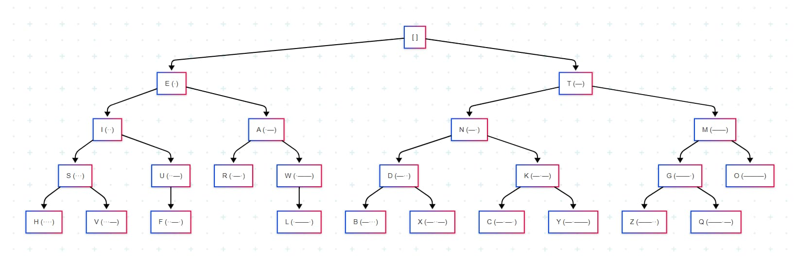
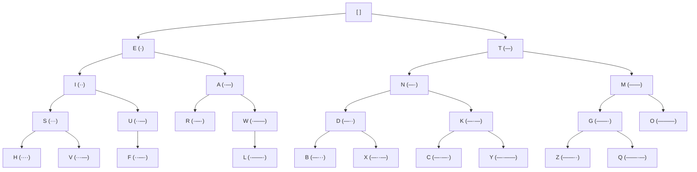

# 摩斯码

摩斯码是一种用于表示字母和数字的编码方式，它使用点（·）和短划线（—）来表示字母。

## 摩斯码的编码表

| 字母 | 摩斯码 | 字母 | 摩斯码 |
| ---- | ------ | ---- | ------ |
| A    | ·—     | N    | —·     |
| B    | —···   | O    | ———    |
| C    | —·—·   | P    | ·——·   |
| D    | —··    | Q    | ——·—   |
| E    | ·      | R    | ·—·    |
| F    | ··—·   | S    | ···    |
| G    | ——·    | T    | —      |
| H    | ····   | U    | ··—    |
| I    | ··     | V    | ···—   |
| J    | ·———   | W    | ·——    |
| K    | —·—    | X    | —··—   |
| L    | ·—··   | Y    | —·——   |
| M    | ——     | Z    | ——··   |

## 摩斯码的二叉树

> [!NOTE]
>
> **说明：**
>
> - `·`（点）表示走左边
> - `—`（划）表示走右边

Mermaid 代码

