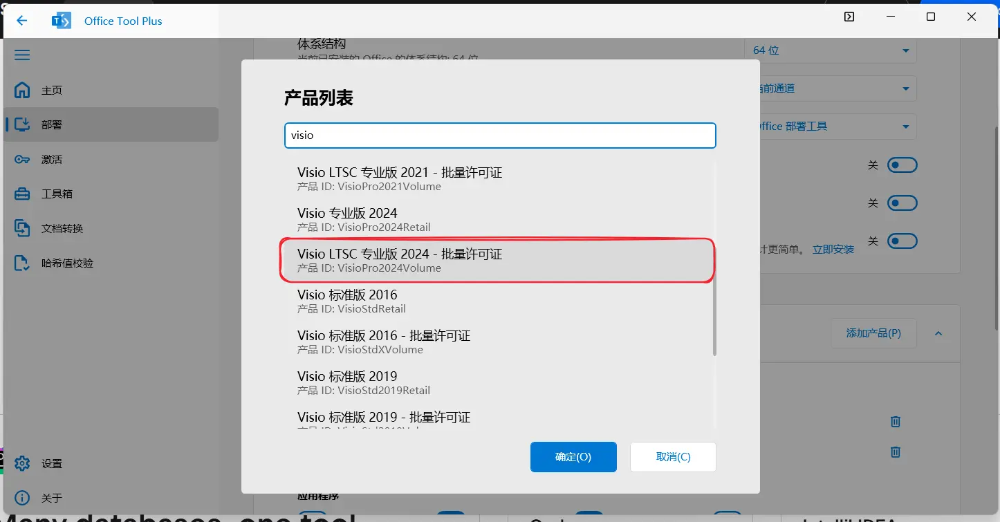
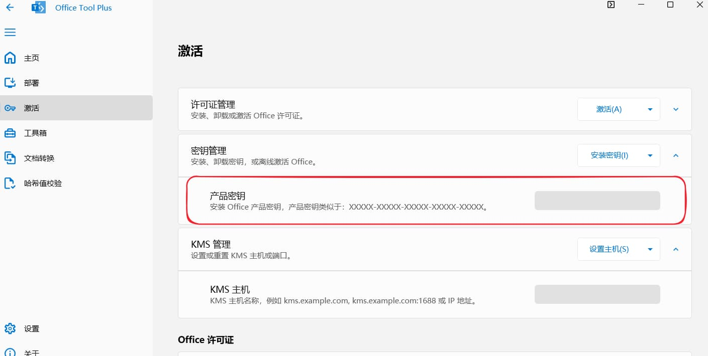

# Office

> [!IMPORTANT]
>
> 本文均使用 `KMS` 激活批量许可证

## KMS 服务器地址

404 Not Found

## GVLK 密钥

### Office LTSC 2024

| 产品                         | GVLK 密钥                     |
| ---------------------------- | ----------------------------- |
| Office LTSC 专业增强版 2024  | XJ2XN-FW8RK-P4HMP-DKDBV-GCVGB |
| Office LTSC 标准版 2024      | V28N4-JG22K-W66P8-VTMGK-H6HGR |
| Project Professional 2024    | FQQ23-N4YCY-73HQ3-FM9WC-76HF4 |
| Project Standard 2024        | PD3TT-NTHQQ-VC7CY-MFXK3-G87F8 |
| Visio LTSC Professional 2024 | B7TN8-FJ8V3-7QYCP-HQPMV-YY89G |
| Visio LTSC Standard 2024     | JMMVY-XFNQC-KK4HK-9H7R3-WQQTV |
| Access LTSC 2024             | 82FTR-NCHR7-W3944-MGRHM-JMCWD |
| Excel LTSC 2024              | F4DYN-89BP2-WQTWJ-GR8YC-CKGJG |
| Outlook LTSC 2024            | D2F8D-N3Q3B-J28PV-X27HD-RJWB9 |
| PowerPoint LTSC 2024         | CW94N-K6GJH-9CTXY-MG2VC-FYCWP |
| Skype for Business LTSC 2024 | 4NKHF-9HBQF-Q3B6C-7YV34-F64P3 |
| Word LTSC 2024               | MQ84N-7VYDM-FXV7C-6K7CC-VFW9J |

### Office LTSC 2021

| 产品                               | GVLK 密钥                     |
| ---------------------------------- | ----------------------------- |
| Office LTSC Professional Plus 2021 | FXYTK-NJJ8C-GB6DW-3DYQT-6F7TH |
| Office LTSC Standard 2021          | KDX7X-BNVR8-TXXGX-4Q7Y8-78VT3 |
| Project Professional 2021          | FTNWT-C6WBT-8HMGF-K9PRX-QV9H8 |
| Project Standard 2021              | J2JDC-NJCYY-9RGQ4-YXWMH-T3D4T |
| Visio LTSC Professional 2021       | KNH8D-FGHT4-T8RK3-CTDYJ-K2HT4 |
| Visio LTSC Standard 2021           | MJVNY-BYWPY-CWV6J-2RKRT-4M8QG |
| Access LTSC 2021                   | WM8YG-YNGDD-4JHDC-PG3F4-FC4T4 |
| Excel LTSC 2021                    | NWG3X-87C9K-TC7YY-BC2G7-G6RVC |
| Outlook LTSC 2021                  | C9FM6-3N72F-HFJXB-TM3V9-T86R9 |
| PowerPoint LTSC 2021               | TY7XF-NFRBR-KJ44C-G83KF-GX27K |
| Publisher LTSC 2021                | 2MW9D-N4BXM-9VBPG-Q7W6M-KFBGQ |
| Skype for Business LTSC 2021       | HWCXN-K3WBT-WJBKY-R8BD9-XK29P |
| Word LTSC 2021                     | TN8H9-M34D3-Y64V9-TR72V-X79KV |

## Visio LTSC 专业版 2024

> 使用 `Office Tool Plus` [下载地址](https://otp.landian.vip/zh-cn/download.html)

1. 安装

    部署 - 添加产品 - 选择 `Visio LTSC 专业版2024-批量许可证`

    

2. 激活

    激活 - 密钥管理 - 输入密钥 `B7TN8-FJ8V3-7QYCP-HQPMV-YY89G` - 安装密钥

    

    然后，使用管理员身份运行 `cmd`，并执行以下命令

    ```cmd
    cd "C:\Program Files\Microsoft Office\Office16"
    cscript ospp.vbs /sethst:kms地址
    cscript ospp.vbs /act
    ```

    > [!TIP]
    >
    > 如果你安装的是32位版本，那么启动命令第一个要改成：`cd "C:\Program Files (x86)\Microsoft Office\Office16"`
