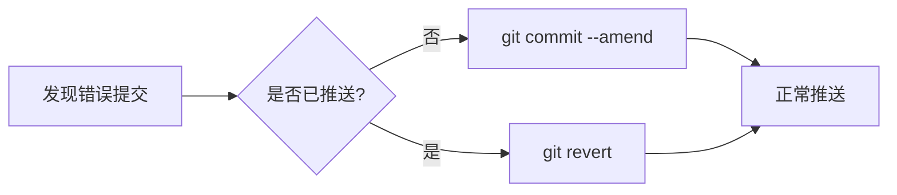

# Git 使用指南

## 提交规范

### 提交类型说明

| 类型       | 适用场景                                         |
| ---------- | ------------------------------------------------ |
| `feat`     | 新增功能模块或组件                               |
| `fix`      | 修复系统缺陷或错误                               |
| `docs`     | 文档更新（README、CHANGELOG等）                  |
| `style`    | 代码格式调整（缩进/空格/分号等不影响逻辑的修改） |
| `build`    | 构建系统或外部依赖调整（webpack/gulp/npm等）     |
| `refactor` | 代码重构（不改变功能的代码结构调整）             |
| `revert`   | 版本回退操作                                     |

### 暂不使用类型

| 类型    | 适用场景               |
| ------- | ---------------------- |
| `test`  | 测试用例相关修改       |
| `perf`  | 性能优化调整           |
| `ci`    | 持续集成配置变更       |
| `chore` | 辅助工具或构建流程调整 |

## 仓库管理

### 初始化操作

```shell
# 本地仓库初始化
git init [目录路径]

# 创建裸仓库（无工作目录）
git init --bare

# 指定模板目录
git init --template=/path/to/template
```

### 克隆仓库

```shell
# 基础克隆
git clone https://github.com/user/repo.git

# 克隆指定分支（深度克隆）
git clone -b main --depth 1 https://github.com/user/repo.git

# 克隆子模块
git clone --recursive https://github.com/user/repo.git
```

## 远程管理

### 远程操作命令集

```shell
# 查看远程仓库详情
git remote -v

# 添加新远程源
git remote add upstream https://github.com/original/repo.git

# 修改远程地址
git remote set-url origin https://new.url/repo.git

# 清理无效远程分支
git remote prune origin
```

## 工作流管理

### 状态监控

```shell
# 精简状态显示
git status -sb

# 显示忽略文件状态
git status --ignored

# 机器可读格式
git status --porcelain
```

### 暂存操作

```shell
# 交互式暂存
git add -p

# 批量添加变更
git add -A

# 排除新增文件
git add -u
```

## 提交配置

### 用户身份设置

```shell
# 全局配置（推荐首次使用设置）
git config --global user.name "开发者名称"
git config --global user.email "合规邮箱@domain.com"

# 项目级配置（覆盖全局）
git config user.name "项目专用名称"
```

## 版本控制

### 提交策略

```shell
# 快速提交
git commit -m "fix: 修复登录页样式问题"

# 追加提交（合并到上次提交）
git commit --amend --no-edit

# 跳过验证提交
git commit --no-verify -m "紧急修复"
```

### 分支管理

```shell
# 创建特性分支
git checkout -b feature/user-auth

# 删除已合并分支
git branch -d legacy-feature

# 分支重命名
git branch -m old-branch new-branch
```

## 远程协作

### 同步操作

```shell
# 安全拉取（仅快进合并）
git pull --ff-only

# 变基式拉取
git pull --rebase

# 强制推送（谨慎使用）
git push -f origin main
```

### 高级抓取

```shell
# 全量更新
git fetch --all

# 清理无效引用
git fetch --prune

# 指定深度抓取
git fetch --depth=5
```

## 历史操作

### 版本回退

::: danger 强制推送警告！

执行强制推送前必须：

1. 确保本地仓库为最新版本
2. 通知所有协作者
3. 确认没有未备份的重要修改
4. 优先考虑使用`revert`代替`reset`

:::

#### 回滚

1. `git log`：首先使用该命令查看所有提交历史，找到需要回退到的特定版本的提交哈希值（commit hash）。

2. `git reset –-hard [哈希值]`：使用上一步找到的提交哈希值替换 `[哈希值]`，执行该命令将 `HEAD` 指向指定版本，并且清除暂存区和工作目录的改动。

3. `git push -f origin [分支] `：如果你正在使用远程仓库，并且需要将回退的更改强制推送到远程仓库，请使用该命令。将 `[分支]` 替换为你的分支名称。

:::danger 注意

回归版本将会删除所有较新的提交历史，需要谨慎操作，确保备份了重要数据。如果你不确定自己的操作，请先进行代码备份。

:::

#### 删除某个提交信息

1. 首先，使用 `git log` 命令找到要删除的提交的哈希值。
2. 然后，使用 `git rebase -i` 命令进入交互式 rebase 界面。
3. 在交互式 rebase 界面中，找到要删除的提交所在的行，`:i` 进入编辑模式，将其前面的命令从 pick 改为 drop。
4. 按 `Ctrl + c` 退出编辑模式，使用 `:wq` 保存并退出交互式 rebase 界面。
5. 执行 `git push --force` 命令将更改强制推送到远程仓库。

:::danger 注意

使用 `git rebase` 命令修改历史记录会改变提交的哈希值，这可能会对其他人的代码产生影响。 因此，在对公共分支进行重写操作之前，需要与团队成员讨论和协商。

:::

### 提交修正



## 最佳实践建议

1. **分支策略**：采用Git Flow工作流，保持`main`分支稳定
2. **提交粒度**：每个提交应聚焦单一功能/修复
3. **消息规范**：使用`类型: 描述`格式，如`feat: 新增支付网关集成`
4. **定期同步**：每日至少执行一次`git pull --rebase`
5. **备份机制**：重要修改前创建临时分支备份

---

> 提示：使用`git reflog`可查看本地操作记录，用于恢复误操作。定期执行`git gc`可优化仓库性能。
